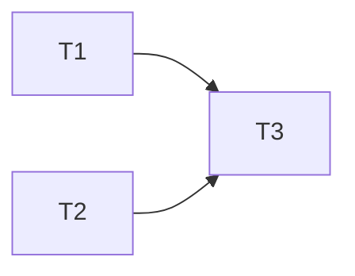

# Phase 4 — Requirements & Task Breakdown

Goal: author §9 REQs and §10 TASKs with non-overlapping `Files:` globs.

## §9 Requirements

Each REQ = one observable, testable behavior.

```markdown
- [ ] **REQ-1** — <short behavior description>
  - Acceptance: <precise, checkable criterion — not "works correctly">
  - Verified by: — <filled by QA in Phase 7>
```

QA ticks the checkbox after coverage is in place. Orchestrator never ticks REQ checkboxes directly.

## §10 Implementation Plan (Tasks)

Each TASK must specify:

```markdown
- [ ] **TASK-1** — <short title>
  - Depends on: — (or TASK-N list)
  - Assignee slot: dev-A | dev-B | serial
  - Files: `opendaimon-<module>/src/main/java/.../Foo.java`, `.../FooTest.java`
  - Acceptance: <precise, checkable criterion>
  - Unit tests to add: `FooTest#shouldDoXWhenY`
  - Notes: <references to §5 subsections>
```

`Files:` is a glob list. Developer's scope lock is literally this list.

## Non-overlap invariant check (MANDATORY before Phase 5 dispatch)

Before declaring any two TASKs for parallel dispatch:

1. List their `Files:` globs side-by-side.
2. Verify no intersection. Use `Grep` / `Glob` if globs are broad.
3. On conflict: **serialize** (sequential dispatch) OR **re-partition** the tasks.

Intersection means last-write-wins = silent data loss. This check cannot be skipped.

## Optional dependency DAG (§10.1)

For complex features, include a mermaid DAG:



Useful when TASK-3 depends on both TASK-1 and TASK-2 completing first.

## Dispatch

Submit REQs and TASKs via `team-secretary append §9` and `append §10` (two batches or one, Secretary accepts both).

## Exit criterion

- §9 REQs have acceptance criteria — no "works correctly" or "as expected" wording.
- §10 TASKs have `Files:` globs, acceptance criteria, dependency list.
- Parallel batches pass the non-overlap check.
