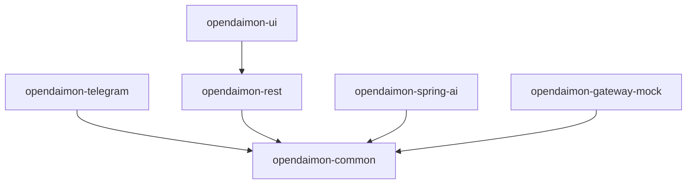

# OpenDaimon

[](https://github.com/NGirchev/open-daimon/actions)
[](https://central.sonatype.com/namespace/io.github.ngirchev)
[](https://sonarcloud.io/summary/new_code?project=NGirchev_open-daimon)
[](https://sonarcloud.io/summary/new_code?project=NGirchev_open-daimon)
[](https://sonarcloud.io/summary/new_code?project=NGirchev_open-daimon)
[](https://sonarcloud.io/summary/new_code?project=NGirchev_open-daimon)
[](https://sonarcloud.io/summary/new_code?project=NGirchev_open-daimon)
[](https://sonarcloud.io/summary/new_code?project=NGirchev_open-daimon)
[](https://sonarcloud.io/summary/new_code?project=NGirchev_open-daimon)
[](https://sonarcloud.io/summary/new_code?project=NGirchev_open-daimon)

[](https://openjdk.org/)
[](https://spring.io/projects/spring-boot)
[](https://github.com/NGirchev/open-daimon/blob/master/LICENSE)

## Quick Setup

**Option 1 — One command (recommended):**

```bash
mkdir my-bot && cd my-bot
npx @ngirchev/open-daimon
```

Requires [Docker Desktop](https://www.docker.com/products/docker-desktop/) and Node.js 18+.

The wizard will:
- Configure `.env` with your credentials
- Let you choose AI provider (OpenRouter or Ollama)
- For Ollama — check the connection and pull `gemma3:1b` automatically
- Generate ready-to-run `docker-compose.yml` and `application-local.yml`
- Offer to start the stack immediately

Before running the wizard, prepare:
- [Create a Telegram bot](docs/setup-telegram.md) — get a token from @BotFather and your user ID from @userinfobot
- [Get an OpenRouter API key](docs/setup-openrouter.md) — free models available; or skip if you plan to use Ollama locally

After the wizard completes, check that the app started:
```bash
docker compose logs -f opendaimon-app
```

**Option 2 — Manual setup (after git clone):** See [Quick start](#quick-start) below.

---

**OpenDaimon** (formerly **ai-bot**) is a multi-module Java platform for building AI-powered chat agents and chatbots. It connects to various AI providers via **Spring AI** (OpenRouter, Ollama) and exposes them through Telegram, REST API, and Web UI. Use it as a library to assemble your own pipelines and integrations, or run the full app as a private, self-hosted chat assistant.

### Who it's for

Java/Spring teams building conversational AI or internal bots; developers who want one backend with Telegram, REST, and Web UI; users who prefer to run a chat agent on their own infrastructure with local or OpenRouter models and no external subscriptions; anyone who needs trusted group access (e.g. family or team) without per-user signups elsewhere.

## Why OpenDaimon?

### For developers and teams

- **Spring AI as a library** — Integrate conversational AI into your apps with agent-style capabilities; plug in only the modules you need (Telegram, REST, UI, Spring AI).
- **Easy to customize for business** — Configure the chat agent (prompts, roles, memory, RAG) via properties and optional extensions; no need to fork the whole project.
- **Resilience and prioritization** — Built-in bulkhead (Resilience4j) and **two user tiers**: VIP and regular (plus admin), with configurable concurrency and wait limits.
- **Custom dialog summarization** — Long conversations are summarized automatically; context window and triggers are configurable.
- **Open, modular architecture** — Spring Boot auto-configurations let you enable/disable features and replace components without touching core code.
- **Ready-made interfaces** — Telegram bot, REST API, and Web UI out of the box; **two UI languages** supported; **default and custom system roles** for the assistant.
- **Foundation for pipelines** — Solid base for building pipelines and integrations with various systems and AI providers for chatbots and automation.

### For end users (self-hosted)

- **Your data stays with you** — Run the agent on **your own machine** or server. Use **OpenRouter** or **Ollama** (local models); all conversations are stored **locally** in your database. No need to send private data to third-party APIs or pay for external chat subscriptions.
- **Trusted Telegram groups** — Add **Telegram groups** (e.g. family, friends) as trusted; members get access without signing up on other services and without dealing with per-user limits on external platforms.

### Technical highlights

- **Streaming** — SSE for REST and Web UI; Telegram receives replies as they are generated (chunk-by-chunk).
- **OpenRouter intelligence** — Automatic retry with model switch on rate limits (429) or errors; capability-based model selection (chat, tool calling, web, vision); optional **free-model rotation** with scheduled registry refresh so VIP/regular users can use free OpenRouter models without manual switching.
- **Multimodal** — Images from Telegram (or REST) stored in MinIO and sent to vision-capable models; optional **RAG** pipeline for PDFs (chunking, embeddings, similarity search).
- **Production-ready** — Published to **Maven Central**; CI (GitHub Actions), SonarCloud, Testcontainers, Flyway migrations, Docker Compose; API keys only in environment variables (no secrets in config files).
- **Observability** — Micrometer, Prometheus, Grafana, optional Elasticsearch/Kibana; custom metrics for request timing, bulkhead usage, and OpenRouter stream retries.

## Table of contents

- [Quick Setup](#quick-setup) — [npx wizard](#quick-setup)
- [Who it's for](#who-its-for)
- [Why OpenDaimon?](#why-opendaimon) — [For developers](#for-developers-and-teams), [For end users](#for-end-users-self-hosted), [Technical highlights](#technical-highlights)
- [Features](#features)
- [User Priorities and Bulkhead](#user-priorities-and-bulkhead)
- [Requirements](#requirements)
- [Tech stack](#tech-stack)
- [Modules](#modules)
- [Quick start](#quick-start) — [Running the app (no Java experience)](#running-the-app-no-java-experience)
- [Build and run](#build-and-run)
- [Server deployment](#server-deployment)
- [Useful links](#useful-links)
- [Testing](#testing)
- [Monitoring and debugging](#monitoring-and-debugging)
- [Troubleshooting](#troubleshooting)
- [Documentation](#documentation)
- [Project structure](#project-structure)
- [Additional commands](#additional-commands)
- [License](#license)

## Features

- **Multiple interfaces**: Telegram bot, REST API, Web UI
- **Spring AI integration**: OpenRouter, Ollama, chat memory, optional RAG; OpenRouter retry and free-model rotation
- **Streaming**: SSE (REST/UI) and chunk-by-chunk replies in Telegram
- **Multimodal**: image uploads (MinIO + vision models), optional PDF RAG (embeddings, similarity search)
- **Modular architecture**: enable only the modules you need; extensible via Spring auto-configurations
- **Request prioritization**: bulkhead (ADMIN/VIP/REGULAR) and per-user concurrency; trusted Telegram groups for shared access
- **Dialog summarization**: configurable long-conversation summarization and context window
- **Roles and i18n**: default and custom system roles; two UI languages
- **Observability**: Prometheus, Grafana, Elasticsearch, Kibana; custom metrics
- **Distribution**: Maven Central, Docker images, CI and SonarCloud

## User Priorities and Bulkhead

The system uses a **Bulkhead pattern** to manage AI request limits based on user priority.

### Priority Levels

| Priority  | Description                              | Max Concurrent Requests | Max Wait Time |
|-----------|------------------------------------------|------------------------|---------------|
| ADMIN     | Bot administrators                       | 10 (configurable)      | 1s            |
| VIP       | Paid users or channel members           | 5 (configurable)       | 1s            |
| REGULAR   | Free users in whitelist                  | 1 (configurable)      | 500ms         |
| BLOCKED   | Not in whitelist — access denied        | 0                      | —             |

### How Priority is Determined

Priority is checked in this order (first match wins):

1. **ADMIN** — in config list (`admin.ids` or `admin.channels`) OR `isAdmin = true` in database
2. **BLOCKED** — not in whitelist, not in any configured channel
3. **VIP** — in config list (`vip.ids`) OR `isPremium = true` (Telegram Premium) OR in `vip.channels`
4. **REGULAR** — all other users in whitelist

### Configuration via Environment Variables

User access is configured via **environment variables** (not hardcoded in YAML):

#### Telegram

```bash
# Admin users by Telegram ID
TELEGRAM_ACCESS_ADMIN_IDS=123456789,987654321

# Admin channel (members get ADMIN)
TELEGRAM_ACCESS_ADMIN_CHANNELS=-1000000000000,@admins

# VIP users by Telegram ID
TELEGRAM_ACCESS_VIP_IDS=111111111,222222222

# VIP channels (members get VIP)
TELEGRAM_ACCESS_VIP_CHANNELS=-1002000000000,@vipgroup

# Regular users by Telegram ID
TELEGRAM_ACCESS_REGULAR_IDS=333333333

# Regular channels (members get REGULAR)
TELEGRAM_ACCESS_REGULAR_CHANNELS=-1003000000000,@community
```

#### REST API

```bash
# Admin emails
REST_ACCESS_ADMIN_EMAILS=admin@example.com

# VIP emails
REST_ACCESS_VIP_EMAILS=vip@example.com,premium@example.com

# Regular emails
REST_ACCESS_REGULAR_EMAILS=user@example.com,test@example.com
```

### Bulkhead Configuration (application.yml)

Edit `application.yml` to change request limits:

```yaml
open-daimon:
  common:
    bulkhead:
      enabled: true
      instances:
        ADMIN:
          maxConcurrentCalls: 10
          maxWaitDuration: 1s
        VIP:
          maxConcurrentCalls: 5
          maxWaitDuration: 1s
        REGULAR:
          maxConcurrentCalls: 1
          maxWaitDuration: 500ms
```

### Managing Users

- **Add admin**: Set `TELEGRAM_ACCESS_ADMIN_IDS` or `REST_ACCESS_ADMIN_EMAILS` env variable
- **Add VIP**: Set `TELEGRAM_ACCESS_VIP_IDS` or `REST_ACCESS_VIP_EMAILS` env variable
- **Add to whitelist (REGULAR)**: Use TelegramWhitelistService or DB table `telegram_whitelist`
- **Database fields**: `isAdmin`, `isPremium` in user tables (legacy, config takes priority)

**Startup initialization of direct users**: On application startup, all users listed in `REST_ACCESS_*_EMAILS` and `TELEGRAM_ACCESS_*_IDS` (admin, vip, regular) are created or updated in the database with flags set by level. If a user appears in more than one level, the highest level wins (ADMIN > VIP > REGULAR). Groups/channels are not used for this; only the direct ids/emails from config are initialized. For Telegram, when the bot is available, the initializer calls the getChat API for each configured id to fetch real username, first name, and last name; new users are then created with these values instead of a placeholder (e.g. `id_<telegramId>`). If getChat fails (e.g. user never chatted with the bot), the placeholder is used.

### Related Files

- `UserPriority.java` — enum with priority levels
- `TelegramUserPriorityService.java` — Telegram priority logic
- `RestUserPriorityService.java` — REST priority logic
- `PriorityRequestExecutor.java` — bulkhead execution
- `application.yml` — bulkhead limits
- `TelegramProperties.java`, `RestProperties.java` — access configuration

## Requirements

- **Java 21** (LTS)
- **Maven 3.6+**
- **Docker & Docker Compose** (for PostgreSQL, Prometheus, Grafana; optional Elasticsearch, Kibana)

## Tech stack

- **Java 21** (LTS), **Spring Boot 3.3.3**
- **PostgreSQL 17.0** with Flyway migrations
- **Prometheus + Grafana** for metrics, **Elasticsearch + Kibana** for logging

## Modules

You can add only the modules you need. All modules use `groupId` `io.github.ngirchev`; set `opendaimon.version` in your POM or use a concrete version.

### Module dependency graph



### Module overview

| Module | Description | Depends on |
|--------|-------------|------------|
| `opendaimon-common` | Core: entities, services, request prioritization | — |
| `opendaimon-telegram` | Telegram Bot interface | `opendaimon-common` |
| `opendaimon-rest` | REST API (controllers, Swagger) | `opendaimon-common` |
| `opendaimon-ui` | Web UI (Thymeleaf) | `opendaimon-rest` |
| `opendaimon-spring-ai` | Spring AI (OpenRouter, Ollama, chat memory, RAG) | `opendaimon-common` |
| `opendaimon-gateway-mock` | Mock AI provider for tests | `opendaimon-common` |

### Example: Telegram bot + Spring AI

Minimal setup for a Telegram bot with AI:

```xml
<dependency>
    <groupId>io.github.ngirchev</groupId>
    <artifactId>opendaimon-telegram</artifactId>
    <version>${opendaimon.version}</version>
</dependency>
<dependency>
    <groupId>io.github.ngirchev</groupId>
    <artifactId>opendaimon-spring-ai</artifactId>
    <version>${opendaimon.version}</version>
</dependency>
```

### Example: REST API + Web UI + Spring AI

No Telegram; REST and browser UI only:

```xml
<dependency>
    <groupId>io.github.ngirchev</groupId>
    <artifactId>opendaimon-ui</artifactId>
    <version>${opendaimon.version}</version>
</dependency>
<dependency>
    <groupId>io.github.ngirchev</groupId>
    <artifactId>opendaimon-spring-ai</artifactId>
    <version>${opendaimon.version}</version>
</dependency>
```

### Example: All modules

Use the assembled application module (includes Telegram, REST, UI, Spring AI, gateway-mock):

```xml
<dependency>
    <groupId>io.github.ngirchev</groupId>
    <artifactId>opendaimon-app</artifactId>
    <version>${opendaimon.version}</version>
</dependency>
```

## Quick start

### Running the app (no Java experience)

If you are new to Java, follow these steps. You will need a **terminal** (command line): on Windows use PowerShell or Command Prompt; on macOS/Linux use Terminal.

**1. Install Java 21**

The app runs on **Java** (a runtime). You need **Java 21** specifically.

- **Windows / macOS / Linux:** download and install from [Eclipse Temurin (Adoptium)](https://adoptium.net/temurin/releases/?version=21&os=windows&arch=x64) — choose your OS and install the JDK 21.
- After installation, open a **new** terminal and run: `java -version`. You should see something like `openjdk version "21.x.x"`.

**2. Install Docker**

The app uses **PostgreSQL** (a database). The easiest way is to run it in **Docker**.

- Install [Docker Desktop](https://www.docker.com/products/docker-desktop/) (includes Docker Compose). Start Docker so it is running in the background.

**3. Prepare configuration**

- In the project folder, copy the example config: copy `.env.example` to a new file named `.env`.
- Open `.env` in a text editor and set at least: `TELEGRAM_USERNAME`, `TELEGRAM_TOKEN`, `OPENROUTER_KEY`, `POSTGRES_PASSWORD`. Do not commit `.env` (it contains secrets).

**4. Start the database**

In the terminal, from the project folder:

```bash
docker-compose up -d postgres prometheus grafana
```

**5. Build and run**

- **If you have the source code** and want to build yourself: install [Maven](https://maven.apache.org/download.cgi) (build tool for Java). Then in the project folder run:
  ```bash
  mvn clean install
  java -jar opendaimon-app/target/opendaimon-app-1.0-SNAPSHOT.jar
  ```
- **If someone gave you a ready JAR file:** put the JAR in a folder, put your `.env` in the same folder (or set the same variables in the environment), then run:
  ```bash
  java -jar opendaimon-app-1.0-SNAPSHOT.jar
  ```

The app will start. You can open the Web UI or use the Telegram bot according to your configuration. For more options (e.g. run everything in Docker), see the sections below.

### Environment variables

Create a `.env` file in the project root (do **not** commit it; add `.env` to `.gitignore`). Use [.env.example](.env.example) as a template:

```bash
cp .env.example .env
# Edit .env and set TELEGRAM_USERNAME, TELEGRAM_TOKEN, OPENROUTER_KEY, POSTGRES_PASSWORD, etc.
```

For local run without Docker Compose you can also `export` variables in the shell.

### Local run (for development)

1. **Start infrastructure:**
   ```bash
   docker-compose up -d postgres prometheus grafana
   ```

2. **Build the project:**
   ```bash
   mvn clean install
   ```

3. **Run the application:**
   ```bash
   mvn spring-boot:run -pl opendaimon-app
   ```

### Run with Docker Compose (recommended)

1. **Create `.env`** from [.env.example](.env.example) and set required values (see [Environment variables](#environment-variables) above).

   Create `application-local.yml` for app overrides (optional but recommended):
   ```bash
   cp application-local.yml.example application-local.yml
   ```

2. **Build the project:**
   ```bash
   mvn clean package -DskipTests
   ```

3. **Start all services:**
   ```bash
   docker-compose up -d
   ```
   Or with image rebuild: `docker-compose up -d --build`

4. **Check status:**
   ```bash
   docker-compose ps
   docker-compose logs -f opendaimon-app
   ```

## Build and run

### Prerequisites

- Java 21: `java -version`
- Maven 3.6+: `mvn -version`
- Docker (for DB and monitoring): `docker --version`

### Start infrastructure

```bash
# PostgreSQL, Prometheus, Grafana, Elasticsearch, Kibana
docker-compose up -d
docker-compose ps
```

### Build project

```bash
mvn clean install
mvn clean install -DskipTests              # without tests
mvn clean install -pl opendaimon-telegram       # single module
mvn clean install -pl opendaimon-app -am        # module and dependencies
```

### Run application

**Option 1: Maven (development)**

```bash
mvn spring-boot:run -pl opendaimon-app
```

**Option 2: Run the built JAR**

After `mvn clean install` (or `mvn clean package -pl opendaimon-app -am`), run the executable JAR. Set environment variables or use a `.env` file in the current directory (see [Environment variables](#environment-variables)).

```bash
java -jar opendaimon-app/target/opendaimon-app-1.0-SNAPSHOT.jar
```

JAR name follows the project version from the parent POM (e.g. `1.0-SNAPSHOT`). Use Java 21: `java -version`.

### DB migrations

```bash
mvn flyway:migrate
mvn flyway:info
mvn flyway:clean   # use with caution
```

## Server deployment

Detailed production deployment guide: **[DEPLOYMENT.md](DEPLOYMENT.md)**

## Useful links

After starting the application:

| Service        | URL |
|----------------|-----|
| Swagger UI     | http://localhost:8080/swagger-ui/index.html |
| Actuator Health| http://localhost:8080/actuator/health |
| Prometheus metrics | http://localhost:8080/actuator/prometheus |
| Prometheus UI  | http://localhost:9090 |
| Grafana        | http://localhost:3000 (admin/admin123456) |
| Kibana         | http://localhost:5601 |

## Testing

### Run all tests

```bash
mvn test
```

### Run tests for a specific module

```bash
mvn test -pl opendaimon-common
mvn test -pl opendaimon-telegram
```

### Run a specific test

```bash
# Example from README
mvn test -Dtest=repository.telegram.io.github.ngirchev.opendaimon.common.TelegramUserRepositoryTest -pl opendaimon-app

# Specific method
mvn test "-Dtest=repository.telegram.io.github.ngirchev.opendaimon.common.TelegramUserRepositoryTest#whenSaveUser_thenUserIsSaved" -pl opendaimon-app

# SpringAIGatewayIT (streaming)
mvn test -pl opendaimon-spring-ai -Dtest=SpringAIGatewayIT
```

### Running tests on Windows
- **mvnw.cmd** requires **JAVA_HOME** (JDK 21). Common path: `C:\Users\<user>\.jdks\corretto-21.0.10` (IDEA) or File → Project Structure → SDKs.
- **PowerShell** from project root:
  ```powershell
  $env:JAVA_HOME = "C:\Users\<user>\.jdks\corretto-21.0.10"; cd c:\path\to\open-daimon; .\mvnw.cmd test -pl opendaimon-spring-ai -Dtest=SpringAIGatewayIT
  ```
  (replace `<user>` and path with your JDK and project location).
- If a single-module test fails with "Could not find artifact opendaimon-common", run `.\mvnw.cmd install -DskipTests` first, then the `test` command.
- **From IntelliJ IDEA**: right-click `SpringAIGatewayIT` → Run 'SpringAIGatewayIT'.

### Integration tests
Uses **Testcontainers** for PostgreSQL:
- Docker container with PostgreSQL is started automatically
- Flyway migrations are applied
- Container is removed after tests
- TelegramMockGatewayIntegrationTest — main test for the Telegram part
- SpringAIGatewayOpenRouterIntegrationTest — main test for the Spring AI part
- SpringAIGatewayIT — streaming test (no Ollama, mocked Flux with delays)

## Monitoring and debugging

### Endpoints
- **Swagger UI**: http://localhost:8080/swagger-ui/index.html
- **Actuator Metrics**: http://localhost:8080/actuator/metrics/telegram.message.processing.time
- **Prometheus**: http://localhost:9090/query
- **Grafana**: http://localhost:3000/ (admin/admin123456)
- **Kibana**: http://localhost:5601/

### Logging
- **Root level**: INFO
- **Flyway**: DEBUG
- **Spring JDBC**: INFO
- **Bulkhead**: INFO

Logs are sent to Elasticsearch via Metricbeat.

## Troubleshooting

### Flyway migrations not applying

```bash
# Check status
mvn flyway:info

# Force apply
mvn flyway:migrate

# Baseline if needed
mvn flyway:baseline
```

### Tests fail with DB error
- Ensure Docker is running
- Testcontainers starts PostgreSQL automatically
- Check logs: `docker logs open-daimon-postgres`

### "Could not find a valid Docker environment" / Status 400 (Windows)
On Windows, Docker Desktop may return 400 over npipe and Testcontainers cannot connect. Enable TCP access to the daemon:

1. **Docker Desktop** → Settings → General → enable **"Expose daemon on tcp://localhost:2375 without TLS"** → Apply & Restart.
2. Before running tests, set (PowerShell):
   ```powershell
   $env:DOCKER_HOST = "tcp://localhost:2375"
   ```
3. Run tests:
   ```powershell
   .\mvnw.cmd verify -q
   ```
   Or in one line: `$env:DOCKER_HOST = "tcp://localhost:2375"; .\mvnw.cmd verify -q`

### Module cannot see dependencies

```bash
# Rebuild with dependencies
mvn clean install -am

# Refresh IDE (IntelliJ IDEA)
File -> Invalidate Caches / Restart
```

### Metrics not showing in Grafana
- Check Prometheus: http://localhost:9090/targets
- Ensure the app exports metrics: http://localhost:8080/actuator/prometheus
- Restart Grafana: `docker-compose restart grafana`

## Documentation

### Setup guides
- **[docs/setup-telegram.md](docs/setup-telegram.md)** — Create a Telegram bot and get your user ID
- **[docs/setup-openrouter.md](docs/setup-openrouter.md)** — Get an OpenRouter API key (free models available)
- **[docs/setup-serper.md](docs/setup-serper.md)** — Enable web search (optional)

### Project docs
- **[AGENTS.md](AGENTS.md)** — Detailed documentation for AI agents (architecture, module structure, code style)
- **[CONTRIBUTING.md](CONTRIBUTING.md)** — How to contribute (setup, code style, testing, PR requirements)
- **[SECURITY.md](SECURITY.md)** — How to report security vulnerabilities
- **[DEPLOYMENT.md](DEPLOYMENT.md)** — Server deployment guide
- **[MODULAR_MIGRATIONS.md](docs/MODULAR_MIGRATIONS.md)** — Flyway modular migrations

## Project structure

```text
open-daimon/
├── opendaimon-common/        # Core module with shared logic
├── opendaimon-telegram/      # Telegram Bot interface
├── opendaimon-rest/          # REST API interface
├── opendaimon-ui/            # Web UI interface
├── opendaimon-spring-ai/     # Spring AI integration
├── opendaimon-gateway-mock/  # Mock provider for tests
└── opendaimon-app/           # Main application module
```

## Additional commands

### Web UI for Ollama

```bash
docker run -d \
  --name open-webui \
  -p 3000:8080 \
  --add-host=host.docker.internal:host-gateway \
  -e OLLAMA_BASE_URL=http://host.docker.internal:11434 \
  -v open-webui:/app/backend/data \
  ghcr.io/open-webui/open-webui:main
```

### Port forwarding (example)

```bash
ssh -N -L 23750:/var/run/docker.sock user@your-server.local
```

### Teardown and full bring-up

```bash
docker-compose -H tcp://localhost:23750 down -v
docker-compose -H tcp://localhost:23750 up -d
```

## License

See [LICENSE](LICENSE) file for details.
