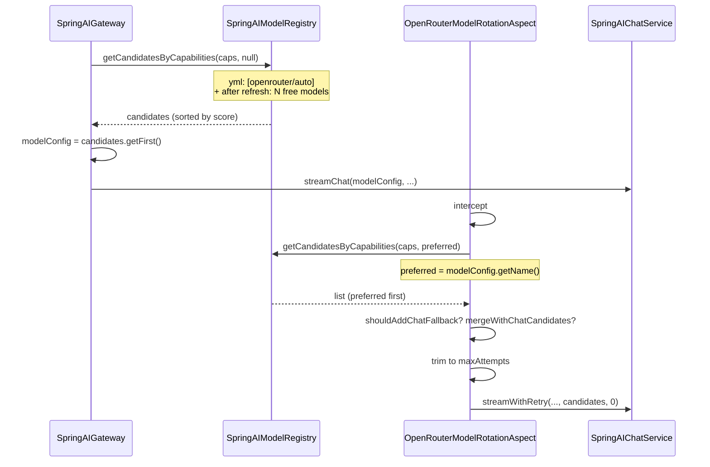

# OpenRouter model routing (single model: openrouter/auto)

This document describes how model routing works when the application is configured with a single model `openrouter/auto` in `application.yml`, and why retry/rotation after errors (e.g. 429) may not switch to another model.

## Request flow (one model in yml)

## Where candidates come from

1. **Gateway** calls `getCandidatesByCapabilities(command.modelCapabilities(), null)` on `SpringAIModelRegistry`. The registry holds: the single yml entry (`openrouter/auto`) plus free models added during **refresh** from the OpenRouter API (`refreshOpenRouterModels()`). The list is sorted by `score()` (latency, cooldown after 429/5xx).

2. **First candidate** is either `openrouter/auto` or a concrete free model (e.g. `google/gemma-3-12b-it:free`), depending on sort order.

3. **Aspect** in `resolveCandidates()` calls `registry.getCandidatesByCapabilities(capabilities, preferred)` with `preferred = modelConfig.getName()`. The result is all models matching capabilities, with `preferred` first.

4. **Single model in yml:** If yml only has `openrouter/auto`, the registry still has many entries after refresh (openrouter/auto + all free models). So `getCandidatesByCapabilities` usually returns multiple candidates.

5. **Attempt limit:** The list is trimmed to `maxAttempts` in `OpenRouterModelRotationAspect` (around line 176): `candidates = candidates.subList(0, maxAttempts)`. The value comes from `open-daimon.ai.spring-ai.openrouter-auto-rotation.max-attempts` (default in code is 2 in `SpringAIProperties`; in `SpringAIAutoConfig` a missing property yields 1).

## Why models do not rotate after 429

- **Single candidate after trim:** If `maxAttempts == 1`, the aspect keeps only one candidate. On 429 in `streamWithRetry()` the check `index + 1 >= candidates.size()` is true, so no switch happens and the log shows "no more candidates".

- **Registry without free models:** If refresh never ran (no API key, timeout, API error), the registry only has `openrouter/auto`. Then even with CHAT fallback (`shouldAddChatFallback` + `mergeWithChatCandidates`) the list stays of size one, so rotation is impossible.

- **Capabilities = AUTO:** For ADMIN, only `openrouter/auto` has the AUTO capability, so the registry returns one candidate for AUTO. CHAT fallback adds other models with CHAT (including free models), so after merge there are several candidates only if the registry has free models. If the registry has only openrouter/auto, there is still one candidate.

- **Synchronous error:** If 429 is thrown before subscribing to the Flux (e.g. when building the request), the `catch (Throwable t)` in `streamWithRetry()` runs. The aspect now handles this case: if the error is retryable and a next candidate exists, it calls `streamWithRetry(..., index + 1)`.

**Summary:** With a single model in yml (`openrouter/auto`), routing after 429 does not switch models when (1) the aspect ends up with one candidate because `maxAttempts == 1`, or (2) the registry only has `openrouter/auto` (refresh did not add free models). In that case the log shows: `OpenRouter model rotation: only 1 candidate(s), retry on stream error will not switch model`.

## What to check or change

1. **Config:** In `application.yml` (or profile) set `open-daimon.ai.spring-ai.openrouter-auto-rotation.max-attempts` to at least 2 (e.g. 3) so the aspect does not trim the list to a single candidate.

2. **Refresh:** Ensure OpenRouter refresh runs (look for log "OpenRouter free models refreshed. count=..."). Without it the registry only has `openrouter/auto` and rotation cannot happen.

3. **Retry logs:** On successful switch, look for "OpenRouter stream retry: switching from model=... to next candidate model=...". If you see "no more candidates" or "only 1 candidate(s)", the cause is a single candidate (maxAttempts or empty registry).

## Related

- [opendaimon-spring-ai/.../retry/README.md](../opendaimon-spring-ai/src/main/java/io/github/ngirchev/opendaimon/ai/springai/retry/README.md) — OpenRouter retry and model rotation (implementation details, retryable errors, logging).
- [AGENTS.md](../AGENTS.md) — Project overview and dialog flow.
