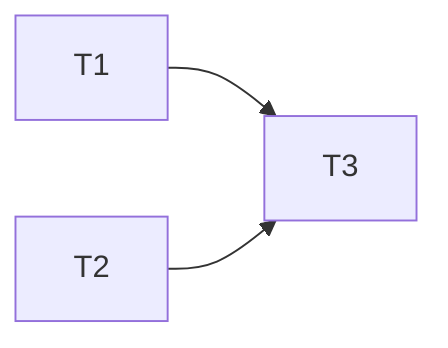

# <Human Readable Title>

## 1. Problem Statement

<Why this feature exists. What pain it addresses. What was missing or broken. 2-5 short paragraphs. Written by orchestrator in Phase 1 Round A from user input.>

## 2. Business Context & Goals

<Who benefits. What outcome counts as success. KPIs or observable criteria.>

## 3. Non-Goals / Out of Scope

<What this feature explicitly does not do. Prevents scope creep during development.>
- <non-goal>
- <non-goal>

## 4. Existing State (Phase 1 Discovery)

<AS-IS summary built from team-explorer findings and user clarifications. Include:>
- Affected modules (`opendaimon-*`)
- Current patterns to reuse
- Related use-cases (`docs/usecases/*.md`)
- Known risks and pitfalls

## 5. Proposed Architecture

<TO-BE description, written as a diff from §4. Fill all subsections relevant to the feature; mark "— not applicable" for others. Always include at least one sequence or component diagram.>

### 5.1 Component diagram / flow
```mermaid
%% sequence or component diagram
```

### 5.2 Module impact
- `opendaimon-<module>`: <what changes and why>

### 5.3 Data model
- Entities added/changed (JPA inheritance: JOINED for User, SINGLE_TABLE for Message)
- Migrations (path: `opendaimon-app/src/main/resources/db/migration/<module>/V<n>__<desc>.sql`)

### 5.4 Configuration
- New properties under `open-daimon.*`
- Feature toggle constants in `FeatureToggle`

### 5.5 Metrics
- New metrics under `<module>.<action>.<metric>` on `OpenDaimonMeterRegistry`

### 5.6 AI integration (if applicable)
- All calls routed through `PriorityRequestExecutor` with appropriate priority

## 6. Alternatives Considered

### Option A — <name>
- Pros: …
- Cons: …

### Option B — <name>
- Pros: …
- Cons: …

**Chosen:** Option <X> because …

## 7. Risks & Mitigations

| Severity | Risk | Mitigation |
|---|---|---|
| HIGH | … | … |
| MEDIUM | … | … |
| LOW | … | … |

(Severity from `.claude/rules/code-review.md`.)

## 8. Non-Functional Constraints

- **Performance:** …
- **Security:** …
- **Concurrency:** …
- **Backward compatibility:** …
- **Migration strategy:** …

## 9. Requirements

<Written after §5 is approved. Each REQ = one observable, testable behavior. QA ticks the checkbox after fixture/unit coverage is in place.>

- [ ] **REQ-1** — <behavior>
  - Acceptance: <precise checkable criterion>
  - Verified by: — <filled by QA with test path>
- [ ] **REQ-2** — <behavior>
  - Acceptance: <…>
  - Verified by: —

## 10. Implementation Plan (Tasks)

<TASK-N with dependency graph. Devs complete the code; orchestrator ticks the checkbox after DONE + COMPILE: OK.>

- [ ] **TASK-1** — <short title>
  - Depends on: —
  - Assignee slot: dev-A | dev-B | serial
  - Files: `opendaimon-<module>/src/main/java/.../Foo.java`, `opendaimon-<module>/src/test/java/.../FooTest.java`
  - Acceptance: <precise criterion>
  - Unit tests to add: `FooTest#shouldDoXWhenY`
  - Notes: <references to §5 sections>

- [ ] **TASK-2** — <…>
  - Depends on: TASK-1
  - …

### 10.1 Optional dependency DAG



## 11. Q&A Log

<Two-channel log. Entries tagged [ORCH] (strategic, answered by orchestrator) or [SEC] (coordination, answered by team-secretary). Secretary appends questions and answers here.>

<!--
Example:

Q1 [SEC] from dev-A, TASK-2, status: answered
  Q: Which service currently persists forwarded-message metadata?
  A: `TelegramMessageService` via `OpenDaimonMessageRepository.save(...)`
     (`opendaimon-telegram/src/main/java/.../TelegramMessageServiceImpl.java:87`).

Q2 [ORCH] from dev-B, TASK-4, status: open
  Q: REQ-3 requires caching — Caffeine or Redis?
-->

## 12. Regressions (Phase 2 Findings)

<Appended by team-secretary during Phase 6 verification. HIGH/CRITICAL findings trigger new TASK-N; MEDIUM/LOW are notes only.>

## 13. Test Coverage Summary (QA phase)

<Filled by orchestrator in Phase 7 based on team-qa-tester reports.>

| REQ | Test path | Type |
|---|---|---|
| REQ-1 | `opendaimon-app/src/it/java/.../it/fixture/FooFixtureIT.java#shouldFoo` | fixture |
| REQ-2 | `opendaimon-<module>/src/test/java/.../BarTest.java#shouldBar` | unit |

Fixture mapping update in `.claude/rules/java/fixture-tests.md`: yes | no

## 14. Closure Notes

<Filled at Phase 8.>

- Use-case docs to update: <`docs/usecases/*.md` or none>
- Module docs to update: <`*_MODULE.md` or none>
- Suggested commit type: <feat | fix | refactor | docs | test | perf | chore>
- Suggested commit subject: <short imperative>

## Activity Log

<Append-only timestamps written by team-secretary. Collapsed into `<details>` when the file exceeds ~30KB.>

- <YYYY-MM-DDTHH:MM:SSZ> — feature bootstrapped
