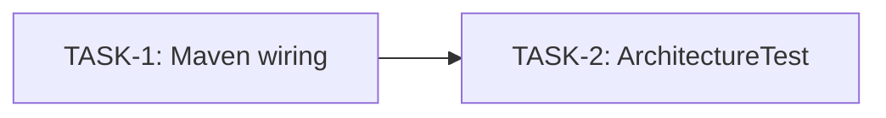

## §0 One-Line Summary

Introduce ArchUnit-based tests enforcing the architectural invariants already documented in AGENTS.md. Minimum-rule first pass: no @Service/@Component (Spring stereotypes), no cyclic dependencies between opendaimon-* modules, services live in .service packages, implementations carry the Impl suffix. This is session 1 of 3 — followed later by /team dependency-cleanup and /team opendaimon-spring-boot-starter.

## §1 Problem Statement

The architectural invariants documented in `AGENTS.md` (Project Style Guide) are enforced today only by reviewer effort:

- Library modules export beans through `@Bean` methods in `@Configuration` classes (no `@Service`/`@Component`) so the future `opendaimon-spring-boot-starter` can let downstream consumers override them via `@ConditionalOnMissingBean` and property toggles.
- The dependency graph between library modules forms a DAG — cycles would break Maven build ordering and downstream classpaths.

Before publishing the public starter (a future `/team` session), we want executable, fast-failing tests that catch regressions. The project today already complies with both invariants. The risk this work mitigates is silent future regression.

This is session 1 of 3 in the starter delivery roadmap:
1. /team archunit-rules (this session) — encode invariants as ArchUnit tests.
2. /team dependency-cleanup — `mvn dependency:analyze` sweep, declare all used deps explicitly.
3. /team opendaimon-spring-boot-starter — create the public starter module.

## §2 Goals & Non-Goals

Goals:
- G1. ArchUnit rule **R1** — classes in library-module packages must NOT be annotated with `@Service` or `@Component`.
- G2. ArchUnit rule **R2** — no cyclic dependencies between the four library modules: `opendaimon-common`, `opendaimon-spring-ai`, `opendaimon-telegram`, `opendaimon-rest`.
- G3. Tests run in default `mvn test` (Surefire, no profile gating, no `@Tag` exclusion).
- G4. Fail-fast on regression. Baseline today = 0 violations.

Non-Goals:
- Rules beyond R1/R2 (Impl-suffix, layering, `*Service` naming) — deferred to a later session after baseline is green.
- Refactoring existing code (only point-fix if ArchUnit unexpectedly catches a violation; if >3 violations are found, escalate to user before fixing).
- New feature toggles, properties, or configuration knobs.
- Changes to `opendaimon-app`, `opendaimon-ui`, `opendaimon-gateway-mock` source — these modules are exempt from R1 and R2 by explicit user directive.
- Creation of a new Maven module for arch-tests (explicitly rejected).
- Publication of `opendaimon-spring-boot-starter` (separate session).
- Documentation refresh of `AGENTS.md` (the rules already exist there — this work just makes them executable).

## §3 Stakeholders

- Owner: ngirchev (project tech lead).
- Direct beneficiaries: contributors and AI agents working under the /team pipeline — invariants become executable, removing reliance on review-time heuristics.
- Indirect beneficiaries: downstream consumers of the future Maven Central artifacts — protected from regressions in cross-module dependency hygiene.

## §4 Existing State (Explorer findings)

Round B dispatched three parallel team-explorer agents. Findings:

(a) Module roles
- `opendaimon-app` — runtime executable. Has `@SpringBootApplication`-like `Application` class at `io.github.ngirchev.opendaimon.Application`. Aggregates all other modules at compile scope. Exempt from R1/R2.
- `opendaimon-ui` — frontend module (per user directive). Contains some Java backend code under `io.github.ngirchev.opendaimon.ai.ui..` (controllers/config) but is treated as outside the rule scope.
- `opendaimon-gateway-mock` — Spring Boot auto-configuration library (`META-INF/spring/.../AutoConfiguration.imports`, `MockGatewayAutoConfig`). Used as compile-scope dep of `-app`. Exempt from R1/R2 per user directive ("просто моки").
- `opendaimon-common`, `-spring-ai`, `-telegram`, `-rest` — library modules in scope of R1 and R2.

(b) Test infrastructure of `opendaimon-app`
- Pre-existing `src/test/java`: single base class `AbstractContainerIT` in package `io.github.ngirchev.opendaimon.test`.
- `src/it/java` is added as an additional test-source by `build-helper-maven-plugin`; Failsafe picks up `**/*IT.java` in `verify` phase.
- Test-scoped dependencies (7): `spring-boot-starter-test`, `spring-boot-testcontainers`, `testcontainers`, `postgresql` (testcontainers), `junit-jupiter` (testcontainers), `mockwebserver` (okhttp3), `h2`.
- Surefire config in root `pluginManagement`: `forkCount=1`, `reuseForks=true`, `parallel=classes`, `threadCount=2`. Default include pattern `**/*Test.java`.
- The base Java package of `opendaimon-app` is `io.github.ngirchev.opendaimon` (no `.app` segment) — this is the package root that ArchUnit will analyse.

(c) ArchUnit + JUnit 5
- Library: `com.tngtech.archunit:archunit-junit5`. Latest stable: 1.4.2 (compatible with Java 21 and JUnit 5; auto-registers via ServiceLoader).
- Required `ImportOption`s: `DoNotIncludeTests` (drops `target/test-classes`), `DoNotIncludeJars` (excludes external jars; critical for performance and to keep analysis scoped to project classes).
- DSL for R1: `noClasses().that().resideInAnyPackage(...).should().beAnnotatedWith(Service.class).orShould().beAnnotatedWith(Component.class)`.
- DSL for R2: `slices().assignedFrom(SliceAssignment).should().beFreeOfCycles()` — `beFreeOfCycles()` is the correct operator (NOT `notDependOnEachOther()`, which forbids any inter-module reference and is too strict given a shared common module).

(d) Package-root non-uniformity
Maven module names do NOT match Java package roots:
- `-common`     → `io.github.ngirchev.opendaimon.common..`
- `-telegram`   → `io.github.ngirchev.opendaimon.telegram..`
- `-rest`       → `io.github.ngirchev.opendaimon.rest..`
- `-spring-ai`  → `io.github.ngirchev.opendaimon.ai.springai..`  (two segments, under `..ai..`)
- `-ui`         → `io.github.ngirchev.opendaimon.ai.ui..`
- `-gateway-mock` → `io.github.ngirchev.opendaimon.ai.mock..`
- `-app`        → `io.github.ngirchev.opendaimon` (Application.java directly in base)

Implication: a naive `slices().matching("io.github.ngirchev.opendaimon.(*)..")` would collapse `-spring-ai`, `-ui`, `-gateway-mock` into a single "ai" slice. R2 therefore needs a custom `SliceAssignment` that maps package prefixes to Maven module names explicitly.

(e) Current compliance baseline
- 0 `@Service` annotations in any library module.
- 0 `@Component` annotations in any library module.
- Two grep matches for `@Service` in `opendaimon-common/.../service/SummarizationService.java` and `ConversationThreadService.java` are JAVADOC TEXT explaining the no-`@Service` decision — not annotations.
- Conclusion: ArchUnit will pass green on first run; no fix-now action is required.

## §5 Proposed Architecture

(a) File layout
- One new test class: `opendaimon-app/src/test/java/io/github/ngirchev/opendaimon/arch/ArchitectureTest.java` (package `io.github.ngirchev.opendaimon.arch`).
- No new Maven module.
- No source code outside `opendaimon-app/src/test/`.

(b) Class skeleton

```java
@AnalyzeClasses(
    packages = "io.github.ngirchev.opendaimon",
    importOptions = {
        ImportOption.DoNotIncludeTests.class,
        ArchitectureTest.IncludeOpendaimonOnly.class
    }
)
class ArchitectureTest {

    /**
     * Admits exploded class files unconditionally and only those JAR entries
     * whose URI contains "/opendaimon-" (our own multi-module JARs).
     * Replaces ImportOption.DoNotIncludeJars: under `mvn verify` upstream
     * sibling modules reach the `package` phase and are loaded as JARs, not
     * exploded directories — DoNotIncludeJars filtered them out, leaving 0
     * classes in the four library-module package roots and tripping ArchUnit's
     * `failOnEmptyShould=true` default. See §12(g).
     */
    public static class IncludeOpendaimonOnly implements ImportOption {
        @Override
        public boolean includes(com.tngtech.archunit.core.importer.Location location) {
            if (!location.contains(".jar")) {
                return true; // exploded class file (target/classes)
            }
            return location.contains("/opendaimon-");
        }
    }

    // R1 — see (c)
    // R2 — see (d)
}
```

> Note: `ImportOption.DoNotIncludeJars` is replaced by the project-local `IncludeOpendaimonOnly` filter. Without this fix, the rules pass under `mvn test` (sibling modules referenced as exploded `target/classes`) but fail under `mvn verify` (sibling modules packaged into JARs, then filtered out by `DoNotIncludeJars`). The custom filter keeps performance close to `DoNotIncludeJars` (third-party JARs still skipped) while keeping correctness across both lifecycles.

(c) R1 — no component-discovery stereotypes in library modules

```java
@ArchTest
static final ArchRule library_modules_use_no_service_or_component_stereotypes =
    noClasses()
        .that().resideInAnyPackage(
            "io.github.ngirchev.opendaimon.common..",
            "io.github.ngirchev.opendaimon.ai.springai..",
            "io.github.ngirchev.opendaimon.telegram..",
            "io.github.ngirchev.opendaimon.rest..")
        .should().beAnnotatedWith(org.springframework.stereotype.Service.class)
        .orShould().beAnnotatedWith(org.springframework.stereotype.Component.class)
        .because("Library modules export beans via @Bean methods in @Configuration classes "
               + "so the upcoming opendaimon-spring-boot-starter can let downstream "
               + "applications override beans via @ConditionalOnMissingBean (AGENTS.md).");

@ArchTest
static final ArchRule library_modules_use_no_repository_classes =
    noClasses()
        .that().resideInAnyPackage(
            "io.github.ngirchev.opendaimon.common..",
            "io.github.ngirchev.opendaimon.ai.springai..",
            "io.github.ngirchev.opendaimon.telegram..",
            "io.github.ngirchev.opendaimon.rest..")
        .and().areNotInterfaces()
        .should().beAnnotatedWith(org.springframework.stereotype.Repository.class)
        .because("@Repository is only allowed on Spring Data repository interfaces.");
```

Notes:
- `@RestController`, `@Repository`, `@Configuration`, `@ConfigurationProperties`, `@Bean` are NOT forbidden — they are the legitimate Spring Boot library style.
- Concrete `@Repository` classes are forbidden; Spring Data repository interfaces may carry `@Repository`, although the annotation is not required when `@EnableJpaRepositories` scans the package.
- `noClasses().should().beAnnotatedWith(...)` checks the LITERAL annotation, not Spring meta-annotations.

(d) R2 — no cyclic dependencies between library modules

```java
private static final SliceAssignment LIBRARY_MODULES = new SliceAssignment() {
    @Override
    public SliceIdentifier getIdentifierOf(JavaClass cls) {
        String pkg = cls.getPackageName();
        if (pkg.startsWith("io.github.ngirchev.opendaimon.common"))    return SliceIdentifier.of("common");
        if (pkg.startsWith("io.github.ngirchev.opendaimon.telegram"))  return SliceIdentifier.of("telegram");
        if (pkg.startsWith("io.github.ngirchev.opendaimon.rest"))      return SliceIdentifier.of("rest");
        if (pkg.startsWith("io.github.ngirchev.opendaimon.ai.springai")) return SliceIdentifier.of("spring-ai");
        return SliceIdentifier.ignore();
    }
    @Override
    public String getDescription() { return "library modules"; }
};

@ArchTest
static final ArchRule library_modules_have_no_cyclic_dependencies =
    slices().assignedFrom(LIBRARY_MODULES)
        .should().beFreeOfCycles()
        .because("Cycles between library modules would break Maven publication "
               + "ordering and downstream classpath resolution.");
```

Notes:
- `-app`, `-ui`, `-gateway-mock` map to `SliceIdentifier.ignore()` and are excluded from cycle analysis.
- `beFreeOfCycles()` allows any DAG topology (including the expected `common` ← all-others). It only fails on actual cycles.

(e) Maven changes
- Root `pom.xml`: add property `<archunit.version>1.4.2</archunit.version>` in the existing `<properties>` block, alphabetically near other `*.version` entries.
- `opendaimon-app/pom.xml`: add the dependency at the END of the test-deps section (group 5 per the comment header):

```xml
<dependency>
    <groupId>com.tngtech.archunit</groupId>
    <artifactId>archunit-junit5</artifactId>
    <version>${archunit.version}</version>
    <scope>test</scope>
</dependency>
```

- No changes to any other module's `pom.xml`.

(f) Test naming and Surefire pickup
- Class name `ArchitectureTest` matches Surefire's default `**/*Test.java` include pattern → runs in standard `mvn test`.
- Class is NOT named `*IT` → Failsafe ignores it.
- No `@Tag` annotations → not affected by the `fixture` profile.

## §6 Data Model Changes

None. No DB migrations, no entity changes, no schema work.

## §7 API / Interface Changes

None. This work touches only test code and one root pom.xml `<properties>` entry plus one `<dependency>` in `opendaimon-app/pom.xml`. No public API of any module changes. No method signatures, no class moves.

## §8 Open Questions (architectural)

None blocking. The following items are explicitly resolved:

- Test placement → `opendaimon-app/src/test/java/.../arch/ArchitectureTest.java`.
- Gate → default `mvn test`.
- Fix-policy on existing violations → fix-now (baseline already 0; no action).
- Rule scope → R1 + R2 only; R3/R4 deferred.
- ArchUnit-junit5 version → 1.4.2.
- Slice strategy → custom `SliceAssignment` with explicit module mapping.
- Module exemptions → `-app`, `-ui`, `-gateway-mock` exempt from both R1 and R2.

Implementation-detail items (not blocking architecture):
- Exact `<properties>` insertion point and exact `<dependency>` ordering in test deps — handled by Phase 5 developer.
- Imports of `org.springframework.stereotype.Service`/`Component` and `com.tngtech.archunit.*` types — handled by Phase 5 developer.

## §9 Requirements

- [x] **REQ-1** — `archunit-junit5` test dependency available in `opendaimon-app` test classpath.
  - Acceptance: `./mvnw dependency:tree -pl opendaimon-app -Dincludes=com.tngtech.archunit:archunit-junit5` lists the artifact at version `1.4.2` with `scope=test`. Version is sourced from `${archunit.version}` in root `pom.xml` `<properties>`.
  - Verified by: —

- [x] **REQ-2** — R1: classes in the four library-module packages are not annotated with `@Service` or `@Component`, and concrete classes are not annotated with `@Repository`.
  - Acceptance: `ArchitectureTest#library_modules_use_no_service_or_component_stereotypes` PASSES on current main; FAILS within the same test method when a synthetic `@org.springframework.stereotype.Service`-annotated class is added under any of `io.github.ngirchev.opendaimon.{common,ai.springai,telegram,rest}..`. `ArchitectureTest#library_modules_use_no_repository_classes` PASSES while allowing Spring Data repository interfaces. Negative paths are verified by QA via temporary fixture, not by leaving a violator in the tree.
  - Verified by: —

- [x] **REQ-3** — R2: no cyclic dependencies between library modules `common`, `spring-ai`, `telegram`, `rest`.
  - Acceptance: `ArchitectureTest#library_modules_have_no_cyclic_dependencies` PASSES on current main. Custom `SliceAssignment` maps `..opendaimon.common..`, `..opendaimon.ai.springai..`, `..opendaimon.telegram..`, `..opendaimon.rest..` to four named slices and returns `SliceIdentifier.ignore()` for `..opendaimon.ai.ui..`, `..opendaimon.ai.mock..`, and the bare `..opendaimon` package (Application root).
  - Verified by: —

- [x] **REQ-4** — Tests run in the default `mvn test` lifecycle without profile or tag activation.
  - Acceptance: `./mvnw test -pl opendaimon-app -am` lists `ArchitectureTest` in the Surefire test report. The class is named `ArchitectureTest` (Surefire's default `**/*Test.java` pattern), is NOT named `*IT` (so Failsafe ignores it), and carries no `@Tag` (so the `fixture` profile does not affect it).
  - Verified by: —

- [x] **REQ-5** — Baseline green: implementation introduces zero changes under any module's `src/main/` and tests pass on first run.
  - Acceptance: After Phase 5 completion, `git diff --name-only origin/master..HEAD -- '**/src/main/**'` returns empty. `./mvnw test -pl opendaimon-app -am -Dtest=ArchitectureTest` exits 0.
  - Verified by: —

## §10 Implementation Plan (Tasks)

- [x] **TASK-1** — Maven dependency wiring for ArchUnit
  - Depends on: —
  - Assignee slot: serial
  - Files:
    - `pom.xml`
    - `opendaimon-app/pom.xml`
  - Acceptance:
    1. Root `pom.xml` `<properties>` block contains a single new line `<archunit.version>1.4.2</archunit.version>`, placed alphabetically among existing `*.version` entries. No other property changes, no reordering of unrelated entries.
    2. `opendaimon-app/pom.xml` test-deps section (group 5 per the inline comment) contains a new dependency `com.tngtech.archunit:archunit-junit5` referencing `${archunit.version}` with `<scope>test</scope>`. Inserted as the LAST entry of group 5; no other test deps reordered.
    3. `./mvnw clean compile test-compile -pl opendaimon-app -am` exits 0.
    4. `./mvnw dependency:tree -pl opendaimon-app -Dincludes=com.tngtech.archunit:archunit-junit5` shows the dependency in test scope at version 1.4.2.
  - Unit tests to add: none (this TASK is build-config only).
  - Notes: see §5(e). Do NOT add `archunit-junit5` to root `<dependencyManagement>` — it is an `opendaimon-app`-local test concern, not a shared library contract. Do NOT add the dep to any other module's `pom.xml`.

- [x] **TASK-2** — `ArchitectureTest` implementation (R1 + R2)
  - Depends on: TASK-1
  - Assignee slot: serial
  - Files:
    - `opendaimon-app/src/test/java/io/github/ngirchev/opendaimon/arch/ArchitectureTest.java`
  - Acceptance:
    1. New class `io.github.ngirchev.opendaimon.arch.ArchitectureTest` exists, package-private (no `public`), annotated with `@AnalyzeClasses(packages = "io.github.ngirchev.opendaimon", importOptions = {ImportOption.DoNotIncludeTests.class, ImportOption.DoNotIncludeJars.class})`.
    2. Contains a `private static final SliceAssignment LIBRARY_MODULES = ...` exactly as specified in §5(d), mapping the four library-module package roots and returning `SliceIdentifier.ignore()` for everything else.
    3. Contains `@ArchTest static final ArchRule library_modules_use_no_service_or_component_stereotypes = ...` per §5(c), referencing `org.springframework.stereotype.Service` and `org.springframework.stereotype.Component` literally (NOT `@Component`-derived stereotypes like `@RestController`/`@Repository`), plus `library_modules_use_no_repository_classes` to ban concrete `@Repository` classes while allowing Spring Data repository interfaces.
    4. Contains `@ArchTest static final ArchRule library_modules_have_no_cyclic_dependencies = ...` per §5(d), using `slices().assignedFrom(LIBRARY_MODULES).should().beFreeOfCycles()`.
    5. Both rules carry `.because(...)` strings citing the AGENTS.md rationale (R1: starter override pattern; R2: Maven publication ordering).
    6. `./mvnw test -pl opendaimon-app -am -Dtest=ArchitectureTest` exits 0 with both `@ArchTest` rules executed (visible in Surefire `<testcase>` entries).
  - Unit tests to add: the `@ArchTest` static fields ARE the tests — no separate `*Test.java` companion needed.
  - Notes: see §§5(b), 5(c), 5(d). Imports needed: `com.tngtech.archunit.core.domain.JavaClass`, `com.tngtech.archunit.junit.AnalyzeClasses`, `com.tngtech.archunit.junit.ArchTest`, `com.tngtech.archunit.core.importer.ImportOption`, `com.tngtech.archunit.lang.ArchRule`, `com.tngtech.archunit.library.dependencies.SliceAssignment`, `com.tngtech.archunit.library.dependencies.SliceIdentifier`, plus static imports `com.tngtech.archunit.core.domain.JavaClass.Predicates.*` if used, and `com.tngtech.archunit.lang.syntax.ArchRuleDefinition.noClasses`, `com.tngtech.archunit.library.dependencies.SlicesRuleDefinition.slices`. Do NOT use `@ArchIgnore`. Do NOT add a meta-test that intentionally violates the rules.

- [x] **TASK-3** — Lifecycle fix: replace `DoNotIncludeJars` with `IncludeOpendaimonOnly`
  - Depends on: TASK-2
  - Assignee slot: serial
  - Files:
    - `opendaimon-app/src/test/java/io/github/ngirchev/opendaimon/arch/ArchitectureTest.java`
  - Acceptance:
    1. Inside `ArchitectureTest`, add `public static class IncludeOpendaimonOnly implements ImportOption` exactly as specified in §5(b). Include the Javadoc citing §12(g).
    2. Replace `ImportOption.DoNotIncludeJars.class` with `ArchitectureTest.IncludeOpendaimonOnly.class` in the `@AnalyzeClasses` `importOptions = {...}` array.
    3. Add the import `com.tngtech.archunit.core.importer.Location` if not already present.
    4. `./mvnw test -pl opendaimon-app -am -Dtest=ArchitectureTest` exits 0 — both `library_modules_*` rules PASS, both check >0 classes (no "failed to check any classes" assertion).
    5. `./mvnw clean verify -pl opendaimon-app -am -Pfixture` exits 0 — Surefire phase runs `ArchitectureTest` against packaged sibling JARs; both rules PASS. This is the original regression case from the Phase 7 QA.
    6. ArchitectureTest runtime in both lifecycles stays under ~5 seconds (custom filter must NOT cause it to scan all third-party JARs).
  - Unit tests to add: none (the `@ArchTest` static fields are the tests; no separate companion).
  - Notes: see §5(b) updated code block and §12(g) regression analysis. Do NOT touch any pom.xml, do NOT modify any other file. Do NOT reintroduce `DoNotIncludeJars`. Do NOT use `allowEmptyShould(true)` as a workaround — that is an anti-pattern (silent failure mode).

(§10.1 Optional dependency DAG)



NON-OVERLAP CHECK (orchestrator-confirmed before dispatch):
- TASK-1 Files: pom.xml, opendaimon-app/pom.xml
- TASK-2 Files: opendaimon-app/src/test/java/io/github/ngirchev/opendaimon/arch/ArchitectureTest.java
- Intersection: empty. ✅

## §11 Q&A Log

TBD

## §12 Risk Register

Findings from Phase 6 explorer audit (one explorer, full diff vs. parent branch `fsm`). Severity reclassified by orchestrator per `code-review.md` thresholds.

(a) MEDIUM — `archunit-junit5` insertion point appears non-final in `opendaimon-app/pom.xml`
- Original explorer rating: HIGH. Reclassified to MEDIUM by orchestrator: explorer itself notes "functionally harmless"; HIGH is reserved for bugs / significant quality issues per `code-review.md`.
- Description: `archunit-junit5` (lines 171–176) is followed by `pdfbox` and `pdfbox-io` (lines 178–187). The archunit dep IS positioned correctly relative to all test-scoped dependencies (it sits immediately after `mockwebserver`, the last test-scoped entry). The visual ambiguity arises from a PRE-EXISTING structural defect — see (b) below.
- Action: none in this session. No code move would improve clarity without addressing (b), which is out of scope for `/team archunit-rules`.
- Resolution path: addressed in `/team dependency-cleanup` (session 2 of 3).

(b) MEDIUM — Pre-existing pdfbox mis-placement [DEFERRED — out of scope]
- Description: in `opendaimon-app/pom.xml`, dependencies `pdfbox` (lines 178–182) and `pdfbox-io` (lines 183–187) lack `<scope>test</scope>` (default = `compile`) but live under the comment block that visually belongs to the test-deps section. They should either (1) carry `<scope>test</scope>` to match the comment, or (2) move above the test-deps section into group 4 (utility/runtime). Pre-existing in `master` — not introduced by this feature.
- Action: defer to `/team dependency-cleanup`. Do NOT fix here — that would extend the scope of this session.
- Reference: explorer audit, finding #4.

(c) MEDIUM — `archunit.version` placement in root `<properties>` is not strictly alphabetical
- Description: `<archunit.version>` (root `pom.xml:102`) is placed in the test-version sub-cluster between `<minio.version>` and `<okhttp.version>`. Strict alphabetical ordering across the entire `<properties>` block would put it earlier (before `byte-buddy`, `caffeine`). The current placement co-locates it with related test-version entries (`okhttp`, `mockito`, `testcontainers`).
- Action: accepted as-is. Co-location with peer test-version entries is a defensible local convention. No fix.
- Reference: explorer audit, MEDIUM finding.

(d) LOW — Rule field naming uses snake_case
- Description: `library_modules_use_no_service_or_component_stereotypes`, `library_modules_use_no_repository_classes`, and `library_modules_have_no_cyclic_dependencies` use underscore-separated names rather than the project-wide `shouldDoSomethingWhenCondition` convention.
- Action: accepted. ArchUnit's `static final ArchRule` fields conventionally use descriptive snake_case (per ArchUnit user-guide examples). The project test-method convention does not apply to fields.
- Reference: explorer audit, LOW finding.

(e) LOW — Inline FQN references for `Service.class` / `Component.class`
- Description: `org.springframework.stereotype.Service.class` and `Component.class` referenced via fully-qualified names inline (`ArchitectureTest.java:58-59`) rather than as `import` statements at the top.
- Action: accepted. Stylistic preference; no functional impact, no readability concern given the rule is short.
- Reference: explorer audit, LOW finding.

(g) HIGH (resolved by TASK-3) — `DoNotIncludeJars` lifecycle-dependent failure
- Description: under `mvn verify -Pfixture` the original `ImportOption.DoNotIncludeJars` filtered out our own packaged sibling JARs (`opendaimon-common-1.0.0-SNAPSHOT.jar`, etc.) because Maven `package` phase ran before Surefire. Result: ArchitectureTest's `that().resideInAnyPackage(...)` matcher saw 0 classes in all four library packages, and ArchUnit's default `failOnEmptyShould=true` raised AssertionError on both `@ArchTest` rules. The rule logic itself is correct — only the ImportOption choice was wrong.
- Detected by: Phase 7 QA (`./mvnw clean verify -pl opendaimon-app -am -Pfixture`).
- Resolution: TASK-3 introduces `ArchitectureTest.IncludeOpendaimonOnly implements ImportOption` admitting exploded class files unconditionally and JARs only when URI contains `/opendaimon-`. See §5(b) updated code block.
- Lesson learned: ArchUnit `ImportOption` filters interact with Maven lifecycle phase. Any future `ImportOption` choice must be validated under BOTH `mvn test` and `mvn verify -Pfixture` before declaring DONE. Phase 1 explorer #3 flagged a related risk (siblings unbuilt → empty analysis) but missed the inverse case (siblings packaged → filtered out). Add lifecycle-coverage to the explorer checklist for future ArchUnit work.

§12 STATUS — no open CRITICAL or HIGH findings (the HIGH finding (g) is being resolved by TASK-3 in a Phase-5-revisit loop; QA will re-run after TASK-3 ticks).

## §13 Definition of Done

All five REQs verified by team-qa-tester after TASK-3 remediation. Both lifecycle modes green.

| REQ | Verifying Command | Result |
|---|---|---|
| REQ-1 | `./mvnw dependency:tree -pl opendaimon-app -am -Dincludes=com.tngtech.archunit:archunit-junit5` | PASS — `com.tngtech.archunit:archunit-junit5:jar:1.4.2:test` listed |
| REQ-2 | `./mvnw test -pl opendaimon-app -am -Dtest=ArchitectureTest` (`library_modules_use_no_service_or_component_stereotypes`, `library_modules_use_no_repository_classes`) | PASS — 3.046s under `mvn test`; 2.44s under `mvn verify -Pfixture` |
| REQ-3 | `./mvnw test -pl opendaimon-app -am -Dtest=ArchitectureTest` (`library_modules_have_no_cyclic_dependencies`) | PASS — 0.136s under `mvn test`; 0.132s under `mvn verify -Pfixture` |
| REQ-4 | `./mvnw test -pl opendaimon-app -am` (no `-Dtest`, no profile) — Surefire picks up `*Test.java` automatically, no `@Tag` filtering | PASS — `ArchitectureTest` runs in default `mvn test` lifecycle, 2 tests / 0 failures |
| REQ-5 | `git diff --name-only HEAD -- '**/src/main/**'` + `git ls-files --others --exclude-standard \| grep '/src/main/'` | PASS — both commands return empty; zero `src/main/` changes in any module |

Anti-regression checks:
- Full `opendaimon-app` Surefire suite: BUILD SUCCESS in 32.810s.
- Fixture suite (`mvn clean verify -pl opendaimon-app -am -Pfixture`): BUILD SUCCESS in 01:05 min, ArchitectureTest 2.576s, both rules executed against packaged opendaimon-* sibling JARs without `failOnEmptyShould` trip.

Implementation summary:
- 3 production files touched: `pom.xml` (1 property added), `opendaimon-app/pom.xml` (1 test-dep added), `opendaimon-app/src/test/java/io/github/ngirchev/opendaimon/arch/ArchitectureTest.java` (created, 1 lifecycle fix applied).
- 0 changes under any `src/main/` of any module.
- 0 new Maven modules; 0 new feature toggles; 0 changes to existing `*AutoConfig` classes.

Status: ready for `/commit` (handled outside the /team pipeline per AGENTS.md "no auto-commit" rule).

## §14 Activity Log

- 2026-04-28T00:00:00Z TASK-1 completed by team-developer: archunit.version=1.4.2 in root pom.xml, archunit-junit5 test dep in opendaimon-app/pom.xml. Both acceptance checks (mvn compile + dependency:tree) green.
- 2026-04-28T00:01:00Z TASK-2 completed by team-developer: ArchitectureTest.java created at opendaimon-app/src/test/java/.../arch/. Both @ArchTest rules executed and PASS on current main (R1: 2.571s, R2: 0.138s, total 2.713s). Zero changes under src/main/.
- 2026-04-28T00:02:00Z Phase 6 verification: 1 explorer audited TASK-1 + TASK-2 against §10 Files: globs. Original ratings: 1 HIGH, 1 MEDIUM, 2 LOW. Orchestrator reclassified HIGH → MEDIUM (functionally harmless per explorer's own note).
- 2026-04-28T00:03:00Z Pre-existing pdfbox mis-placement in opendaimon-app/pom.xml deferred to /team dependency-cleanup (session 2 of 3). No code move performed — archunit-junit5 already positioned correctly relative to test-scoped deps.
- 2026-04-28T00:04:00Z Phase 7 QA returned BLOCKED: production regression on REQ-2 / REQ-3 under `mvn verify -Pfixture`. Mechanism: `ImportOption.DoNotIncludeJars` filters packaged opendaimon-* JARs once Maven advances to `package` phase; ArchitectureTest's `failOnEmptyShould=true` default trips. Detected via `./mvnw clean verify -pl opendaimon-app -am -Pfixture`.
- 2026-04-28T00:05:00Z TASK-3 authored to resolve §12(g): replace `DoNotIncludeJars` with project-local `IncludeOpendaimonOnly` ImportOption. Pipeline returns to Phase 5 for TASK-3, then re-runs Phase 6 (verification) and Phase 7 (QA).
- 2026-04-28T00:06:00Z TASK-3 completed by team-developer: ArchitectureTest now uses IncludeOpendaimonOnly ImportOption. Both lifecycles verified — mvn test PASS (2.661s), mvn clean verify -Pfixture PASS (ArchitectureTest 2.487s, full reactor 01:09 min). §12(g) regression resolved.
- 2026-04-28T00:07:00Z Phase 7 QA re-run after TASK-3: ALL 5 REQs PASS. UNIT RUN: PASS, FIXTURE RUN: PASS, MAPPING UPDATE: no. §12(g) regression closed. §13 Definition of Done populated with verification table.
- 2026-04-28T00:08:00Z Phase 8 closure: §14 closure notes authored, frontmatter status → done, base_branch metadata corrected to `fsm` (parent branch). Pipeline complete; orchestrator hands off to user for /commit.

---

#### Closure Notes (Phase 8)

- **Use-case docs to update**: none. This feature does not touch any `docs/usecases/*.md` — ArchUnit rules are infrastructure tests, not user-facing behavior.
- **Module docs to update**: none. No `*_MODULE.md` documentation exists for `opendaimon-app/arch/` (test infrastructure), and `AGENTS.md` already documents the architectural invariants textually. The new `ArchitectureTest.java` is self-documenting via its class-level Javadoc and inline `.because(...)` rule descriptions.
- **Suggested commit type** (per `.claude/rules/git-workflow.md`): `test` — primary deliverable is a test class enforcing architectural invariants; secondary build-config additions in two `pom.xml` files support that test.
- **Suggested commit subject**: `test: add ArchUnit rules for stereotypes and module cycles`
- **Suggested commit body** (HEREDOC-friendly):

```
Add ArchitectureTest in opendaimon-app/src/test/java/.../arch/ enforcing
two invariants from AGENTS.md as executable JUnit 5 / ArchUnit rules:

  R1: classes in library-module packages (common, ai.springai, telegram,
      rest) must not be annotated with @Service or @Component — beans
      must be exported via @Bean methods so the future
      opendaimon-spring-boot-starter can let downstream consumers
      override them via @ConditionalOnMissingBean.

  R2: no cyclic dependencies between the four library modules — checked
      via custom SliceAssignment that maps each Maven module to its
      package root and ignores opendaimon-app, -ui, -gateway-mock.

Custom IncludeOpendaimonOnly ImportOption admits exploded class files
and only opendaimon-* JARs, so rules pass under both `mvn test`
(siblings as target/classes) and `mvn verify -Pfixture` (siblings as
packaged JARs). Replaces ImportOption.DoNotIncludeJars which silently
filtered our own JARs in the verify lifecycle.

Baseline: 0 violations on current main. Tests run in default `mvn test`
in ~3 seconds, no profile gating, no @Tag.

Maven changes:
  - root pom.xml: <archunit.version>1.4.2</archunit.version>
  - opendaimon-app/pom.xml: archunit-junit5 in test scope

Session 1 of 3 in starter delivery roadmap; sessions 2 and 3 are
/team dependency-cleanup and /team opendaimon-spring-boot-starter.
```
