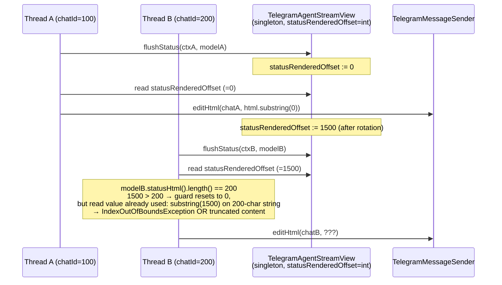
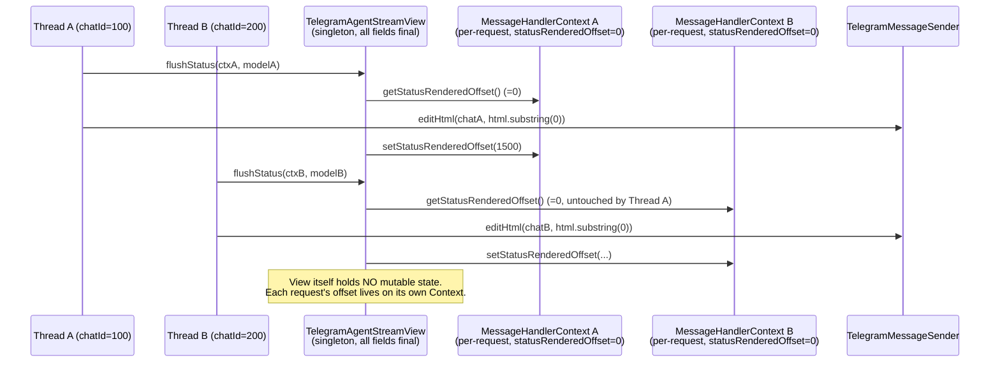
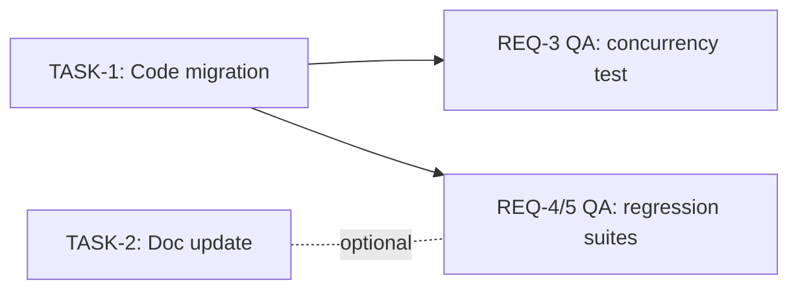

# TD-1: Isolate per-stream offset state from singleton TelegramAgentStreamView

## 1. Problem Statement

TelegramAgentStreamView is a Spring singleton bean (registered via @Bean in TelegramCommandHandlerConfig:241-246) but holds a mutable `int statusRenderedOffset` field at `opendaimon-telegram/src/main/java/io/github/ngirchev/opendaimon/telegram/service/TelegramAgentStreamView.java:22`. The field is read at lines 55, 58, 74 and written at lines 56, 74 inside `flushStatus(...)`.

Because the bean is shared across all concurrent agent streams in different chats:
- User A's status rotation writes `statusRenderedOffset = 1500`
- Concurrent User B with a much shorter `model.statusHtml()` reads that offset → `substring(1500)` on a shorter string → either `IndexOutOfBoundsException` or wrong content sent to Telegram
- The guard at line 55 (`if (statusRenderedOffset > fullHtml.length()) statusRenderedOffset = 0;`) is not atomic — check-then-act races between threads
- `TelegramChatPacer` serializes operations within a single `chatId` but provides NO ordering between different chats

This was identified as TD-1 during the post-mortem of the "На ос" duplication bug fixed in commit c2d6a66, where audit of `TelegramAgentStreamView` surfaced the singleton-state issue as a separate concern that must be addressed before merging the `fsm-5-3-telegram-stream-view` feature to master.

## 2. Business Context & Goals

Move `statusRenderedOffset` from the singleton `TelegramAgentStreamView` to per-request state living in `MessageHandlerContext` (which already holds `statusMessageId`, `tentativeAnswerMessageId`, `lastStatusEditAtMs`, etc. — natural neighbor by concept).

After the fix:
- `TelegramAgentStreamView` declares only `final` fields → truly stateless singleton
- The offset is read/written via `ctx.getStatusRenderedOffset()` / `ctx.setStatusRenderedOffset(int)` throughout `flushStatus`
- A regression test demonstrates two concurrent `MessageHandlerContext` instances flushing through the same View instance without state leakage

## 3. Non-Goals / Out of Scope

- TD-2: 16-arg constructor refactor of `TelegramMessageHandlerActions` — separate /team session
- TD-4: IT wiring duplication across `TelegramFixtureConfig` / `TelegramMockGatewayIT` / `MessageTelegramCommandHandlerIT` — separate /team session
- TD-5: Legacy tentative-bubble dead code in `TelegramMessageHandlerActions` (`promoteTentativeAnswer`, `editTentativeAnswer`, `forceFinalAnswerEdit`, `rollbackAndAppendToolCall`, `handlePartialAnswer`, `handleAgentStreamEvent` and related constants) — separate /team session
- Any change to streaming UX behavior — this is a pure isolation refactor, no observable behavior change for end users
- Conversion of `MessageHandlerContext` to immutable / record — out of scope (`StateContext` mutable accumulator pattern documented in `.claude/rules/java/coding-style.md`)

### Future tech-debt items surfaced during TD-1 discovery (NOT addressed in this PR)

The Phase 1 singleton-bean audit (team-explorer Round B) of `opendaimon-telegram` found additional concurrency / lifecycle issues. They are filed here so the next /team session can pick them up; explicitly out of scope for THIS PR (per user choice in Phase 1 Round A: "Строго TD-1, без побочных правок").

- **TD-future-A: `InMemoryModelSelectionSession` — atomic cache-aside pattern (MEDIUM).** Lines 26-31 use non-atomic `get()+put()`. Under concurrent requests for the same userId, the AI-gateway fetcher may be called more than once and the second result silently overwrites the first. Replace with `computeIfAbsent` or CAS-equivalent. Impact: redundant rate-limited AI calls, not data corruption.
- **TD-future-B: `TelegramChatPacerImpl.slots` unbounded growth (LOW).** `ConcurrentHashMap<Long, ChatSlot>` grows forever as new chatIds arrive; entries are never evicted. A `Caffeine` cache with time-based expiry would bound memory. Impact: long-running bot leaks memory in proportion to unique chat count.
- **TD-future-C: `TelegramBotMenuService.currentMenuVersionHash` — test isolation (LOW).** `volatile` reference set once via DCL pattern at construction; correct at runtime, but stateful under Spring test-context reuse → could produce stale hash false-positives in `@DirtiesContext` cascades. Consider `@PostConstruct` re-init or scope to per-context.

Audit confirmed only 1 AT-RISK bean (TelegramAgentStreamView — current TD-1 scope). Count is under the systemic threshold (5 AT-RISK beans = ArchUnit/lint rule warranted), so per-bean fixes are appropriate going forward.

## 4. Existing State (Phase 1 Discovery)

### MessageHandlerContext (target for the new field)

Source: `opendaimon-telegram/src/main/java/io/github/ngirchev/opendaimon/telegram/command/handler/impl/fsm/MessageHandlerContext.java`

- **Class shape:** `public final class MessageHandlerContext implements StateContext<MessageHandlerState>` (line 38). NO Lombok anywhere — every accessor is explicit Java. Mix of `final` (immutable-after-construction collaborators set via constructor) and non-final (FSM-actions / view-populated render state) fields.
- **NOT Serializable.** Does not implement `java.io.Serializable`; `StateContext` is an external library marker but no persistence path uses `MessageHandlerContext`. Verified via `find_referencing_symbols` — no `ObjectOutputStream`, no Jackson read/write of the context. Adding a primitive int field carries zero schema-migration risk.
- **Lifecycle:** Instantiated fresh per Telegram message in `MessageTelegramCommandHandler.handleInner():83-84`, lives for one `handlerFsm.handle(ctx, ...)` invocation, then GC'd. No pooling, no reuse — per-request scope is the same isolation guarantee we need.
- **Existing precedent for primitive-int progressive cursor:** `private int toolMarkerScanOffset;` at line 112 (an offset into `tentativeAnswerBuffer` tracking how far tool-marker scanning has progressed). Accessor pair at lines 392-398 uses hand-written `getToolMarkerScanOffset()` / `setToolMarkerScanOffset(int)`. Reset via `this.toolMarkerScanOffset = 0;` inside `resetTentativeAnswer()` (line 407).
- **Render-state field neighborhood (where the new field belongs):** `Integer statusMessageId` (line 92), `final StringBuilder statusBuffer` (line 93), `long lastStatusEditAtMs` (line 94, set by `markStatusEdited()` at line 334). The new `statusRenderedOffset` is conceptually a sibling of these three.

### TelegramAgentStreamView (source of the migrated field)

Source: `opendaimon-telegram/src/main/java/io/github/ngirchev/opendaimon/telegram/service/TelegramAgentStreamView.java`

- **Singleton bean** registered via `@Bean` in `TelegramCommandHandlerConfig:241-246`. Spring default scope = singleton.
- **Mutable field:** `private int statusRenderedOffset;` at line 22. Read at lines 55, 58, 74. Written at lines 56, 74 inside `flushStatus(...)`. Guard at line 55 (`if (statusRenderedOffset > fullHtml.length()) statusRenderedOffset = 0;`) is non-atomic check-then-act — races between concurrent threads handling different chats.
- **Other fields are safe:** `messageSender`, `telegramChatPacer`, `telegramProperties` all `final`. Removing `statusRenderedOffset` makes the View truly stateless.
- **Concurrency boundary:** `TelegramChatPacer` serializes operations within a single `chatId` but provides NO ordering between different chats. So concurrent `flushStatus` calls from chats A and B race on the shared offset.

### Singleton-bean audit summary (opendaimon-telegram, full module sweep)

| Bean class | Mutable field | Severity | Disposition |
|---|---|---|---|
| `TelegramAgentStreamView` | `int statusRenderedOffset` | HIGH | TD-1 — fixed in this PR |
| `InMemoryModelSelectionSession` | non-atomic `get()+put()` on `userCache` | MEDIUM | TD-future-A (deferred) |
| `TelegramChatPacerImpl.slots` | unbounded `ConcurrentHashMap` growth | LOW | TD-future-B (deferred) |
| `TelegramBotMenuService.currentMenuVersionHash` | volatile DCL field, test-context reuse risk | LOW | TD-future-C (deferred) |
| `TelegramAgentStreamRenderer` | `final ObjectMapper` | SAFE | n/a |
| `TelegramMessageSender` | all `final` thread-safe collaborators | SAFE | n/a |
| `TelegramChatPacerImpl.ChatSlot.nextAllowedAtMs` | `synchronized`-protected `long` | SAFE | n/a (correct monitor discipline) |
| `TypingIndicatorService.activeTypingIndicators` | `final ConcurrentHashMap`, replace-not-mutate values | SAFE | n/a |
| `TelegramMessageCoalescingService.pendingByKey` | `final ConcurrentHashMap`, immutable record values | SAFE | n/a |

### Phase 1 Round A user decisions (constraints for Phase 2 architecture)

- **Concurrency test style:** real threads + `CountDownLatch` (`Executors.newFixedThreadPool(2)`, both threads await a shared latch, then perform parallel `flushStatus(ctx, model)` calls on a single `TelegramAgentStreamView` instance with two distinct `MessageHandlerContext` instances; assert each context's offset advances independently). Rationale: catches real interleavings; deterministic-only simulator was rejected because it could miss subtle JVM memory-model edge cases.
- **Adjacent singleton-bean issues found by Explorer 2:** logged as TD-future-A/B/C in §3, NOT fixed in this PR. Strict TD-1 scope confirmed.

## 5. Proposed Architecture

TO-BE diff vs §4: `TelegramAgentStreamView` becomes a truly stateless singleton (only `final` fields). The progressive-render cursor `statusRenderedOffset` migrates from a singleton field into `MessageHandlerContext`, joining its conceptual siblings `statusMessageId` (Integer), `statusBuffer` (StringBuilder), and `lastStatusEditAtMs` (long). Each per-message context already provides the per-request scope needed for isolation.

### 5.1 Component diagram / flow

#### AS-IS (race)


#### TO-BE (isolated)


### 5.2 Module impact

- **`opendaimon-telegram`** (production):
  - `service/TelegramAgentStreamView.java` — remove `private int statusRenderedOffset;` field; replace 5 read/write occurrences inside `flushStatus(...)` with `ctx.getStatusRenderedOffset()` / `ctx.setStatusRenderedOffset(int)`. After change, every instance field is `final`.
  - `command/handler/impl/fsm/MessageHandlerContext.java` — add `private int statusRenderedOffset;` declaration adjacent to `lastStatusEditAtMs` (line 94 area); add hand-written `getStatusRenderedOffset()` / `setStatusRenderedOffset(int)` accessors adjacent to `markStatusEdited()` (line 334 area). NO Lombok (matches class convention). Field defaults to 0 implicitly (matches `toolMarkerScanOffset` precedent at line 112).
- **`opendaimon-telegram`** (tests):
  - new file `src/test/java/.../service/TelegramAgentStreamViewConcurrencyTest.java` — exercises two real threads through one View instance with two distinct Contexts, asserts offset isolation.
- **`opendaimon-telegram`** (docs):
  - `TELEGRAM_MODULE.md` — add one sentence in the "Agent Streaming Internals" section noting that `TelegramAgentStreamView` is stateless and the per-stream render offset lives on `MessageHandlerContext`.
- **`opendaimon-app`**: NO changes. `TelegramAgentStreamView`'s public constructor signature is unchanged → IT wiring (the three files patched in commit 2d909db) is unaffected. This is a deliberate design choice — TD-4 (IT wiring duplication) is out of scope.
- **No other modules touched.**

### 5.3 Data model
— not applicable. No entities, no migrations, no JPA changes.

### 5.4 Configuration
— not applicable. No new `open-daimon.*` properties, no `FeatureToggle` constants. The fix is purely a state-ownership refactor.

### 5.5 Metrics
— not applicable. No new metrics on `OpenDaimonMeterRegistry`. (Adding a metric like `telegram.agent.stream.race-recovery.count` was considered but rejected — after the fix, races by construction cannot occur, so a recovery counter would always read 0.)

### 5.6 AI integration
— not applicable. No AI calls; this is pure infrastructure plumbing.

## 6. Alternatives Considered

### Option A — Move `statusRenderedOffset` into `MessageHandlerContext`
- **Pros:**
  - Mirrors the existing `toolMarkerScanOffset` precedent at `MessageHandlerContext:112` (same pattern, same module).
  - Per-request lifecycle (`MessageTelegramCommandHandler.handleInner():83-84` creates fresh Context per message) gives natural isolation — no synchronization primitives needed.
  - `TelegramAgentStreamView` becomes a true stateless singleton (only `final` fields), trivially safe under any future scaling (multiple Spring contexts, classpath reloading).
  - Zero impact on public API — View's constructor unchanged → IT wiring unaffected (preserves TD-4 separation).
  - Zero serialization risk (Phase 1 confirmed Context is not persisted anywhere).
- **Cons:**
  - One extra field on an already-large `MessageHandlerContext` class. Mitigated by the natural conceptual fit with sibling fields `statusMessageId`/`statusBuffer`/`lastStatusEditAtMs`.
  - View now reads/writes through accessor calls instead of direct field access — negligible JIT overhead.

### Option B — Convert `statusRenderedOffset` to a `ThreadLocal<Integer>` on the View
- **Pros:**
  - Smaller diff: only `TelegramAgentStreamView` changes, no Context modification.
  - Survives across method calls within the same thread without explicit threading.
- **Cons:**
  - **DEALBREAKER for this codebase**: agent streaming uses `reactor.core.publisher.Mono`/`Flux` (`TelegramMessageHandlerActions.generateAgentResponse():410-420` chains a `.concatMap` over `executeStream(...)`). Reactor schedulers freely reassign work between threads; ThreadLocal contents are not propagated unless `Schedulers.onScheduleHook()` is configured project-wide, which it is not.
  - Requires explicit `ThreadLocal.remove()` in a finally-block to prevent classloader leaks in the application server — error-prone.
  - Singleton bean still has mutable state, just hidden behind ThreadLocal — future maintainers might add another mutable field thinking the precedent is set.

### Option C — Make `TelegramAgentStreamView` a prototype-scoped or request-scoped bean
- **Pros:**
  - Conceptually cleanest: each agent stream gets its own View instance, all fields naturally per-request.
- **Cons:**
  - **DEALBREAKER**: `TelegramAgentStreamView` is injected as a `final` field into `TelegramMessageHandlerActions` (constructor param at `TelegramCommandHandlerConfig:265`) and similar IT factories (3 places). All 4 injection points expect a singleton; switching to prototype scope without `ObjectProvider<TelegramAgentStreamView>` indirection would silently get only the first-resolved instance, defeating the purpose.
  - Significant refactor — would need to wrap all injections with `ObjectProvider`, change every call from `agentStreamView.flush(...)` to `agentStreamView.getObject().flush(...)`. Touches 4+ files and contradicts the "strict TD-1 scope" non-goal.
  - Spring `@RequestScope` requires a Servlet request — not applicable here (Telegram updates are not HTTP requests).

### **Chosen: Option A** — move the field to `MessageHandlerContext`.

Justification: lowest-blast-radius change with the strongest existing precedent (`toolMarkerScanOffset`). Eliminates mutable singleton state by construction (no synchronization primitives, no ThreadLocal cleanup, no Spring scope rewiring). Per-request scope is automatic from existing context lifecycle. Public API of View unchanged → TD-4 separation preserved.

## 7. Risks & Mitigations

| Severity | Risk | Mitigation |
|---|---|---|
| MEDIUM | A future contributor adds another mutable field to `TelegramAgentStreamView`, reintroducing the same anti-pattern. | Mark all View instance fields `final` after the change (compile-time enforcement); add a class-level Javadoc noting "stateless singleton — all per-request state lives on `MessageHandlerContext`." Optional: ArchUnit rule for `service.TelegramAgent*View` to enforce all-final fields (logged as TD-future-D below; not addressed here). |
| LOW | The `flushStatus` rotation path (lines 70-83 in current code) writes `statusRenderedOffset` on the same call as `setStatusMessageId(nextId)` — if accessor names are similar, an editor's auto-complete could swap them silently. | Naming chosen distinct (`setStatusRenderedOffset` vs `setStatusMessageId`); regression test asserts both fields advance correctly. |
| LOW | `resetTentativeAnswer()` (`MessageHandlerContext:401`) zeros `toolMarkerScanOffset`. If the streaming flow ever introduces a similar reset path for status state, `statusRenderedOffset` may need symmetric reset there. | Phase 1 explorer flagged this. Decision deferred to Phase 4 task breakdown: a one-line check in TASK comments asks the developer to grep for `resetTentativeAnswer` callsites and confirm that no status-message reset path currently exists; if it does, add `statusRenderedOffset = 0` to it. Currently no such callsite — `resetTentativeAnswer` is invoked only from `rollbackAndAppendToolCall` which leaves the status message untouched. |
| LOW | The new concurrency test using `Executors.newFixedThreadPool(2)` + `CountDownLatch` is inherently scheduler-dependent — under heavy CI load it could intermittently complete one thread before the other awaits the latch, weakening the race coverage without failing. | Use `CyclicBarrier(2)` instead of `CountDownLatch(1)` so both threads must rendezvous before either proceeds (stronger contention guarantee); set a 5-second JUnit `@Timeout` on the test method to fail loud rather than hang on regression; assert offset isolation via final per-Context state inspection (deterministic regardless of interleaving). |

## 8. Non-Functional Constraints

- **Performance:** Zero overhead. One additional `getfield`/`putfield` JIT-inlined operation replaces the previous direct singleton-field access. No allocations, no synchronization primitives.
- **Security:** Not applicable. No authentication / authorization / cryptography surface touched.
- **Concurrency:** This IS the non-functional improvement. Before: one shared `int` across all chats with non-atomic check-then-act, races between threads. After: per-request field on per-request context — concurrency safety by construction. No locks, atomics, or memory-model considerations needed (single thread accesses one Context per FSM run; `MessageHandlerContext` is documented as a `StateContext` mutable accumulator per `.claude/rules/java/coding-style.md`).
- **Backward compatibility:** Public APIs unchanged. `TelegramAgentStreamView`'s constructor signature, public methods (`flush`, `flushFinal`), and `@Bean` definition in `TelegramCommandHandlerConfig:241-246` are all preserved. `MessageHandlerContext` is internal to the `opendaimon-telegram` module and not part of any external SPI — adding a private field with public accessors is a non-breaking addition.
- **Migration strategy:** Not applicable. No persistent state involved (Phase 1 explorer confirmed `MessageHandlerContext` is not Serializable and is never persisted via Jackson or `ObjectOutputStream`). The change is purely in-memory; deploying the new build is sufficient — no data migration, no version-pinning, no rolling-upgrade ordering concerns. Old running JVMs simply finish their in-flight requests with the old (racy) singleton field, then exit normally; the new JVMs use the per-Context field.

## 9. Requirements

- [x] **REQ-1** — `TelegramAgentStreamView` declares zero mutable instance state.
  - Acceptance: every instance field on `TelegramAgentStreamView` is declared with the `final` modifier. Verifiable by `grep -nE "^\s*private (?!final)" opendaimon-telegram/src/main/java/io/github/ngirchev/opendaimon/telegram/service/TelegramAgentStreamView.java` returning zero matches, OR by reflection (`Arrays.stream(TelegramAgentStreamView.class.getDeclaredFields()).filter(f -> !Modifier.isStatic(f.getModifiers())).allMatch(f -> Modifier.isFinal(f.getModifiers()))` returns `true`).
  - Verified by: `opendaimon-telegram/src/test/java/io/github/ngirchev/opendaimon/telegram/service/TelegramAgentStreamViewConcurrencyTest.java#shouldDeclareOnlyFinalInstanceFields` (reflection invariant, `@BeforeAll`)

- [x] **REQ-2** — `MessageHandlerContext` owns the per-stream render offset.
  - Acceptance: `MessageHandlerContext` contains a `private int statusRenderedOffset` field placed adjacent to `lastStatusEditAtMs` (line 94 area), plus hand-written `public int getStatusRenderedOffset()` and `public void setStatusRenderedOffset(int statusRenderedOffset)` accessors (no Lombok — explicit Java methods, mirroring the `toolMarkerScanOffset` precedent at line 112). Default initial value is `0` (no initializer needed; relies on Java default for `int`).
  - Verified by: `opendaimon-telegram/src/test/java/io/github/ngirchev/opendaimon/telegram/command/handler/impl/fsm/MessageHandlerContextTest.java#shouldRoundtripStatusRenderedOffset`

- [x] **REQ-3** — Concurrent `flushStatus` calls on a single `TelegramAgentStreamView` instance with two distinct `MessageHandlerContext` instances do not leak offset state between contexts.
  - Acceptance: a unit test (file: `opendaimon-telegram/src/test/java/io/github/ngirchev/opendaimon/telegram/service/TelegramAgentStreamViewConcurrencyTest.java`) creates ONE `TelegramAgentStreamView` bean with mocked `TelegramMessageSender` and `TelegramChatPacer`, two distinct `MessageHandlerContext` instances (chatId=100, chatId=200) and two `TelegramAgentStreamModel` instances. Two threads (via `ExecutorService` with `CyclicBarrier(2)` rendezvous + `@Timeout(5, SECONDS)` on the test method) invoke `view.flushStatus(ctxA, modelA)` and `view.flushStatus(ctxB, modelB)` in parallel. After both threads return, the test asserts: `ctxA.getStatusRenderedOffset()` reflects ONLY chat A's model state, `ctxB.getStatusRenderedOffset()` reflects ONLY chat B's, and the two values would not match if they were sharing the same singleton field.
  - Verified by: `opendaimon-telegram/src/test/java/io/github/ngirchev/opendaimon/telegram/service/TelegramAgentStreamViewConcurrencyTest.java#shouldKeepStatusRenderedOffsetIsolatedAcrossConcurrentFlushes`

- [x] **REQ-4** — Existing streaming behavior tests pass without modification.
  - Acceptance: `./mvnw test -pl opendaimon-telegram -am -Dtest='TelegramAgentStreamModelTest,TelegramMessageHandlerActionsStreamingTest,TelegramAgentStreamRendererTest'` exits with code 0.
  - Verified by: `./mvnw test -pl opendaimon-telegram -am -Dtest='TelegramAgentStreamModelTest,TelegramMessageHandlerActionsStreamingTest,TelegramAgentStreamRendererTest'` → 43 tests pass (7 + 17 + 19)

- [x] **REQ-5** — Full fixture integration suite passes.
  - Acceptance: `./mvnw clean verify -pl opendaimon-app -am -Pfixture` exits with code 0. No fixture test in `opendaimon-app/src/it/java/.../it/fixture/` regresses (use-case → fixture mapping per `.claude/rules/java/fixture-tests.md`).
  - Verified by: `./mvnw clean verify -pl opendaimon-app -am -Pfixture` → 20 fixture tests pass; BUILD SUCCESS in 1m01s

- [x] **REQ-6** — `TELEGRAM_MODULE.md` documents the new ownership.
  - Acceptance: `opendaimon-telegram/TELEGRAM_MODULE.md` contains a sentence in the "Agent Streaming Internals" section (around line 730) explicitly stating that `TelegramAgentStreamView` is a stateless singleton and that the per-stream render offset lives on `MessageHandlerContext`. Verifiable by `grep -F "stateless" opendaimon-telegram/TELEGRAM_MODULE.md` returning at least one matching line in the streaming section.
  - Verified by: `grep -nF "stateless" opendaimon-telegram/TELEGRAM_MODULE.md` → line 732 in "Agent Streaming Internals" section

## 10. Implementation Plan (Tasks)

- [x] **TASK-1** — Migrate `statusRenderedOffset` from `TelegramAgentStreamView` to `MessageHandlerContext`.
  - Depends on: —
  - Assignee slot: dev-A
  - Files:
    - `opendaimon-telegram/src/main/java/io/github/ngirchev/opendaimon/telegram/command/handler/impl/fsm/MessageHandlerContext.java`
    - `opendaimon-telegram/src/main/java/io/github/ngirchev/opendaimon/telegram/service/TelegramAgentStreamView.java`
  - Acceptance:
    1. `MessageHandlerContext` gains `private int statusRenderedOffset;` placed adjacent to `lastStatusEditAtMs` (around line 94), plus public `getStatusRenderedOffset()` / `setStatusRenderedOffset(int)` adjacent to `markStatusEdited()` (around line 334). Style mirrors `toolMarkerScanOffset` exactly (no Lombok, no initializer, hand-written accessors).
    2. `TelegramAgentStreamView` removes the `private int statusRenderedOffset;` field at line 22.
    3. Inside `flushStatus(ctx, model, force)`: every prior read of `statusRenderedOffset` (lines 55, 58, 74) is replaced with `ctx.getStatusRenderedOffset()`. Every prior write (lines 56, 74) is replaced with `ctx.setStatusRenderedOffset(...)`.
    4. After change, `TelegramAgentStreamView` declares only `final` instance fields. Verify with `grep -nE "^\s*private (?!final)" opendaimon-telegram/src/main/java/io/github/ngirchev/opendaimon/telegram/service/TelegramAgentStreamView.java` (must return zero matches).
    5. `./mvnw compile -pl opendaimon-telegram -am` exits 0.
    6. `./mvnw test -pl opendaimon-telegram -am -Dtest='TelegramAgentStreamModelTest,TelegramMessageHandlerActionsStreamingTest,TelegramAgentStreamRendererTest'` exits 0 (REQ-4 sanity check during dev — final REQ-4 verification is QA's).
  - Unit tests to add: minimal sanity-only — if a test class for `MessageHandlerContext` accessors does not yet exist, do NOT create one (out of scope; the broader concurrency assertion is REQ-3 / Phase 7 QA's responsibility). For `TelegramAgentStreamView` no new dev-side test is required either; the concurrency test belongs to QA.
  - Notes:
    - §5.2 (Module impact) lists exact file paths.
    - §7 LOW risk: do NOT add `statusRenderedOffset = 0;` to `resetTentativeAnswer()` in `MessageHandlerContext`. Phase 1 explorer confirmed no status-message reset path currently exists; the field's lifecycle is bounded by the per-request Context lifetime, so explicit reset is unnecessary. Keep `resetTentativeAnswer()` body unchanged.
    - Add a class-level Javadoc to `TelegramAgentStreamView` after the change: one sentence noting "Stateless singleton — all per-request render state lives on `MessageHandlerContext`." This is the §7 MEDIUM-risk mitigation against future contributors re-introducing mutable fields.
    - Do NOT touch any other file. Specifically out of bounds (per §3 Non-Goals): `TelegramMessageHandlerActions.java`, any IT config (`TelegramFixtureConfig`, `TelegramMockGatewayIT`, `MessageTelegramCommandHandlerIT`), any `pom.xml`.

- [x] **TASK-2** — Update `TELEGRAM_MODULE.md` to document the View's statelessness.
  - Depends on: — (parallel-safe with TASK-1 — disjoint Files set)
  - Assignee slot: dev-B
  - Files:
    - `opendaimon-telegram/TELEGRAM_MODULE.md`
  - Acceptance:
    1. In the "Agent Streaming Internals" section (around line 730 in current revision), add a sentence stating: `TelegramAgentStreamView` is a stateless singleton; the per-stream render offset lives on `MessageHandlerContext` (alongside `statusMessageId`, `statusBuffer`, `lastStatusEditAtMs`).
    2. Sentence MUST contain the literal word "stateless" so REQ-6 grep verification succeeds: `grep -F "stateless" opendaimon-telegram/TELEGRAM_MODULE.md` returns ≥1 match in the streaming section.
    3. Do NOT renumber sections, do NOT alter unrelated paragraphs, do NOT touch other docs.
  - Unit tests to add: none (doc-only TASK).
  - Notes:
    - §6 chosen Option A explicitly preserves View's public API to keep IT wiring untouched (TD-4 separation). The doc sentence reinforces this invariant for future readers.
    - The previous turn's `2d909db` commit already added a related doc note in step 6 of Event flow (about partial overlay strip). The new sentence should NOT contradict or duplicate that — it documents architectural ownership of the offset, not the cleanup behavior.

### 10.1 Dependency DAG



TASK-1 and TASK-2 are parallel. QA work (REQ-3 concurrency test, REQ-4 streaming regression, REQ-5 fixture suite) waits on TASK-1 completion (and benignly on TASK-2 — fixture suite does not read TELEGRAM_MODULE.md).

## 11. Q&A Log

<!-- Two-channel log. Entries tagged [ORCH] or [SEC]. -->

## 12. Regressions (Phase 6 Findings)

Phase 6 verification (single team-explorer pass) returned `STATUS: ok` with zero CRITICAL/HIGH/MEDIUM findings. All TASK-1 and TASK-2 acceptance bullets verified against the diff. Three LOW-severity informational notes for user awareness, no remediation required:

- **[LOW] Javadoc clarity on `TelegramAgentStreamView` (line 16):** the new "Stateless singleton" paragraph could theoretically be misread as a Spring scope annotation rather than a field-level invariant. The §7 mitigation goal (deter future contributors from re-introducing mutable fields) is met by stating the consequence (TD-1 race), but the compile-time enforcement mechanism (all `final` fields) is implicit. Optional future polish: extend the Javadoc sentence with "all instance fields are `final`". Not blocking; current text is adequate.
- **[LOW] REQ-3 QA test-setup cost (forward-looking):** the concurrency test (`TelegramAgentStreamViewConcurrencyTest`) requires constructing `MessageHandlerContext` via its 3-arg constructor `(TelegramCommand, Message, Consumer<String>)`. If `TelegramCommand` lacks a convenient test builder, QA setup may be verbose. Phase 7 QA briefing should include: "inspect TelegramCommand constructor/factory before authoring the concurrency test; consider extracting a helper if setup repeats more than twice". Not a production regression — pre-existing test-side concern surfaced by audit.
- **[LOW] `resetTentativeAnswer()` does not zero `statusRenderedOffset`:** confirmed intentional per §7 LOW row and §10 TASK-1 Notes. Phase 1 explorer verified no status-message reset path currently exists; the field's lifecycle is bounded by Context's per-request scope. If future code introduces a status-reset path analogous to `resetTentativeAnswer`, the field will not be zeroed automatically — at that point a symmetric `resetStatus()` method should be added. Logged here for Phase 6 audit completeness; no action needed now.

Verification scope confirmed: diff touches exactly 3 files, all within authorized TASK-1+TASK-2 `Files:` lists. Zero drift into `TelegramMessageHandlerActions`, IT configs, `pom.xml`, or other modules. All five original `statusRenderedOffset` read/write sites in `flushStatus` correctly migrated to `ctx.getStatusRenderedOffset()` / `ctx.setStatusRenderedOffset(...)`. View instance fields all `final` (REQ-1 satisfied). Doc sentence at TELEGRAM_MODULE.md:732 orthogonal to existing partial-overlay strip note at line 558 (no contradiction).

## 13. Test Coverage Summary (QA phase)

Phase 7 QA results: 6/6 REQs covered, all green. New tests authored under `opendaimon-telegram/src/test/`; no fixture IT added (mapping file untouched). Bonus vacuity-guard test included (`shouldExposeAtLeastOneInstanceFieldForTheReq1Guard`) to ensure REQ-1's reflection invariant cannot pass on an empty field set.

| REQ | Test path | Type |
|---|---|---|
| REQ-1 | `opendaimon-telegram/src/test/java/.../service/TelegramAgentStreamViewConcurrencyTest.java#shouldDeclareOnlyFinalInstanceFields` | unit (@BeforeAll reflection invariant) |
| REQ-2 | `opendaimon-telegram/src/test/java/.../command/handler/impl/fsm/MessageHandlerContextTest.java#shouldRoundtripStatusRenderedOffset` | unit (accessor round-trip) |
| REQ-3 | `opendaimon-telegram/src/test/java/.../service/TelegramAgentStreamViewConcurrencyTest.java#shouldKeepStatusRenderedOffsetIsolatedAcrossConcurrentFlushes` | unit (real-thread concurrency, CyclicBarrier(2), @Timeout(5s)) |
| REQ-4 | `TelegramAgentStreamModelTest` (7 tests) + `TelegramMessageHandlerActionsStreamingTest` (17 tests) + `TelegramAgentStreamRendererTest` (19 tests) — 43 total | unit (regression suite) |
| REQ-5 | `./mvnw clean verify -pl opendaimon-app -am -Pfixture` — 20 fixture tests, BUILD SUCCESS in 1m01s | fixture (Testcontainers postgres) |
| REQ-6 | `grep -nF "stateless" opendaimon-telegram/TELEGRAM_MODULE.md` → match at line 732 in "Agent Streaming Internals" section | doc verification |

**Vacuity guard:** `TelegramAgentStreamViewConcurrencyTest#shouldExposeAtLeastOneInstanceFieldForTheReq1Guard` — meta-test ensuring REQ-1's `allMatch(...)` predicate is not satisfied trivially on an empty field stream. Pins the contract that the class still has at least one instance field for the reflection invariant to be meaningful.

Fixture mapping update in `.claude/rules/java/fixture-tests.md`: **no** (new tests are unit tests in `opendaimon-telegram/src/test/`, not fixture ITs in `opendaimon-app/src/it/java/.../fixture/`).

QA notes: Phase 6 LOW-2 forward-looking concern about `TelegramCommand` setup cost did NOT materialize — the existing `mock(TelegramCommand.class) + when(command.telegramId())` pattern from `TelegramMessageHandlerActionsStreamingTest` reused cleanly in 3 lines; no helper extraction needed.

## 14. Closure Notes

- **Use-case docs to update:** none. TD-1 is a concurrency isolation refactor with no observable user-facing behavior change. No `docs/usecases/*.md` requires modification.
- **Module docs to update:** `opendaimon-telegram/TELEGRAM_MODULE.md` — **already updated** in TASK-2 (commit-pending). Sentence at line 732 in "Agent Streaming Internals" section documents `TelegramAgentStreamView` as a stateless singleton with per-stream render offset on `MessageHandlerContext`.
- **Suggested commit type:** `fix` — concurrent agent streams in different chats had a race condition on the singleton `statusRenderedOffset` field that could produce `IndexOutOfBoundsException` or corrupted status content under load. Although the bug was identified by audit (not from production incident reports), the concurrency hole was real and could materialize at any time with two simultaneous agent-mode streams across distinct chat IDs.
- **Suggested commit subject:** `fix(telegram): isolate per-stream render offset on MessageHandlerContext`
- **Suggested commit body** (optional, for user's /commit):
  ```
  TelegramAgentStreamView held a mutable int statusRenderedOffset on a Spring
  singleton, shared across all concurrent agent streams. Two threads handling
  different chats could race on the offset (read=write check-then-act not
  atomic), producing wrong substring offsets or IndexOutOfBoundsException.

  Move the field to MessageHandlerContext (per-request scope, mirrors the
  existing toolMarkerScanOffset pattern). View now declares only final
  instance fields with a class-level Javadoc deterring re-introduction of
  mutable state.

  Tests:
  - TelegramAgentStreamViewConcurrencyTest (real-thread CyclicBarrier)
  - MessageHandlerContextTest (accessor round-trip)
  - regression: 43 streaming tests + 20 fixture tests pass

  Related: TD-1 from fsm-5-3-telegram-stream-view post-mortem.
  ```

### Deferred work tracked in §3 (separate /team sessions)

- TD-2: 16-arg constructor refactor of `TelegramMessageHandlerActions`
- TD-4: IT wiring duplication across `TelegramFixtureConfig` / `TelegramMockGatewayIT` / `MessageTelegramCommandHandlerIT`
- TD-5: Legacy tentative-bubble dead code in `TelegramMessageHandlerActions`
- TD-future-A: `InMemoryModelSelectionSession` non-atomic cache-aside
- TD-future-B: `TelegramChatPacerImpl.slots` unbounded growth
- TD-future-C: `TelegramBotMenuService.currentMenuVersionHash` test isolation

These are NOT addressed in this PR per Phase 0 user choice ("строго TD-1, без побочных правок").

## Activity Log

- 2026-04-26T00:00:00Z — feature bootstrapped
- 2026-04-26T00:01:00Z [SEC] Phase 1 complete. Round A: user confirmed scope (strict TD-1), concurrency test style (real threads + CountDownLatch), deferred TD-future-A/B/C. Round B (team-explorer): full module singleton-bean audit completed — 9 beans inspected, 1 AT-RISK (TelegramAgentStreamView.statusRenderedOffset HIGH), 3 deferred (MEDIUM/LOW). §3 updated with TD-future-A/B/C; §4 populated with MessageHandlerContext shape, TelegramAgentStreamView field analysis, audit table, and Phase 1 Round A decisions.
- 2026-04-27T00:00:00Z [SEC] Phase 2 architecture authored, status → user-review. §5 Proposed Architecture (TO-BE diff, AS-IS/TO-BE sequence diagrams, module impact, N/A subsections), §6 Alternatives Considered (Options A/B/C, chosen Option A), §7 Risks & Mitigations (1 MEDIUM, 3 LOW), §8 Non-Functional Constraints — all written in single batch. §§1-4 untouched.
- 2026-04-26T00:02:00Z [SEC] Phase 4 REQs + TASKs authored, status → developing. §9 written (6 REQs: REQ-1 through REQ-6). §10 written (2 TASKs: TASK-1 code migration dev-A, TASK-2 doc update dev-B). §10.1 Dependency DAG present. Parallel-safe non-overlap verified: TASK-1 Files ∩ TASK-2 Files = ∅. §§1-8 verified intact, no drift detected.
- 2026-04-26T00:03:00Z [SEC] Phase 5 development complete; TASK-1 (dev-A) and TASK-2 (dev-B) ticked; COMPILE OK; dev-A bonus regression pass (43 tests); ready for Phase 6 verification.
- 2026-04-26T00:04:00Z [SEC] Phase 6 verification complete; STATUS: ok; 3 LOW findings logged in §12; no remediation TASK needed; ready for Phase 7 QA.
- 2026-04-26T00:05:00Z [SEC] Phase 7 QA complete; 6/6 REQs ticked; FIXTURE PASS (1m01s); UNIT PASS (3 new tests + 43 regression); status → qa; ready for Phase 8 closure.
- 2026-04-26T00:06:00Z [SEC] Phase 8 closure complete; §14 populated (use-case docs: none, module docs: TELEGRAM_MODULE.md already updated, commit type: fix, commit subject + body provided, deferred TD-2/4/5/future-A/B/C listed); status → done; ready for /commit.
