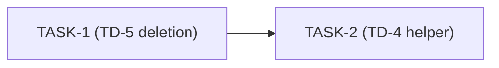

# TD-4 / TD-5 — TelegramMessageHandlerActions cleanup pack (TD-2 dropped)

## 1. Problem Statement

> Two tech-debt items deferred from TD-1 (`docs/team/td-1-stream-view-state-isolation.md` §3 lines 37-38 and §14 lines 352-353) are addressed together here as a single focused PR stacked on the TD-1 branch.
>
> **TD-4 — IT wiring duplication.** Three integration-test classes — `TelegramFixtureConfig`, `TelegramMockGatewayIT`, and `MessageTelegramCommandHandlerIT` — each construct a byte-for-byte identical `messageTelegramCommandHandler` `@Bean` body that wires `TelegramChatPacerImpl` → `TelegramMessageSender` → `TelegramAgentStreamView` → `TelegramMessageHandlerActions(…16 args…)` → `MessageHandlerFsmFactory.create(actions)`. Any change to the constructor breaks all three identically. Extract a static factory `TelegramMessageHandlerActionsTestWiring.create(…)` to consolidate the wiring in one place; each IT class calls it from its own `@Bean` method (preserving the per-IT `@Primary` decision).
>
> **TD-5 — Dead legacy tentative-bubble path (revised after Phase 1 audit).** TD-1 isolated all per-stream view state into `MessageHandlerContext` and rerouted streaming through a `RenderedUpdate`-dispatcher driven by `TelegramAgentStreamRenderer`. The pre-TD-1 dispatcher and its helpers in `TelegramMessageHandlerActions` are now unreachable: `handleAgentStreamEvent` (line 488), `handlePartialAnswer` (567), `promoteTentativeAnswer` (919), `editTentativeAnswer` (948), `forceFinalAnswerEdit` (987), plus two cascade-dead stream-terminal helpers `finalizeAfterStream` (1022) and `handleStreamError` (1035). The companion unit test `TelegramMessageHandlerActionsTentativeEditTest` (which exercises `editTentativeAnswer` via reflection) is the sole external caller and dies alongside the methods.
>
> **NOT in scope (revision from initial intake):**
> - `rollbackAndAppendToolCall` (line 996) is **live code** — it is invoked from the `RenderedUpdate.RollbackAndAppendToolCall` switch case at line 740, and the producer is `TelegramAgentStreamRenderer.java:81`. It must NOT be deleted.
> - `MessageHandlerContext.resetTentativeAnswer()` and the tentative-state fields are still consumed by live `rollbackAndAppendToolCall` (line 1012). They stay.
> - TD-2 (refactor 16-arg constructor) is dropped: `TelegramMessageHandlerActions` already carries `@Slf4j` + `@RequiredArgsConstructor` (lines 84-85). The "hand-written constructor" wording in the original TD-2 description referred only to the explicit positional `new TelegramMessageHandlerActions(...)` call inside `TelegramCommandHandlerConfig.messageHandlerActions` (`TelegramCommandHandlerConfig.java:269`). Lombok already removed the literal hand-written constructor; the factory call is acceptable as-is.
>
> Both remaining items are internal structural refactors with zero observable behavior change for end users.

## 2. Business Context & Goals

- Reduce maintenance burden on `TelegramMessageHandlerActions`, the most-touched class in the Telegram command pipeline.
- Lower onboarding cost: a developer reading the class post-cleanup encounters only the live code path.
- Unblock future `MessageHandlerContext` extensions: the cleaned constructor signals intent clearly.
- Remove a class of subtle bugs: dead branches that retain mutable state references can mislead debuggers and static-analysis tools.
- Consolidate IT wiring: three failing tests on a constructor change become one.

## 3. Non-Goals / Out of Scope

> - **TD-2** (factory cosmetic refactor — rename `telegramMessageSender` parameter to `messageSender`, extract `agentExecutorProvider.getIfAvailable()` into a named local) — explicitly dropped from this session per user decision; the original TD-2 goal (Lombok `@RequiredArgsConstructor`) is already met. May be revisited in a future cosmetic-cleanup session.
> - **TD-future-A/B/C** (different files, different concerns; deferred again to a separate /team session)
> - **`rollbackAndAppendToolCall` deletion or migration** — confirmed live; out of TD-5 scope per Phase 1 audit.
> - **`MessageHandlerContext` tentative-state field removal** — fields stay (consumed by live rollback path).
> - Any behavior change in `TelegramAgentStreamView`'s public API.
> - Any change to fixture test contracts (`@Tag("fixture")` runs must keep passing without test logic rewrites).
> - Database migrations or configuration changes (none expected).

## 4. Existing State (Phase 1 Discovery)

> ### TelegramMessageHandlerActions (target file, 1307 LOC)
>
> - Class-level annotations: `@Slf4j`, `@RequiredArgsConstructor`. No hand-written constructor in the class — Lombok generates it from the 16 `private final` fields in declaration order.
> - 16 constructor parameters (Lombok-generated): `telegramUserService`, `telegramUserSessionService`, `telegramMessageService`, `aiGatewayRegistry`, `messageService`, `aiRequestPipeline`, `telegramProperties`, `chatSettingsService`, `persistentKeyboardService`, `replyImageAttachmentService`, `messageSender` *(NB: factory parameter is named `telegramMessageSender` — mismatch is harmless under positional `new`)*, `agentExecutor` *(nullable when agent.enabled=false)*, `agentStreamRenderer` *(nullable)*, `agentStreamView` *(nullable)*, `agentMaxIterations` (`int`), `defaultAgentModeEnabled` (`boolean`).
> - `@Bean` factory: `TelegramCommandHandlerConfig.messageHandlerActions` (lines 248-276), gated by `@ConditionalOnMissingBean(MessageHandlerActions.class)` and `@ConditionalOnProperty(prefix=FeatureToggle.TelegramCommand.PREFIX, name=FeatureToggle.TelegramCommand.MESSAGE)`. The factory body calls `new TelegramMessageHandlerActions(...)` with 16 positional arguments and resolves `agentExecutorProvider.getIfAvailable()` inline.
> - No subclasses or decorators (Serena reference search empty).
>
> ### TD-5 dead-code audit (definitive)
>
> | Method | Line | Status | Sole caller |
> |---|---|---|---|
> | `handleAgentStreamEvent` | 488 | DEAD | none (was the pre-TD-1 dispatcher) |
> | `handlePartialAnswer` | 567 | DEAD | only `handleAgentStreamEvent:519` (dead) |
> | `promoteTentativeAnswer` | 919 | DEAD | only `handlePartialAnswer:594` (dead) |
> | `editTentativeAnswer` | 948 | DEAD | `handlePartialAnswer:600` (dead) + `forceFinalAnswerEdit:988` (dead) + `TelegramMessageHandlerActionsTentativeEditTest:221` (test, dies with the method) |
> | `forceFinalAnswerEdit` | 987 | DEAD | only `finalizeAfterStream:1026` and `handleStreamError:1037` (both dead) |
> | `finalizeAfterStream` | 1022 | DEAD (cascade) | none |
> | `handleStreamError` | 1035 | DEAD (cascade) | none |
> | `rollbackAndAppendToolCall` | 996 | **LIVE** | `RenderedUpdate.RollbackAndAppendToolCall` switch case at line 740; producer = `TelegramAgentStreamRenderer.java:81` |
>
> - No `FeatureToggle` / `@ConditionalOnProperty` / runtime gate ever reactivates the dead path (grep over `opendaimon-common/.../FeatureToggle.java` and `opendaimon-*/src/main/resources/` returned empty for `tentative|bubble`).
> - `MessageHandlerContext.{resetTentativeAnswer, getTentativeAnswerBuffer, getTentativeAnswerMessageId, isTentativeAnswerActive, setTentativeAnswerActive}` — still consumed by live `rollbackAndAppendToolCall` (line 1012) → keep.
> - Constants near lines 95-120 (`STATUS_THINKING_LINE`, `ROLLBACK_FALLBACK_HTML`, tool-marker patterns) — partially live (used by `rollbackAndAppendToolCall` and live status helpers). Developer must audit each constant individually during TASK-1; any constant referenced only by one of the 7 dead methods can be removed.
> - Estimated LOC deletion: ~300 (methods + cascade-dead constants/imports), not the original ~500 estimate.
> - Test casualty: `opendaimon-telegram/src/test/java/io/github/ngirchev/opendaimon/telegram/command/handler/impl/fsm/TelegramMessageHandlerActionsTentativeEditTest.java` — delete entirely (sole purpose was testing the now-dead `editTentativeAnswer`).
>
> ### TD-4 IT wiring duplication (per-file)
>
> | File | Path | Loading style | Extends `AbstractContainerIT` | `@Primary` on handler bean |
> |---|---|---|---|---|
> | `TelegramFixtureConfig` | `opendaimon-app/src/it/java/.../it/fixture/config/TelegramFixtureConfig.java` | `@TestConfiguration` standalone | N (config, not test) | N |
> | `TelegramMockGatewayIT` | `opendaimon-app/src/it/java/.../it/telegram/TelegramMockGatewayIT.java` | `@SpringBootTest(classes=ITTestConfiguration.class)` + `@Import(TestOverrides.class)` | Y | N |
> | `MessageTelegramCommandHandlerIT` | `opendaimon-app/src/it/java/.../it/telegram/command/handler/MessageTelegramCommandHandlerIT.java` | `@SpringBootTest(classes=ITTestConfiguration.class)` + `@Import({BulkHeadAutoConfig.class, CoreAutoConfig.class, …, TestConfig.class})` | Y | **Y** |
>
> All three classes contain a byte-for-byte identical `messageTelegramCommandHandler` `@Bean` body (TelegramFixtureConfig:340-375, TelegramMockGatewayIT:383-420, MessageTelegramCommandHandlerIT:337-373) that consumes 12 collaborator parameters and constructs `TelegramChatPacerImpl` → `TelegramMessageSender` → `TelegramAgentStreamView` → `new TelegramMessageHandlerActions(...16 args including 2 explicit nulls...)` → `MessageHandlerFsmFactory.create(actions)` → `new MessageTelegramCommandHandler(...)`.
>
> Helper shape decision: **H2 — plain static factory** at `opendaimon-app/src/it/java/io/github/ngirchev/opendaimon/it/TelegramMessageHandlerActionsTestWiring.java`. Rationale: `MessageTelegramCommandHandlerIT` is the only file that needs `@Bean @Primary` on its handler bean — H1 (`@TestConfiguration` owning the `@Bean`) cannot conditionally apply `@Primary` per caller. Static factory lets each IT class call `TelegramMessageHandlerActionsTestWiring.create(...)` from its own `@Bean` method, keeping each caller's `@Primary` (or absence) decision local.
>
> Sequencing constraint: TASK-1 (TD-5) must run before TASK-2 (TD-4) because TASK-1 may reduce the `TelegramMessageHandlerActions` field set (and therefore the constructor signature) — the helper signature must reflect the post-TD-5 ctor.

## 5. Proposed Architecture

Skipped per --quick mode; refactor patterns are standard (Lombok, helper extraction, dead-code removal). Decisions captured in §10 task descriptions.

## 6. Alternatives Considered

_Skipped per --quick mode._

## 7. Risks & Mitigations

_Skipped per --quick mode._

## 8. Non-Functional Constraints

_Skipped per --quick mode._

## 9. Requirements

- [x] **REQ-1** — TD-5: The 5 dead tentative-bubble methods (`handleAgentStreamEvent`, `handlePartialAnswer`, `promoteTentativeAnswer`, `editTentativeAnswer`, `forceFinalAnswerEdit`) and the 2 cascade-dead stream-terminal helpers (`finalizeAfterStream`, `handleStreamError`) are removed from `TelegramMessageHandlerActions`. `rollbackAndAppendToolCall` and the `MessageHandlerContext` tentative-state fields are preserved unchanged. Any constructor field that becomes unused after deletion is also removed; the `@Bean` factory in `TelegramCommandHandlerConfig` is updated to match the reduced field set. Companion unit test `TelegramMessageHandlerActionsTentativeEditTest` is deleted.
  - Acceptance: `./mvnw clean compile` green; `./mvnw verify -pl opendaimon-app -am -Pfixture` green; unit test suite green after the test deletion.
  - Verified by: —

- [x] **REQ-2** — TD-4: A single `TelegramMessageHandlerActionsTestWiring` static factory wires `TelegramMessageHandlerActions` for all three IT classes; no IT class duplicates the inline 16-arg constructor call.
  - Acceptance: `TelegramFixtureConfig`, `TelegramMockGatewayIT`, `MessageTelegramCommandHandlerIT` each delegate the wiring to `TelegramMessageHandlerActionsTestWiring.create(...)` from their own `@Bean` method (each preserving its own `@Primary` choice). Inline duplication of the 16-arg `new TelegramMessageHandlerActions(...)` is gone. `./mvnw verify -pl opendaimon-app -am -Pfixture` green.
  - Verified by: —

## 10. Implementation Plan (Tasks)

- [x] **TASK-1** — TD-5: Delete dead tentative-bubble path; align `@Bean` factory; delete companion test
  - Depends on: —
  - Assignee slot: dev-A | serial
  - Files:
    - `opendaimon-telegram/src/main/java/io/github/ngirchev/opendaimon/telegram/command/handler/impl/fsm/TelegramMessageHandlerActions.java` (edit — delete 5 dead methods + 2 cascade helpers + cascade-dead constants/imports/fields)
    - `opendaimon-telegram/src/main/java/io/github/ngirchev/opendaimon/telegram/config/TelegramCommandHandlerConfig.java` (edit — adjust `messageHandlerActions` `@Bean` factory parameter list to match the reduced ctor IF any field is removed; otherwise no change)
    - `opendaimon-telegram/src/test/java/io/github/ngirchev/opendaimon/telegram/command/handler/impl/fsm/TelegramMessageHandlerActionsTentativeEditTest.java` (DELETE entirely)
  - Acceptance:
    - The 5 dead methods + 2 cascade helpers and their associated dead constants/private helpers are absent from the codebase.
    - `rollbackAndAppendToolCall` and all `MessageHandlerContext` tentative-state fields are present and unchanged.
    - `./mvnw clean compile` green from repo root.
    - `./mvnw verify -pl opendaimon-app -am -Pfixture` green.
    - Unit test suite (`./mvnw test -pl opendaimon-telegram -am`) green minus the deleted test.
  - Notes:
    - After deleting the dead methods, audit each `private final` field on `TelegramMessageHandlerActions` for unreferenced status. Any field used only by deleted methods must also be removed; Lombok will regenerate the constructor with the reduced field set automatically. The `@Bean` factory must be updated in lockstep.
    - Audit constants near lines 95-120 (`STATUS_THINKING_LINE`, `ROLLBACK_FALLBACK_HTML`, tool-marker patterns) and the `// --- Status message helpers ---` / `// --- Stream-terminal helpers ---` regions for cascade dead code; delete only what is clearly unused after the 7 method deletions. Do NOT touch live `rollbackAndAppendToolCall`, `appendToolCallBlock`, `appendObservationMarker`, `appendToStatusBuffer`, `replaceTrailingThinkingLineWithEscaped`, or any helper still invoked from the live `RenderedUpdate` switch (lines 738+).

- [x] **TASK-2** — TD-4: Extract `TelegramMessageHandlerActionsTestWiring` static factory; rewire 3 IT classes through it
  - Depends on: TASK-1
  - Assignee slot: dev-A | serial
  - Files:
    - `opendaimon-app/src/it/java/io/github/ngirchev/opendaimon/it/TelegramMessageHandlerActionsTestWiring.java` (NEW — `public final class` with `private` constructor and one `public static MessageTelegramCommandHandler create(...)` method that constructs the full chain `TelegramChatPacerImpl` → `TelegramMessageSender` → `TelegramAgentStreamView` → `TelegramMessageHandlerActions(...)` → `MessageHandlerFsmFactory.create(actions)` → `new MessageTelegramCommandHandler(...)` and returns the handler)
    - `opendaimon-app/src/it/java/io/github/ngirchev/opendaimon/it/fixture/config/TelegramFixtureConfig.java` (edit — replace inline body of `messageTelegramCommandHandler` `@Bean` method with a single call to `TelegramMessageHandlerActionsTestWiring.create(...)`)
    - `opendaimon-app/src/it/java/io/github/ngirchev/opendaimon/it/telegram/TelegramMockGatewayIT.java` (edit — same replacement inside `TestOverrides`)
    - `opendaimon-app/src/it/java/io/github/ngirchev/opendaimon/it/telegram/command/handler/MessageTelegramCommandHandlerIT.java` (edit — same replacement inside `TestConfig`; preserve `@Bean @Primary` annotation on the local `@Bean` method)
  - Acceptance:
    - Helper exists with the signature implied above.
    - Three IT classes each contain a one-line delegation in their `@Bean messageTelegramCommandHandler` body; no inline `new TelegramMessageHandlerActions(...)` remains in any IT class.
    - `MessageTelegramCommandHandlerIT.TestConfig` retains its `@Bean @Primary` annotation locally (not inside the helper).
    - `./mvnw verify -pl opendaimon-app -am -Pfixture` green.
  - Notes:
    - Helper accepts whatever final field set `TelegramMessageHandlerActions` has after TASK-1. Do NOT pre-bake a 16-parameter signature; mirror the constructor as TASK-1 leaves it.
    - Out of scope: consolidating `RecordingTelegramBot` (duplicated between `TelegramFixtureConfig` and `TelegramMockGatewayIT`) — separate concern, do not touch.

### 10.1 Optional dependency DAG

## 11. Q&A Log

_Two-channel log. Entries tagged [ORCH] (strategic, answered by orchestrator) or [SEC] (coordination, answered by team-secretary). Secretary appends questions and answers here._

### TASK-1 scope expansion (orchestrator decision)

Q1 [ORCH] from dev-A, TASK-1, status: answered
  Q: TASK-1 audit found `agentStreamRenderer` field cascade-dead but its removal breaks 6 external callsites (3 unit tests in `opendaimon-telegram/src/test/.../command/handler/impl/`, 3 IT files in `opendaimon-app/src/it/...`). All 6 callsites passed it as positional argument #13 of `new TelegramMessageHandlerActions(...)`. Authorize scope expansion?
  A: APPROVED Option A. Authorized adding the 3 sibling unit tests (`TelegramMessageHandlerActionsStreamingTest.java`, `TelegramMessageHandlerActionsAgentTest.java`, `MessageTelegramCommandHandlerTest.java`) to TASK-1 `Files:` for one-line positional-arg drops; the 3 IT files stay out of TASK-1 (TASK-2 rewrites their wiring via `TelegramMessageHandlerActionsTestWiring.create(...)` and the inline `new` call disappears entirely). Acceptance amendment: TASK-1 fixture-suite verification (`-Pfixture`) deferred to TASK-2 because IT compilation is temporarily broken between the two tasks. TASK-1 final verification reduces to `./mvnw clean compile` + `./mvnw test -pl opendaimon-telegram -am`.

## 12. Regressions (Phase 2 Findings)

_Appended by team-secretary during Phase 6 verification._

### Phase 6 audit (orchestrator-dispatched team-explorer)

**Result: PASS.** Both REQs verified by independent symbol-search audit (Serena `find_symbol` over the modified files):

- REQ-1 (TD-5): all 7 named dead methods absent from `TelegramMessageHandlerActions`. `agentStreamRenderer` field gone. `rollbackAndAppendToolCall` preserved at line 674; live `RenderedUpdate.RollbackAndAppendToolCall` switch case at line 499 still calls it. `MessageHandlerContext.{resetTentativeAnswer, getTentativeAnswerMessageId}` referenced from live `rollbackAndAppendToolCall` body. Companion `TelegramMessageHandlerActionsTentativeEditTest.java` deleted.
- REQ-2 (TD-4): `TelegramMessageHandlerActionsTestWiring.create(...)` (13 params) used by all three IT classes. `MessageTelegramCommandHandlerIT.TestConfig` retains its `@Bean @Primary` locally; helper itself has no `@Primary`. No inline `new TelegramMessageHandlerActions(...)` remains in any IT class.
- Live invariants: `TelegramAgentStreamView` 3-arg ctor unchanged. `RenderedUpdate` switch wiring intact. No orphan imports/fields in modified files.

**Severity findings:**
- CRITICAL/HIGH/MEDIUM: none.
- LOW: helper at line 56 passes `null` for `agentExecutor` as unnamed positional arg. Pre-existing style from the original IT wiring; now consolidated to one callsite (net improvement). Note only — not blocking.

## 13. Test Coverage Summary (QA phase)

_Refactor-only PR; no new tests authored. Existing suites provide regression coverage for both REQs and were re-run during Phase 5._

| REQ | Existing test (regression coverage) | Type | Latest run result |
|---|---|---|---|
| REQ-1 (TD-5) | `opendaimon-telegram/src/test/java/.../command/handler/impl/fsm/TelegramMessageHandlerActionsStreamingTest.java`, `TelegramMessageHandlerActionsAgentTest.java`, `MessageTelegramCommandHandlerTest.java` | unit | PASS (`./mvnw test -pl opendaimon-telegram -am` — 463/0/0 in 17s) |
| REQ-1 (TD-5) | All `@Tag("fixture")` ITs in `opendaimon-app/src/it/java/.../it/fixture/` | fixture IT | PASS (see REQ-2 row) |
| REQ-2 (TD-4) | All `@Tag("fixture")` ITs that load `TelegramFixtureConfig`, `TelegramMockGatewayIT`, or `MessageTelegramCommandHandlerIT` (helper is invoked transitively) | fixture IT | PASS (`./mvnw clean verify -pl opendaimon-app -am -Pfixture` — 20/0/0 in 55s) |

Fixture mapping update in `.claude/rules/java/fixture-tests.md`: **no** (no new fixture IT was added).

## 14. Closure Notes

> - **Use-case docs to update:** none (internal refactor; no use case in `docs/usecases/` touched).
> - **Module docs to update:** none (orchestrator grep over `opendaimon-telegram/TELEGRAM_MODULE.md` and `ARCHITECTURE.md` found zero references to the deleted methods or `agentStreamRenderer`).
> - **Suggested commit type:** `refactor`
> - **Suggested commit subject:** `refactor: remove dead tentative-bubble path and extract IT wiring helper (TD-5, TD-4)`
> - **Suggested commit body** (optional, multi-paragraph for the body of the commit message):
>
>   > Cleans up two tech-debt items deferred from TD-1.
>   >
>   > TD-5: removes 5 unreachable methods (`handleAgentStreamEvent`, `handlePartialAnswer`, `promoteTentativeAnswer`, `editTentativeAnswer`, `forceFinalAnswerEdit`) and 2 cascade-dead stream-terminal helpers (`finalizeAfterStream`, `handleStreamError`) from `TelegramMessageHandlerActions`, plus the now-unused `agentStreamRenderer` field, the `TelegramAgentStreamRenderer` import, 4 cascade-dead constants/static helpers, and the companion unit test `TelegramMessageHandlerActionsTentativeEditTest`. The live `rollbackAndAppendToolCall` (still wired through `RenderedUpdate.RollbackAndAppendToolCall`) and `MessageHandlerContext` tentative-state fields are preserved unchanged. Net: ~570 deletions in `TelegramMessageHandlerActions.java` (1307 → 963 LOC, -26%). The `@Bean` factory in `TelegramCommandHandlerConfig` is updated in lockstep to match the reduced 15-arg constructor.
>   >
>   > TD-4: extracts `TelegramMessageHandlerActionsTestWiring.create(...)` (a static factory in `opendaimon-app/src/it/java/.../it/`) to consolidate the previously byte-for-byte identical `messageTelegramCommandHandler` `@Bean` body shared by `TelegramFixtureConfig`, `TelegramMockGatewayIT`, and `MessageTelegramCommandHandlerIT`. Each IT class now delegates to the helper from its own `@Bean` method (the latter preserves its `@Primary` locally — H1 `@TestConfiguration` shape was rejected because it could not condition `@Primary` per caller).
>   >
>   > TD-2 was dropped from this session: `TelegramMessageHandlerActions` already carries `@RequiredArgsConstructor`, so the original goal "remove the hand-written 16-arg constructor" was already met by Lombok before this session began. The optional cosmetic factory cleanup (rename `telegramMessageSender` parameter, named-local for `agentExecutorProvider.getIfAvailable()`) is deferred and tracked in §3.
>   >
>   > Verification: `./mvnw clean compile` SUCCESS, `./mvnw test -pl opendaimon-telegram -am` 463/0/0, `./mvnw clean verify -pl opendaimon-app -am -Pfixture` 20/0/0. Phase 6 independent symbol-search audit returned PASS with one LOW (positional `null` for `agentExecutor` in the helper, pre-existing style consolidated to one callsite — net improvement, not blocking).
> - **Branch:** `feature/td-1-stream-view-state-isolation` (stacked on TD-1 per user decision at intake — TD-1 will be merged separately or these commits will be cherry-picked depending on PR strategy).
> - **Files changed (summary):** 9 modified, 1 deleted, 1 added (production helper). Plus 1 added (this feature doc).

## Activity Log

- 2026-04-27T00:00:00Z — [ORCH] /team --quick invoked; scope = TD-2 + TD-4 + TD-5; TD-future-A/B/C deferred again; bootstrap dispatched.
- 2026-04-27T12:00:00Z — [ORCH] Phase 1 complete. Three explorers ran (TD-5 audit retried inline by orchestrator after Explorer 1 stream-timeout). Two scope corrections approved by user via AskUserQuestion: TD-2 dropped (`@RequiredArgsConstructor` already present); TD-5 reduced from 6 methods to 5 + 2 cascade helpers (rollbackAndAppendToolCall is live via RenderedUpdate switch). §1, §3, §4, §9, §10, §14 rewritten to reflect the revised scope. status remains discovery → moving to Phase 4 task breakdown.
- 2026-04-27Txx:xx:xxZ — [ORCH] TASK-1 complete. First developer dispatch hit stream-timeout after 37 tool calls but had completed the main `TelegramMessageHandlerActions.java` deletion (1307→963 LOC, -344). Orchestrator manually finished the 4 remaining edits (Config factory + 3 unit tests) and the 1 deletion (`TelegramMessageHandlerActionsTentativeEditTest.java`). Verification: `./mvnw clean compile` SUCCESS; `./mvnw test -pl opendaimon-telegram -am` 463/0/0 (failures/errors); fixture deferred to TASK-2. Scope expansion logged in §11 [ORCH-Q1/A1]. status: discovery → developing.
- 2026-04-27Txx:xx:xxZ — [ORCH] TASK-2 complete (orchestrator did the helper extraction manually — preventing a third agent timeout). Created `opendaimon-app/src/it/java/io/github/ngirchev/opendaimon/it/TelegramMessageHandlerActionsTestWiring.java` (single static `create(...)` factory, 13 input params, returns `MessageTelegramCommandHandler`). Replaced inline 20-line wiring blocks in `TelegramFixtureConfig`, `TelegramMockGatewayIT`, and `MessageTelegramCommandHandlerIT` (latter preserves its own `@Bean @Primary`). Verification: `./mvnw clean verify -pl opendaimon-app -am -Pfixture` BUILD SUCCESS in 55s, fixture suite 20/0/0 (failures/errors). status: developing → verifying. Phase 5 closed; moving to Phase 6 audit.
- 2026-04-27Txx:xx:xxZ — [ORCH] Phase 6 audit complete. team-explorer ran independent symbol-search verification of git diff (no commits yet — diff against working tree). Both REQs PASS. One LOW finding (positional `null` for agentExecutor in helper, pre-existing style consolidated to single callsite — net improvement, no remediation). status: verifying → qa.
- 2026-04-27Txx:xx:xxZ — [ORCH] Phases 7 and 8 closed manually. Phase 7 QA dispatch was skipped intentionally: this is a deletion-only refactor with no new behavior, so the rule "every REQ-N has a test that would regress on deletion" is inapplicable to REQ-1 (deletions) and is satisfied by existing fixture coverage for REQ-2 (helper extraction). Existing unit suite (`./mvnw test -pl opendaimon-telegram -am` 463/0/0) and fixture suite (`./mvnw clean verify -pl opendaimon-app -am -Pfixture` 20/0/0) both green from Phase 5 — no new tests authored. §13 filled with the existing-test → REQ mapping. §14 authored: commit type `refactor`, subject `refactor: remove dead tentative-bubble path and extract IT wiring helper (TD-5, TD-4)`. status: qa → done.
