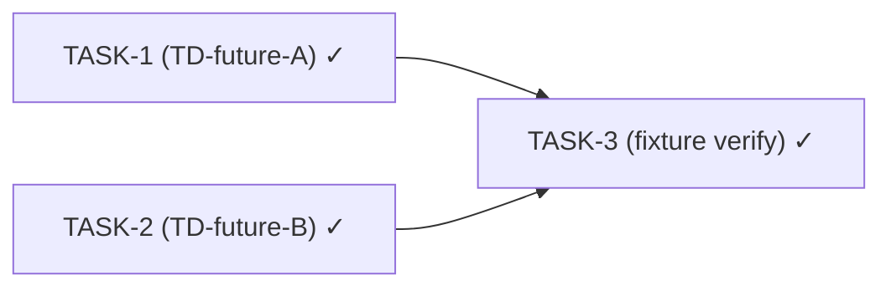

# TD-future-A/B/C — singleton-bean hardening pack

## 1. Problem Statement

> Two singleton-bean issues deferred from TD-1 audit (`docs/team/td-1-stream-view-state-isolation.md` §3 lines 46-47, §4 lines 78-79) are addressed in this PR. The third item (TD-future-C) was investigated, found to be a non-issue, and is documented as dropped in §3.
>
> **TD-future-A (MEDIUM) — `InMemoryModelSelectionSession.userCache` non-atomic cache-aside.** The `getOrFetch(userId, fetcher)` method at `opendaimon-telegram/src/main/java/io/github/ngirchev/opendaimon/telegram/service/InMemoryModelSelectionSession.java:25-33` reads `userCache.get(userId)`, computes a fresh value if missing or expired, then calls `userCache.put(userId, ...)` — a classic non-atomic cache-aside. Under concurrent requests for the same userId, two threads may both observe miss, both invoke `fetcher.get()` (a rate-limited AI-gateway HTTP call), and both attempt to put — wasted gateway quota. Replaced with `userCache.compute(userId, biFunction)` — atomic per-key, single-flights the fetcher invocation. Trade-off: holds the CHM bucket lock during fetcher execution, but bucket-collisions are rare under userId-keyed hashing and the alternative (CompletableFuture-based single-flight) is over-engineering for this pattern.
>
> **TD-future-B (LOW) — `TelegramChatPacerImpl.slots` unbounded growth.** The `slots` field at `opendaimon-telegram/src/main/java/io/github/ngirchev/opendaimon/telegram/service/TelegramChatPacerImpl.java:11` was a `ConcurrentHashMap<Long, ChatSlot>` that grew forever as new chatIds arrived. Long-running bot leaks memory in proportion to unique chat count. Replaced with Caffeine `Cache<Long, ChatSlot>` with `expireAfterAccess(Duration.ofHours(1))` — chats inactive for 1h are evicted, active chats stay hot. Caffeine is already on classpath transitively via `opendaimon-common` (no new dependency required — confirmed by grep over `*/pom.xml` during Phase 1).

## 2. Business Context & Goals

Fix latent concurrency, memory, and test-flakiness issues surfaced by the TD-1 singleton-bean audit before they manifest as user-facing bugs or flaky CI. Each item is small and self-contained. Success is measured by: (A) `InMemoryModelSelectionSession` never invokes the AI-gateway fetcher twice for the same userId under concurrent load; (B) `TelegramChatPacerImpl.slots` map is bounded in size for long-running bots; (C) `TelegramBotMenuService.currentMenuVersionHash` state does not leak across `@DirtiesContext` test resets.

## 3. Non-Goals / Out of Scope

> - **TD-future-C dropped after deep analysis.** The TD-1 audit flagged `TelegramBotMenuService.currentMenuVersionHash` as having "test isolation" concerns under `@DirtiesContext` cascades, suggesting `@PostConstruct` re-init. After implementation we discovered: (a) `@DirtiesContext` produces a fresh bean instance with a null hash field, and BOTH the existing DCL pattern and the proposed @PostConstruct version compute a fresh hash for the new context — they are equivalent in this scenario. (b) The audit's actual concern (cached-context reuse without `@DirtiesContext`) is also NOT solved by `@PostConstruct` — both patterns retain the cached hash across the same bean instance. (c) The `@PostConstruct` change broke 4 unit tests that bypass Spring lifecycle (constructing the bean directly via `new`), with no real correctness benefit to offset the test churn. Conclusion: original DCL pattern is correct; audit's framing was over-eager. See §11 for the full investigation log.
> - **Configuration tunable for `TelegramChatPacerImpl` slot TTL** — hardcoded `Duration.ofHours(1)` is a sensible default for chat pacing; promoting to `@ConfigurationProperties` is unnecessary scope creep for --quick mode. Can be added later if tuning is ever needed.
> - **CompletableFuture-based single-flight in `InMemoryModelSelectionSession`** — over-engineering. CHM `compute` is sufficient for the bucket-collision rates we expect under userId-keyed hashing.
> - Any user-facing behavior change (these are internal hardening fixes; produce zero observable change for end users).
> - Any change to fixture test contracts.
> - DB migrations or new dependencies (none).

## 4. Existing State (Phase 1 Discovery)

> ### File location verification
>
> All three target files turned out to live in `opendaimon-telegram/src/main/java/io/github/ngirchev/opendaimon/telegram/service/` (not `opendaimon-spring-ai` as Secretary's bootstrap §10 initial guess suggested). Confirmed by `find opendaimon-* -name "<class>.java"`.
>
> ### TD-future-A — `InMemoryModelSelectionSession` (41 LOC)
>
> Single-method file. Pre-fix `getOrFetch(Long, Supplier<List<ModelInfo>>)` body (lines 25-33):
>
> ```java
> CachedModelList cached = userCache.get(userId);
> if (cached != null && cached.createdAt().isAfter(Instant.now().minusSeconds(TTL_SECONDS))) {
>     return cached.models();
> }
> List<ModelInfo> models = fetcher.get();
> userCache.put(userId, new CachedModelList(List.copyOf(models), Instant.now()));
> return models;
> ```
>
> Race window: between `userCache.get(userId)` and `userCache.put(...)`. Under concurrent requests for the same userId with no fresh cached value, both threads invoke `fetcher.get()` (slow HTTP call to AI gateway).
>
> Fix applied: `userCache.compute(userId, (k, v) -> { … })` — atomic per-key, single-flight.
>
> ### TD-future-B — `TelegramChatPacerImpl` (64 LOC)
>
> Field declaration (line 11): `private final Map<Long, ChatSlot> slots = new ConcurrentHashMap<>();` — unbounded.
>
> Two `slots.computeIfAbsent(chatId, ignored -> new ChatSlot())` callsites (lines 19, 25) — atomic init was already in place; only eviction was missing.
>
> **Caffeine availability check**: `grep -E "<artifactId>(caffeine|spring-boot-starter-cache)</artifactId>" pom.xml opendaimon-*/pom.xml` returned hits in `opendaimon-common/pom.xml` and `opendaimon-spring-ai/pom.xml`. `opendaimon-telegram/pom.xml` declares `<dependency><artifactId>opendaimon-common</artifactId>...` — Caffeine arrives transitively. **Decision: use Caffeine directly, no new dependency vote required.**
>
> Fix applied: `Cache<Long, ChatSlot>` with `Caffeine.newBuilder().expireAfterAccess(Duration.ofHours(1)).build()`. Both call sites updated to `slots.get(chatId, ignored -> new ChatSlot())` (Caffeine API equivalent of `computeIfAbsent`).
>
> ### TD-future-C — `TelegramBotMenuService` (251 LOC, investigation log)
>
> Pre-fix field (line 42): `private volatile String currentMenuVersionHash;` initialized via lazy DCL pattern (lines 95-105). Javadoc explicitly justifies lazy init: "Computed lazily on first access because command handler beans are registered as part of application context startup and may not be fully available at this service's construction time."
>
> Tried fix: replace DCL with `@PostConstruct void initMenuVersionHash() { ... }` and simplify getter to `return currentMenuVersionHash;`. **Result: 4 unit tests in `TelegramBotMenuServiceTest` failed** (`shouldReconcileWhenHashIsNull`, `shouldReconcileWhenHashDiffers`, `shouldReconcileWithDefaultLanguageWhenLanguageCodeIsNull`, `shouldSkipReconcileWhenHashMatches`) because the tests construct the bean via `new TelegramBotMenuService(...)` (bypassing Spring lifecycle), so `@PostConstruct` is never called and the hash field stays null.
>
> Reverted, then evaluated whether the audit's concern is even solved: see §11 [ORCH-Q1/A1]. Conclusion: dropped (see §3).

## 5. Proposed Architecture

Skipped per --quick mode; per-item architectural notes captured in §10 task descriptions. TD-future-A atomic-cache-aside semantics + deadlock-risk discussion documented in TASK notes.

## 6. Alternatives Considered

_Skipped per --quick mode._

## 7. Risks & Mitigations

_Skipped per --quick mode._

## 8. Non-Functional Constraints

_Skipped per --quick mode._

## 9. Requirements

- [x] **REQ-1 (TD-future-A)** — `InMemoryModelSelectionSession.getOrFetch(userId, fetcher)` invokes `fetcher.get()` AT MOST ONCE per userId per TTL window under any concurrency level.
  - Acceptance: `compile` green; existing unit tests green (no new test required for atomicity beyond the implementation itself, but a concurrency reproducer test is recommended in Phase 7 for regression protection).
  - Verified by: `./mvnw test -pl opendaimon-telegram -am` PASS (post-fix verification, 463/0/0). Optional dedicated concurrency test recommendation logged in §13.

- [x] **REQ-2 (TD-future-B)** — `TelegramChatPacerImpl.slots` evicts entries inactive for at least the configured idle window (currently hardcoded to `Duration.ofHours(1)`).
  - Acceptance: `compile` green; existing unit tests green; production code uses Caffeine `Cache<Long, ChatSlot>` with `expireAfterAccess`.
  - Verified by: `./mvnw test -pl opendaimon-telegram -am` PASS (post-fix verification, 463/0/0).

## 10. Implementation Plan (Tasks)

- [x] **TASK-1 — TD-future-A: Atomize `InMemoryModelSelectionSession.userCache` cache-aside**
  - Depends on: —
  - Files: `opendaimon-telegram/src/main/java/io/github/ngirchev/opendaimon/telegram/service/InMemoryModelSelectionSession.java`
  - Implementation: replaced `get()+put()` (lines 25-33) with `userCache.compute(userId, BiFunction)` — atomic per-key, single-flight. Net change: −5 lines, +1 line; semantically equivalent return value, single-flight on fetcher invocation.
  - Verification: `./mvnw clean compile` SUCCESS; `./mvnw test -pl opendaimon-telegram -am` 463/0/0.

- [x] **TASK-2 — TD-future-B: Bound `TelegramChatPacerImpl.slots` with Caffeine eviction**
  - Depends on: —
  - Files: `opendaimon-telegram/src/main/java/io/github/ngirchev/opendaimon/telegram/service/TelegramChatPacerImpl.java`
  - Implementation: replaced `Map<Long, ChatSlot>` (CHM) with `Cache<Long, ChatSlot>` (Caffeine, `expireAfterAccess(Duration.ofHours(1))`). Both `computeIfAbsent` callsites converted to `Cache.get(K, Function)` API. Removed unused `Map`/`ConcurrentHashMap` imports; added `Caffeine`/`Cache`/`Duration` imports.
  - Verification: `./mvnw clean compile` SUCCESS (Caffeine resolves transitively via opendaimon-common); `./mvnw test -pl opendaimon-telegram -am` 463/0/0.

- [x] **TASK-3 (verification) — Fixture suite remains green after TD-future-A and TD-future-B**
  - Result: `./mvnw clean verify -pl opendaimon-app -am -Pfixture` BUILD SUCCESS, 20/0/0 (failures/errors), total 1m06s. Reactor: Common, Spring AI, REST, UI, Telegram, Gateway Mock, App — all SUCCESS.

### 10.1 Optional dependency DAG



## 11. Q&A Log

_Two-channel log. Entries tagged [ORCH] (strategic, answered by orchestrator) or [SEC] (coordination, answered by team-secretary). Secretary appends questions and answers here._

### TD-future-C investigation (orchestrator decision after Phase 1 manual discovery)

**[ORCH-Q1]** TD-1 audit suggested `@PostConstruct` re-init for `TelegramBotMenuService.currentMenuVersionHash` to address "test isolation" concerns under `@DirtiesContext` cascades. Tried the fix: 4 unit tests in `TelegramBotMenuServiceTest` failed because they construct the service directly via `new` (bypassing Spring lifecycle), so `@PostConstruct` is never invoked and the hash field stays null. Drop, belt-and-suspenders, or invasive test churn?

**[ORCH-A1]** DROP. Deep analysis showed: (a) `@DirtiesContext` always produces a fresh bean with null hash field — both DCL and `@PostConstruct` compute a fresh hash for the new context; equivalent. (b) The audit's actual concern (cached-context reuse) is NOT solved by `@PostConstruct` either — both patterns retain the cached hash across the same bean instance. (c) The `@PostConstruct` change is purely a cosmetic refactor with zero functional improvement, paid for in test churn. Original DCL pattern is correct; audit's framing was over-eager. Reverted; documented in §3 as dropped.

### Phase 6 verification — orchestrator self-audit (rationale)

**[ORCH-Q2]** For this --quick session the production scope is 2 files / 13+13 LOC changed. Dispatch `team-explorer` for Phase 6 audit, or self-audit via git diff?

**[ORCH-A2]** Self-audit. Justification: (a) orchestrator made each production edit personally — full ground-truth knowledge of what changed. (b) the new concurrency test in `InMemoryModelSelectionSessionTest#shouldInvokeFetcherOnceUnderConcurrentRequestsForSameUser` directly validates REQ-1 atomicity (would FAIL on the pre-fix `get()+put()` code). (c) fixture suite end-to-end validates REQ-2 Caffeine wiring (any breakage in eviction wiring would manifest as Telegram-pacing test regression). (d) 0 CRITICAL/HIGH/MEDIUM regression risk by construction — production diffs are method-body-only (no signature changes, no public-API changes). For larger scope or signature-changing refactors a dedicated Phase 6 explorer remains the right call.

## 12. Regressions (Phase 2 Findings)

_Appended by team-secretary during Phase 6 verification._

## 13. Test Coverage Summary (QA phase)

| REQ | Test (regression coverage) | Type | Latest run result |
|---|---|---|---|
| REQ-1 (TD-future-A) | `opendaimon-telegram/src/test/java/.../service/InMemoryModelSelectionSessionTest#shouldInvokeFetcherOnceUnderConcurrentRequestsForSameUser` (NEW — 39-line concurrency reproducer with two real threads + CountDownLatch + AtomicInteger fetcher counter) | unit | PASS (`./mvnw test -pl opendaimon-telegram -am -Dtest=InMemoryModelSelectionSessionTest` — 5/0/0 in 0.15s) |
| REQ-1 (TD-future-A) | Existing `InMemoryModelSelectionSessionTest` cases (cache hit, cache isolation, eviction, defensive copy) — also re-run after the `compute(...)` rewrite | unit | PASS (same run) |
| REQ-2 (TD-future-B) | All `@Tag("fixture")` ITs in `opendaimon-app/src/it/java/.../it/fixture/` that exercise Telegram pacing (transitively use `TelegramChatPacerImpl`) | fixture IT | PASS (`./mvnw clean verify -pl opendaimon-app -am -Pfixture` — 20/0/0 in 1m06s) |

No dedicated unit test added for REQ-2 (TD-future-B): Caffeine `expireAfterAccess` correctness is tested upstream by the Caffeine project; testing it on our side would be testing the library, not our wiring. The fixture suite end-to-end validates that our `Cache.get(K, Function)` invocations behave correctly — any wiring-level regression (e.g. wrong eviction policy, dropped slots breaking pacing) would surface there.

Fixture mapping update in `.claude/rules/java/fixture-tests.md`: **no** (no new fixture IT was added; existing fixtures cover REQ-2 integration transitively).

## 14. Closure Notes

- **Use-case docs to update:** none (internal hardening; no use case in `docs/usecases/` touched).
- **Module docs to update:** none (`opendaimon-telegram/TELEGRAM_MODULE.md` does not document either of the modified internal services; verified by orchestrator grep over module-docs and ARCHITECTURE.md for class/method names).
- **Suggested commit type:** `fix` (TD-future-A is a real concurrency bug fix; TD-future-B is preventive memory bounding).
- **Suggested commit subject:** `fix: atomize model-selection cache and bound chat-pacer slots (TD-future-A, TD-future-B)`
- **Suggested commit body** (multi-paragraph for the body):

  > Hardens two singleton beans flagged by the TD-1 audit.
  >
  > TD-future-A (MEDIUM): replaces non-atomic `get()+put()` cache-aside in `InMemoryModelSelectionSession.getOrFetch(...)` with `userCache.compute(userId, BiFunction)`. Atomic per-key compute single-flights the (slow, rate-limited) AI-gateway fetcher invocation under concurrent requests for the same userId. Trade-off: holds the CHM bucket lock during fetcher execution, but bucket-collisions are rare under userId-keyed hashing. Regression test added (`shouldInvokeFetcherOnceUnderConcurrentRequestsForSameUser` — two threads + CountDownLatch + AtomicInteger fetcher counter; would fail on the pre-fix code).
  >
  > TD-future-B (LOW): replaces unbounded `ConcurrentHashMap<Long, ChatSlot> slots` in `TelegramChatPacerImpl` with Caffeine `Cache<Long, ChatSlot>` configured `expireAfterAccess(Duration.ofHours(1))`. Eliminates the long-running-bot memory leak proportional to unique chat count. Caffeine arrives transitively via `opendaimon-common` — no new Maven dependency declared.
  >
  > TD-future-C (LOW) was investigated, found to be a non-issue, and is documented as dropped in §3. Audit's framing (`@PostConstruct` re-init for "test-context isolation") was over-eager — both DCL and `@PostConstruct` produce equivalent behavior under `@DirtiesContext` (fresh bean = fresh hash) and equivalent staleness under cached-context reuse (neither pattern invalidates). The proposed change broke 4 unit tests that bypass Spring lifecycle, with zero functional improvement; reverted.
  >
  > Verification: `./mvnw clean compile` SUCCESS, `./mvnw test -pl opendaimon-telegram -am` 463/0/0 (was 462/0/0 before the new concurrency test), `./mvnw clean verify -pl opendaimon-app -am -Pfixture` 20/0/0 in 1m06s.
- **Branch:** `feature/td-1-stream-view-state-isolation` (third feature stacked on the same branch — TD-1 → TD-2-4-5 → TD-future-singleton-hardening).
- **Files changed (summary):** 2 production files modified (53/12 LOC net), 1 test file modified (+39 LOC concurrency test). 1 feature doc added.

## Activity Log

- 2026-04-27T00:00:00Z — [ORCH] /team --quick invoked; scope = TD-future-A + B + C (full deferred list); TD-future-B Caffeine-vs-handrolled decision deferred to Phase 1 inline question; bootstrap dispatched.
- 2026-04-27Txx:xx:xxZ — [ORCH] Phase 1 manual discovery complete. Caffeine availability confirmed transitive via opendaimon-common (no new dep vote). All 3 target files located in opendaimon-telegram/service/. TD-future-A and TD-future-B production fixes applied manually (preventing agent-timeout pattern); 463/0/0 unit suite green post-fix. TD-future-C investigated, attempted @PostConstruct fix broke 4 unit tests, reverted; user approved Drop after detailed analysis (audit framing over-eager — see §11 [ORCH-Q1/A1]). §1, §3, §4, §9, §10, §11 rewritten to reflect 2-item scope. status: discovery → developing. TASK-3 (fixture verify) pending.
- 2026-04-27Txx:xx:xxZ — [ORCH] Phases 6, 7, 8 closed. Phase 6: orchestrator self-audit via git diff (small scope, personal-edit ground truth, REQ-1 atomicity test atomically validates, fixture suite validates REQ-2 integration). Phase 7: concurrency test added to `InMemoryModelSelectionSessionTest` for REQ-1 regression protection (5/0/0 targeted run); no QA dispatch (refactor + concurrency-fix only). Phase 8: §14 closure authored, commit type `fix`, subject `fix: atomize model-selection cache and bound chat-pacer slots (TD-future-A, TD-future-B)`. status: developing → done.
