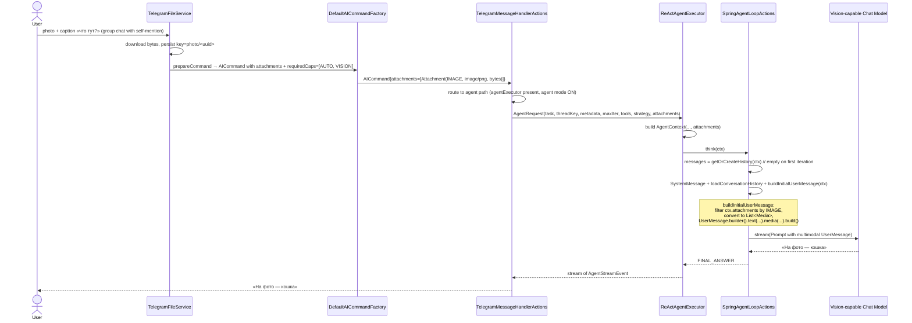

# Agent Path: Image Attachment Propagation

> **Fixture test:** `TelegramAgentImageFixtureIT` — run with `./mvnw clean verify -pl opendaimon-app -am -Pfixture`
>
> **Unit tests:**
> - `SpringAgentLoopActionsAttachmentsTest` — agent path (ReAct/think) media injection
> - `SimpleChainExecutorTest#shouldAttachImageMediaToUserMessageWhenAttachmentsHasImage` — simple-chain path
> - `TelegramMessageHandlerActionsAgentTest#shouldPassAttachmentsToAgentRequestWhenCommandHasImage` — caller wiring

## Why this exists

When a user uploads a photo with a caption in Telegram and the chat is in **agent mode**
(ReAct/thinking enabled), the routing predicate sends the request to
`AgentExecutor.executeStream(AgentRequest)` instead of the gateway path. Before this
use case was covered, `AgentRequest` had no `attachments` field — the image was already
materialised in `TelegramCommand.attachments()` (verified by logs: `Photo processed for
user 2: key=photo/...`) and `DefaultAICommandFactory` correctly resolved
`requiredCaps=[AUTO, VISION]` and routed to a vision-capable model
(`z-ai/glm-4.5v`), but the bytes never reached the prompt:

```
Agent think: raw prompt messages
[USER] что тут?
[CHAT history…]
```

No `image_url`, no `Media`. The vision model would politely answer
"уточните, есть ли у вас изображение?" — closing the loop with the user staring at
a missing image.

The gateway path (`SpringAIGateway` + `SpringDocumentPreprocessor`) already did this
correctly by building `UserMessage.builder().text(...).media(mediaList).build()`. The
agent path was a parallel implementation that forgot the media step.

## Flow (agent path with image)



## Invariants

1. **Image attachments propagate end-to-end.** Source of attachments at the
   Telegram → agent boundary is `aiCommand.attachments()` (the
   pipeline-processed list inside `ChatAICommand`), with a fallback to
   `command.attachments()` only when `aiCommand` is not a `ChatAICommand`.
   Mirrors `SpringAIGateway.java:384`. This matters for image-only PDFs:
   `AIRequestPipeline` renders each PDF page into an IMAGE attachment in
   `mutableAttachments`, and the agent path must read those rendered pages —
   not the raw PDF that `toImageMedia()` would discard as non-IMAGE.
   Chain: `aiCommand.attachments()` → `AgentRequest.attachments()` →
   `AgentContext.getAttachments()` → first `UserMessage.media` in the prompt.
   Any link broken silently degrades vision queries to text-only.
2. **Only IMAGE-typed attachments cross the boundary.** PDFs and other documents
   go through the gateway RAG path (`SpringDocumentPreprocessor`); they are
   intentionally filtered out of the agent prompt.
3. **Media is attached once, on the first user message of the run.** ReAct loops
   reuse the same `messages` list across `think()` iterations
   (`KEY_CONVERSATION_HISTORY` extras key); subsequent iterations append assistant
   and tool messages without rebuilding from scratch, so the original
   `UserMessage(media)` survives every prompt rebuild.
4. **Tool-result UserMessages stay plain-text.** The follow-up `UserMessage` created
   for `ToolResponseMessage` propagation is intentionally without media — the image
   is already in the conversation context above it.
5. **SimpleChain executor mirrors the same shape.** Strategy=SIMPLE goes through
   `SimpleChainExecutor`, not `ReActAgentExecutor`, but it uses the same
   `buildUserMessage`-with-media helper so caption-only photos in non-ReAct flows
   also work.
6. **Plan-and-execute sub-tasks do NOT inherit attachments.** Sub-steps of a
   decomposed plan are textual and run with `attachments=List.of()`; if a future
   product requirement needs an image to flow into a specific plan step, see the
   TODO in `PlanAndExecuteAgentExecutor`.

## Out of scope

- Persisting media in `ChatMemory` for cross-turn recall — the current
  implementation only carries the image into the *current* run; on the next user
  turn, the previous image is not auto-resurrected from history.
- The unrelated `400 "text must be non-empty"` from a status-message edit
  (visible in the same prod log block) — separate bug, separate ticket.
