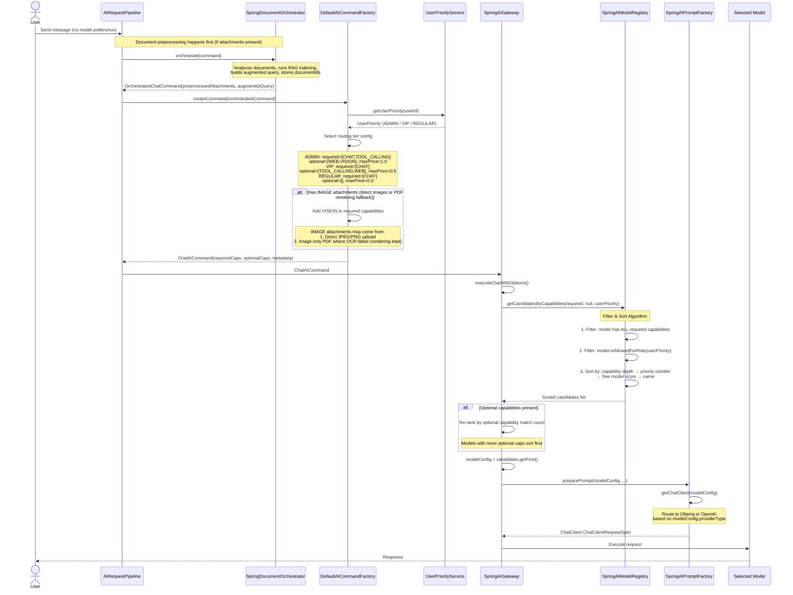
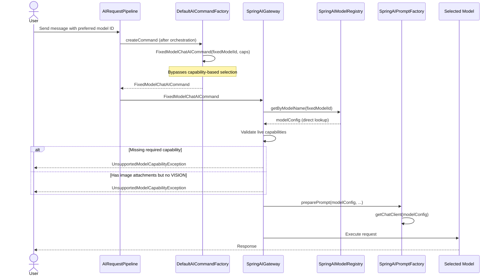
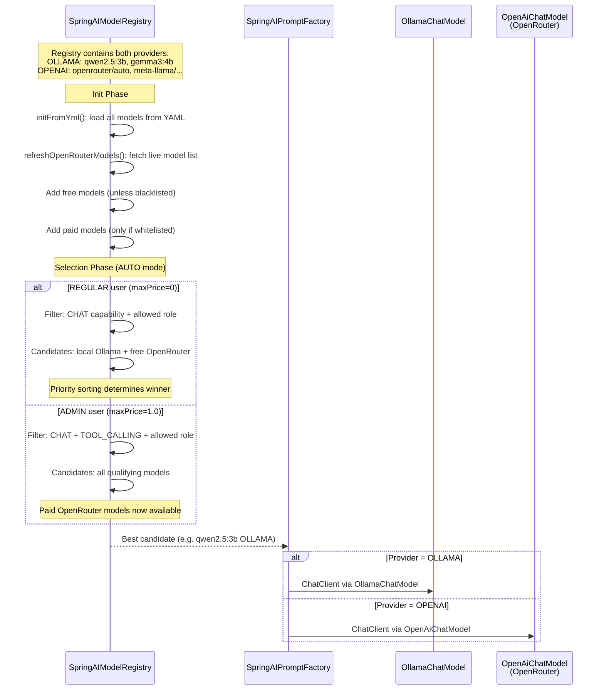
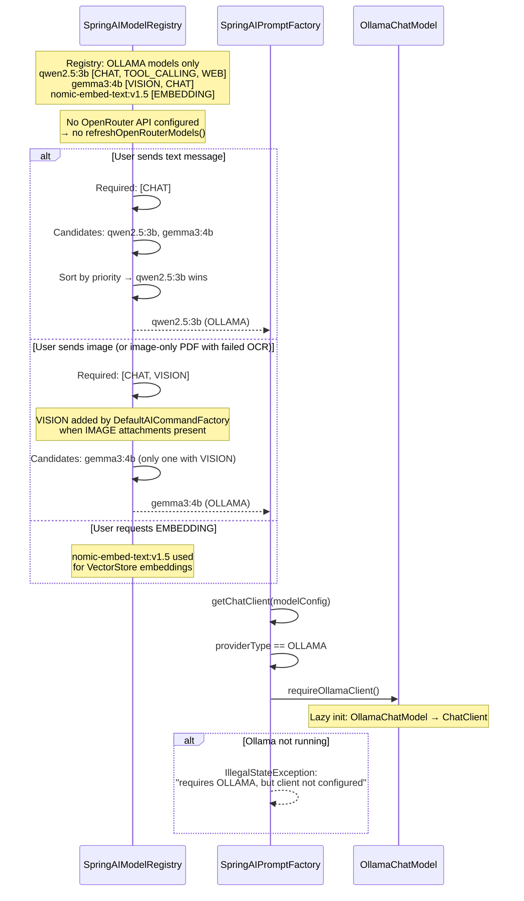
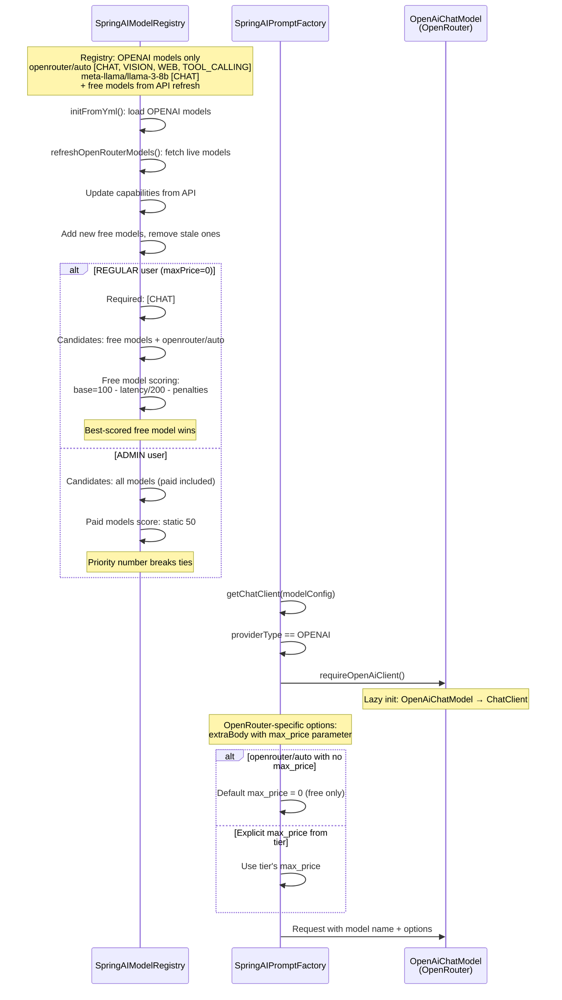
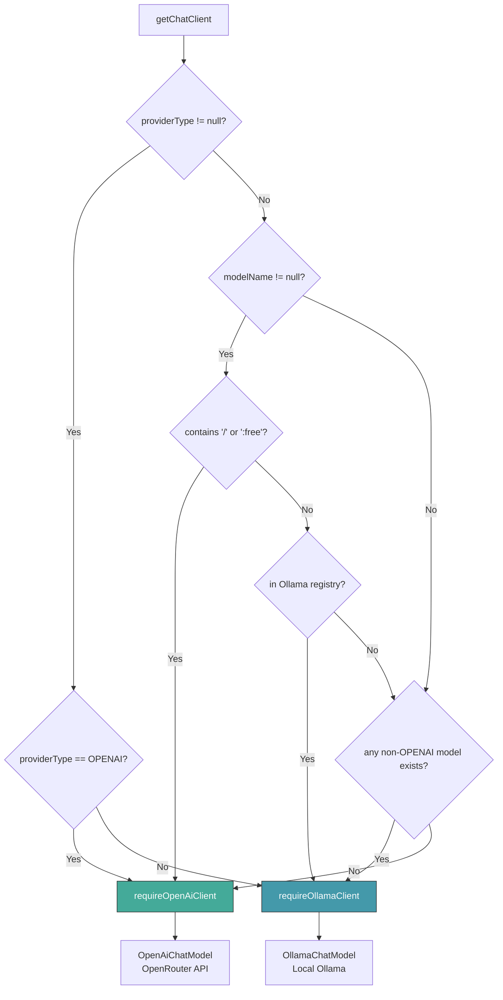
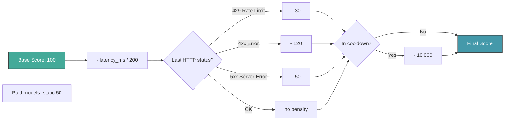

# AUTO Mode: Model Selection & Provider Routing

> **Fixture test:** `AutoModeModelSelectionFixtureIT` — run with `./mvnw clean verify -pl opendaimon-app -am -Pfixture`

The system automatically selects the best model based on required capabilities,
user priority tier, and available providers. This document covers three deployment
scenarios: dual-provider, Ollama-only, and OpenRouter-only.

## AUTO Mode Selection Algorithm

## Explicit Model Selection (Fixed Model)

## Scenario 1: Ollama + OpenRouter (Dual Provider)

## Scenario 2: Ollama Only

## Scenario 3: OpenRouter Only

## Provider Routing Logic (getChatClient)

## Free Model Scoring (OpenRouter)

## Key Design Points

1. **Capability detection happens before gateway** — `DefaultAICommandFactory` determines
   required capabilities (including VISION for IMAGE attachments) after `AIRequestPipeline`
   has already run document orchestration. The gateway only receives a finalized command and
   executes the model call.

2. **VISION is added by the factory, not the gateway** — previously, `SpringAIGateway`
   internally rendered image-only PDFs and called a VISION model, bypassing priority checks.
   Now `SpringDocumentPreprocessor` (in the pipeline, before the factory) renders the PDF,
   and if OCR fails, the IMAGE attachments reach the factory which adds VISION to required
   capabilities. Priority enforcement blocks REGULAR users correctly.

3. **Capability-first, priority-second** — models are filtered by required capabilities
   first, then sorted by priority number. A model with all required caps but priority=3
   always beats a model missing a capability.

4. **User tier isolation** — `allowedRoles` on models prevents REGULAR users from
   accessing expensive paid models. ADMIN tier gets full access.

5. **Free model health tracking** — EWMA latency and HTTP status penalties dynamically
   re-rank free OpenRouter models. A model returning 429s drops to the bottom.

6. **Lazy client initialization** — `ChatClient` instances are created on first use
   with double-checked locking. If a provider is not configured, the error is deferred
   until a model from that provider is actually selected.

7. **Provider inference fallback** — if `providerType` is not set in YAML, the system
   infers from the model name (e.g., `meta-llama/llama-3-8b` → OpenRouter). Local
   models without `/` are assumed Ollama.
