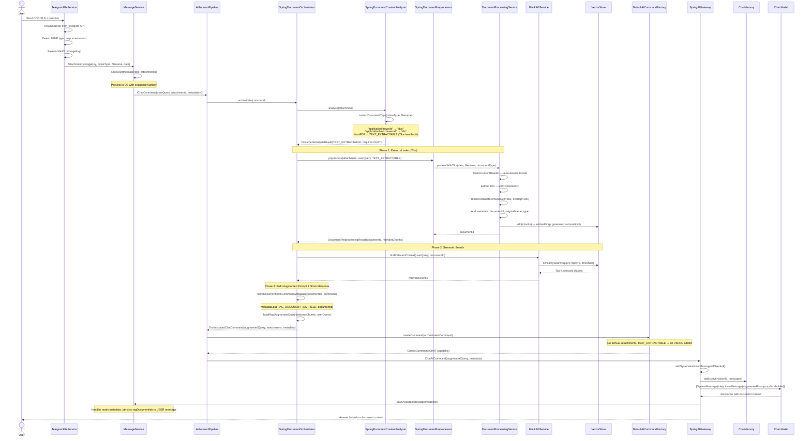
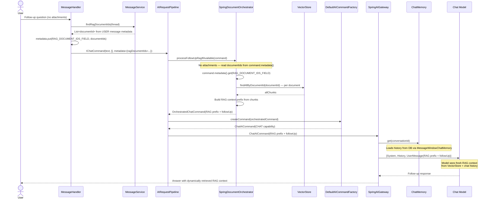

# DOC/XLS Document: Tika RAG Flow

> **Manual tests:**
> - `DocRagOllamaManualIT`, `DocRagOpenRouterManualIT` — DOC files
> - `XlsRagOllamaManualIT`, `XlsRagOpenRouterManualIT` — XLS files
>
> Run with: `./mvnw -pl opendaimon-app -am clean test-compile failsafe:integration-test failsafe:verify -Dit.test=<TestClass> -Dfailsafe.failIfNoSpecifiedTests=false -Dmanual.ollama.e2e=true`

When a user uploads a DOC, XLS, DOCX, XLSX or other office document, the system extracts
text via Apache Tika (through Spring AI's `TikaDocumentReader`), indexes chunks in
VectorStore, and builds an augmented prompt for the LLM. No vision model is needed.

## Supported Document Types

| Extension | MIME Type | Document Type |
|-----------|-----------|---------------|
| `.doc` | `application/msword` | `doc` |
| `.docx` | `application/vnd.openxmlformats-officedocument.wordprocessingml.document` | `docx` |
| `.xls` | `application/vnd.ms-excel` | `xls` |
| `.xlsx` | `application/vnd.openxmlformats-officedocument.spreadsheetml.sheet` | `xlsx` |
| `.ppt` | `application/vnd.ms-powerpoint` | `ppt` |
| `.pptx` | `application/vnd.openxmlformats-officedocument.presentationml.presentation` | `pptx` |
| `.txt`, `.csv`, `.html`, `.md`, `.json`, `.xml`, `.rtf`, `.odt`, `.ods`, `.odp`, `.epub` | various | mapped by extension |

Detection is done in `SpringDocumentContentAnalyzer.extractDocumentType()` via `DocumentTypeMapping` —
checks MIME type patterns first, then file extension fallback. This logic was extracted from
`SpringAIGateway` as part of the architecture refactoring.

## First Message (Document Upload + Question)

## Follow-Up Message (No Attachments)

## Key Design Points

1. **Tika handles all non-PDF office formats** — `TikaDocumentReader` from Spring AI
   auto-detects the file format and extracts text. No format-specific code needed.

2. **Same RAG pipeline as text PDF** — after text extraction, the flow is identical to
   [`text-pdf-rag.md`](./text-pdf-rag.md): chunk, index, search, augment prompt.

3. **Type detection in `SpringDocumentContentAnalyzer`** — MIME type and extension mapping
   (previously `SpringAIGateway.extractDocumentType()`) now lives in
   `SpringDocumentContentAnalyzer`. Non-PDF documents always return `TEXT_EXTRACTABLE`;
   only PDFs require the `PdfTextDetector` check.

4. **DocumentIds stored in USER message metadata** — the orchestrator writes documentIds into
   `AICommand.metadata` under `RAG_DOCUMENT_IDS_FIELD`. The handler persists them on the
   USER message via `OpenDaimonMessageService.updateRagMetadata()`.

5. **AttachmentType.PDF used as catch-all** — the `AttachmentType` enum currently only has
   `IMAGE` and `PDF`. All non-image documents (DOC, XLS, etc.) are classified as
   `AttachmentType.PDF` at the Telegram layer. Real format detection happens in
   `SpringDocumentContentAnalyzer` via MIME type and extension mapping.

6. **No vision model needed** — unlike image-only PDFs (see
   [`image-pdf-vision-cache.md`](./image-pdf-vision-cache.md)), office documents contain
   extractable text. Tika handles the binary format decoding.

7. **XLS/XLSX specifics** — Tika extracts cell values as text, preserving tabular structure
   to a degree. Column headers and data rows become searchable text chunks.
