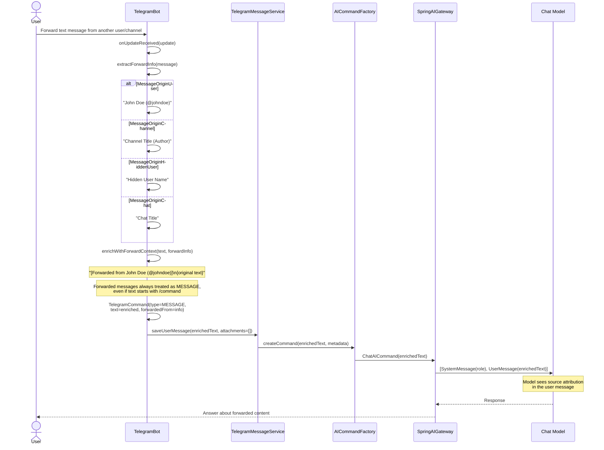
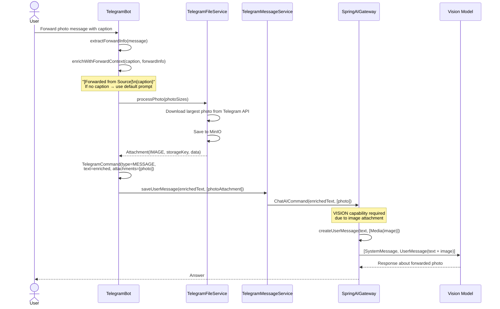
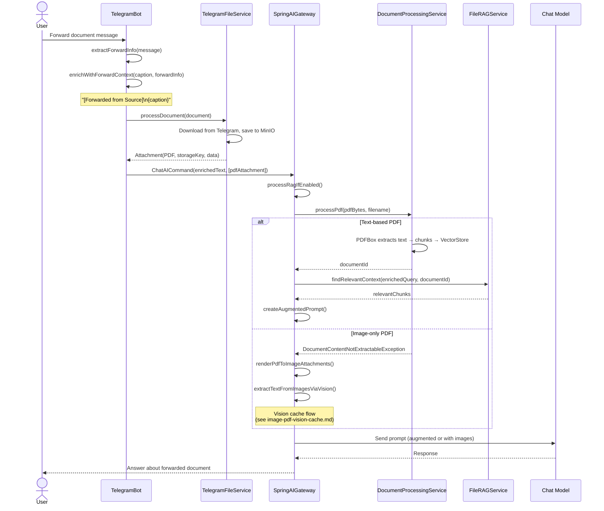

# Forwarded (Reposted) Message Handling

> **Fixture test:** `ForwardedMessageFixtureIT` — run with `./mvnw clean verify -pl opendaimon-app -am -Pfixture`

When a user forwards someone else's message to the bot, the system detects the origin,
enriches the text with source attribution, and processes it as a regular message.

## Forwarded Text Message

## Forwarded Message with Photo

## Forwarded Message with Document (PDF)

## Forward Origin Types

| Origin Type | Example | Format |
|-------------|---------|--------|
| **MessageOriginUser** | User forwards from a person | `"John Doe (@johndoe)"` |
| **MessageOriginChannel** | Forward from a channel | `"Channel Title"` or `"Channel Title (Author)"` |
| **MessageOriginHiddenUser** | Privacy-hidden sender | `"Anonymous Name"` |
| **MessageOriginChat** | Forward from a group chat | `"Chat Title"` |

## Key Design Points

1. **Security: forwarded commands are not executed** — even if the forwarded text starts
   with `/start` or any other command, it is treated as a regular MESSAGE. This prevents
   executing arbitrary commands from untrusted sources.

2. **Source attribution in text** — the `[Forwarded from ...]` prefix is embedded directly
   into the user message text, so the LLM always knows the content came from another source.

3. **Localization** — the forward prefix is localized via `telegram.forward.prefix`
   property (`telegram_en.properties` / `telegram_ru.properties`).

4. **Attachments processed normally** — photos, documents, and other attachments from
   forwarded messages go through the same processing pipeline as direct uploads.
