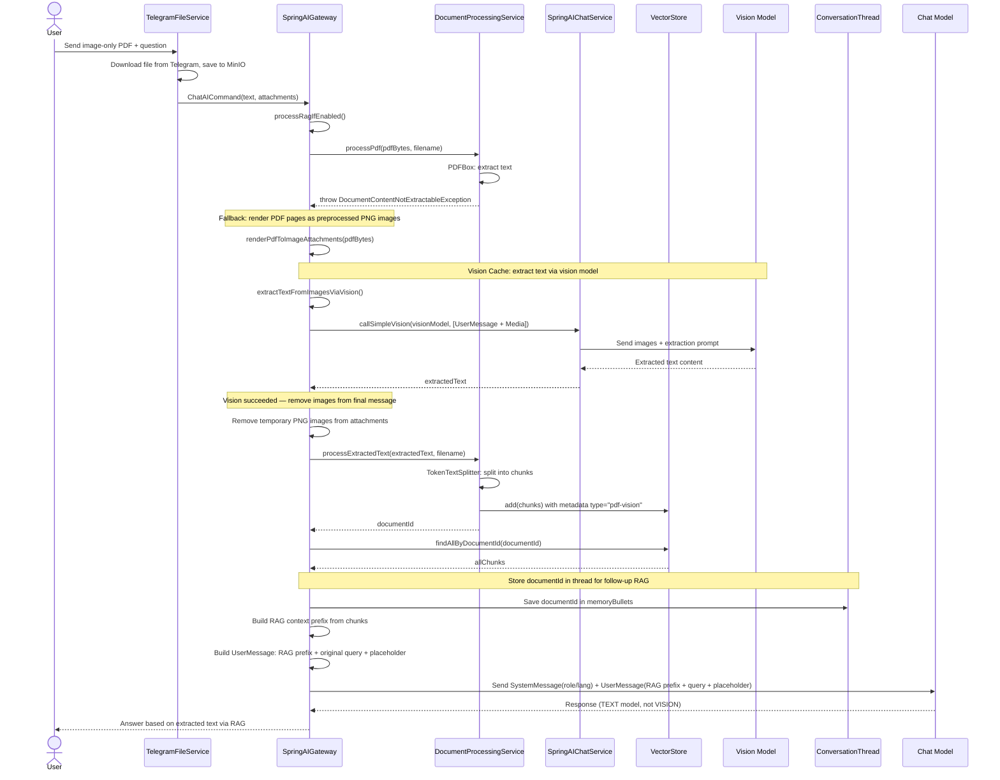
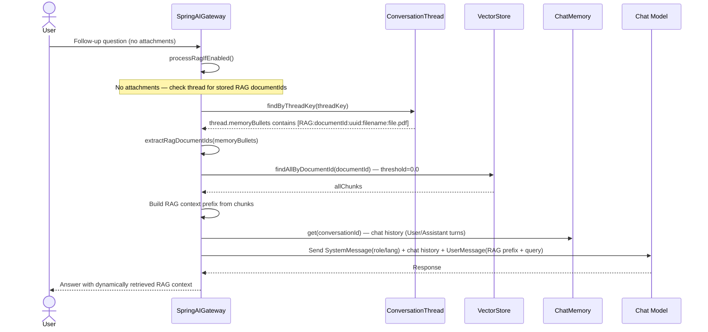

# Image-Only PDF: Vision Cache Sequence Diagram

> **Fixture test:** `ImagePdfVisionCacheFixtureIT` — run with `./mvnw clean verify -pl opendaimon-app -am -Pfixture`

When a user uploads an image-only PDF (scan, certificate, etc.), the system extracts text
via a vision-capable model and caches it in VectorStore for follow-up queries.

## First Message (PDF Upload)

## Follow-Up Message (No Attachments)

## Key Design Decisions

1. **RAG context is prepended to UserMessage** — gateway builds a RAG prefix from
   retrieved chunks and prepends it to the user query. A short placeholder
   `[Documents loaded for context: filename.pdf]` is also appended for traceability.

2. **DocumentId stored in `ConversationThread.memoryBullets`** — format:
   `[RAG:documentId:<uuid>:filename:<name>]`. On follow-up messages, the gateway reads
   these markers and fetches relevant chunks from VectorStore dynamically.

3. **No transient RAG SystemMessage** — document context is injected directly into
   `UserMessage` as a prefix so small local models reliably consume it.

4. **After successful vision extraction, images are removed** — the text model (not VISION)
   answers using RAG context. Images are only kept as fallback if vision extraction fails.

5. **Vision extraction is a separate internal call** — uses `callSimpleVision()` without
   ChatMemory, web tools, or conversationId to avoid polluting chat history.

6. **Both first message and follow-up use `findAllByDocumentId()`** — with threshold=0.0
   to bypass cross-language similarity mismatch (e.g. Russian query vs English document).
   Since chunks are filtered by documentId, all returned chunks belong to the user's document.

7. **Graceful degradation on restart** — if VectorStore data is lost (SimpleVectorStore
   is in-memory), follow-up returns no chunks and the model answers from chat history only.

## Direct Ollama Findings (Local Validation, March 29, 2026)

These findings were validated with direct `POST /api/chat` calls to local Ollama using the
same PDF sample from IT resources.

1. **`gemma3:4b` is the viable vision OCR path** — direct image OCR works when the page is
   sent as a lossless PNG (300 DPI) with a full extraction prompt and deterministic options
   (`temperature=0`, `top_p=1`, fixed `seed`, high `num_predict`).

2. **Two-step dialog is reproducible with `gemma3:4b` vision input** — asking first
   `"что в первом предложении?"` and then
   `"а что было в последнем предложении в скобках?"`
   returns the expected phrase `(as far as they know)` in repeated direct runs.

3. **`gemma3:1b` should not be used for image input** — local direct calls with image payload
   returned HTTP 500:
   `"this model is missing data required for image input"`.

4. **`gemma3:1b` is valid for text-only follow-up (RAG-style)** — when OCR text is already
   available as plain context, `gemma3:1b` can answer follow-up correctly and include
   `(as far as they know)`.

5. **Operational model split** — for this local setup, reliable image-PDF flow is:
   vision OCR on `gemma3:4b` -> store text in RAG -> follow-up on text model (`gemma3:1b`
   or another text-capable model).

## Prompting Caveat

Direct narrow prompts such as "return only the final parentheses phrase" were less reliable
than full-page OCR extraction prompts. The robust sequence is:

1. Extract full page text via vision.
2. Ask follow-up question over extracted text context.
