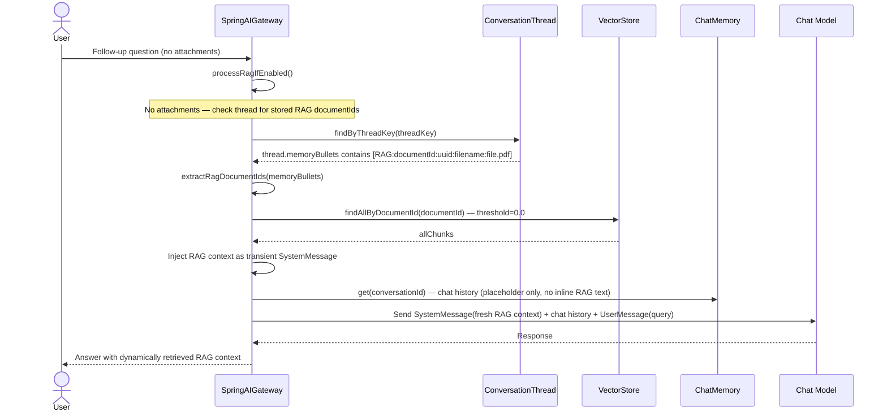

# Image-Only PDF: Vision Cache Sequence Diagram

> **Fixture test:** `ImagePdfVisionCacheFixtureIT` — run with `./mvnw clean verify -pl opendaimon-app -am -Pfixture`

When a user uploads an image-only PDF (scan, certificate, etc.), the system extracts text
via a vision-capable model and caches it in VectorStore for follow-up queries.

## First Message (PDF Upload)

## Follow-Up Message (No Attachments)

## Key Design Decisions

1. **RAG context is NOT stored inline in chat memory** — instead, a short placeholder
   `[Documents loaded for context: filename.pdf]` is stored in the UserMessage. The full
   document text lives only in VectorStore, not in `spring_ai_chat_memory`.

2. **DocumentId stored in `ConversationThread.memoryBullets`** — format:
   `[RAG:documentId:<uuid>:filename:<name>]`. On follow-up messages, the gateway reads
   these markers and fetches relevant chunks from VectorStore dynamically.

3. **RAG context injected as transient SystemMessage** — this SystemMessage is added to the
   prompt for the LLM but is NOT persisted by `MessageChatMemoryAdvisor` (which only stores
   User/Assistant messages). This keeps chat memory lean.

4. **After successful vision extraction, images are removed** — the text model (not VISION)
   answers using RAG context. Images are only kept as fallback if vision extraction fails.

5. **Vision extraction is a separate internal call** — uses `callSimpleVision()` without
   ChatMemory, web tools, or conversationId to avoid polluting chat history.

6. **Both first message and follow-up use `findAllByDocumentId()`** — with threshold=0.0
   to bypass cross-language similarity mismatch (e.g. Russian query vs English document).
   Since chunks are filtered by documentId, all returned chunks belong to the user's document.

7. **Graceful degradation on restart** — if VectorStore data is lost (SimpleVectorStore
   is in-memory), follow-up returns no chunks and the model answers from chat history only.
