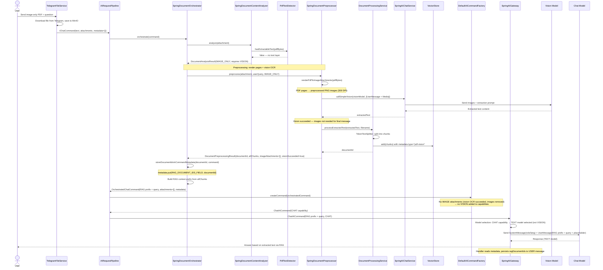
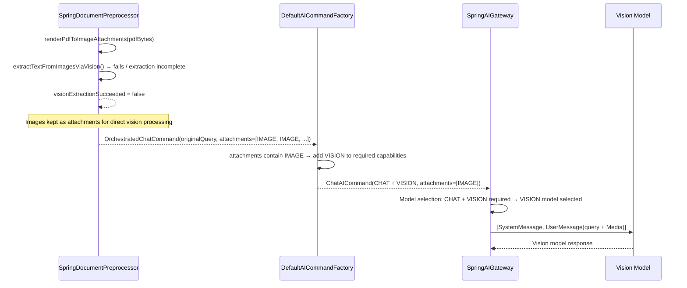
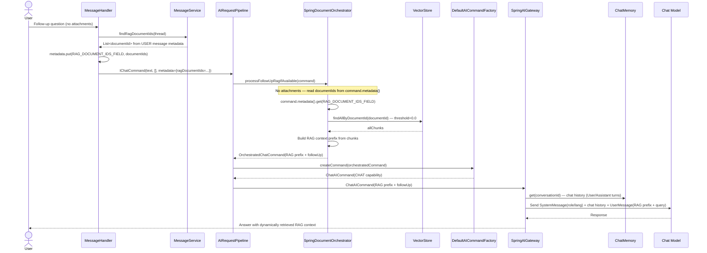

# Image-Only PDF: Vision Cache Sequence Diagram

> **Fixture test:** `ImagePdfVisionCacheFixtureIT` — run with `./mvnw clean verify -pl opendaimon-app -am -Pfixture`
>
> **Manual tests:**
> - `ImagePdfVisionRagOllamaManualIT` — `image-based-pdf-sample.pdf` with OCR via gemma3:4b
>
> Run with: `./mvnw -pl opendaimon-app -am clean test-compile failsafe:integration-test failsafe:verify -Dit.test=ImagePdfVisionRagOllamaManualIT -Dfailsafe.failIfNoSpecifiedTests=false -Dmanual.ollama.e2e=true`

When a user uploads an image-only PDF (scan, certificate, etc.), the system detects it
before the gateway call, renders pages as images, extracts text via a vision-capable model,
and caches it in VectorStore for follow-up queries.

## First Message (PDF Upload)

## Vision OCR Fallback (OCR Failed)

If vision extraction fails, the PDF page images are kept as attachments so the model can
process them directly. In this case the factory detects IMAGE attachments and adds VISION.

## Follow-Up Message (No Attachments)

## Key Design Decisions

1. **Vision capability detection before gateway** — `SpringDocumentContentAnalyzer` (via
   `PdfTextDetector`) determines whether a PDF needs VISION before model selection. This
   ensures REGULAR users who lack VISION access are blocked at the factory level, not deep
   inside the gateway.

2. **RAG context is prepended to UserMessage** — the orchestrator builds a RAG prefix from
   retrieved chunks and prepends it to the user query. A short placeholder
   `[Documents loaded for context: filename.pdf]` is also appended for traceability.

3. **DocumentId stored in USER message metadata** — the orchestrator writes documentIds into
   `AICommand.metadata` under `RAG_DOCUMENT_IDS_FIELD`. The handler then persists them
   on the USER message via `OpenDaimonMessageService.updateRagMetadata()`. On follow-up
   messages, the handler reads stored documentIds from message history and injects them
   back into `AICommand.metadata` before calling the pipeline.

4. **No transient RAG SystemMessage** — document context is injected directly into
   `UserMessage` as a prefix so small local models reliably consume it.

5. **After successful vision extraction, images are removed** — the text model (not VISION)
   answers using RAG context. Images are only kept as fallback if vision extraction fails.

6. **Vision extraction is a separate internal call** — `SpringDocumentPreprocessor` uses
   `callSimpleVision()` without ChatMemory, web tools, or conversationId to avoid polluting
   chat history.

   **Note:** Direct JPEG/PNG images (not wrapped in PDF) follow a completely different path —
   they go straight to the vision model without OCR extraction or RAG indexing. See
   [`docs/usecases/image-vision-direct.md`](./image-vision-direct.md).

7. **Both first message and follow-up use `findAllByDocumentId()`** — with threshold=0.0
   to bypass cross-language similarity mismatch (e.g. Russian query vs English document).
   Since chunks are filtered by documentId, all returned chunks belong to the user's document.

8. **Graceful degradation on restart** — if VectorStore data is lost (SimpleVectorStore
   is in-memory), follow-up returns no chunks and the model answers from chat history only.

## Direct Ollama Findings (Local Validation, March 29, 2026)

These findings were validated with direct `POST /api/chat` calls to local Ollama using the
same PDF sample from IT resources.

1. **`gemma3:4b` is the viable vision OCR path** — direct image OCR works when the page is
   sent as a lossless PNG (300 DPI) with a full extraction prompt and deterministic options
   (`temperature=0`, `top_p=1`, fixed `seed`, high `num_predict`).

2. **Two-step dialog is reproducible with `gemma3:4b` vision input** — asking first
   `"что в первом предложении?"` and then
   `"а что было в последнем предложении в скобках?"`
   returns the expected phrase `(as far as they know)` in repeated direct runs.

3. **`gemma3:1b` should not be used for image input** — local direct calls with image payload
   returned HTTP 500:
   `"this model is missing data required for image input"`.

4. **`gemma3:1b` is valid for text-only follow-up (RAG-style)** — when OCR text is already
   available as plain context, `gemma3:1b` can answer follow-up correctly and include
   `(as far as they know)`.

5. **Operational model split** — for this local setup, reliable image-PDF flow is:
   vision OCR on `gemma3:4b` -> store text in RAG -> follow-up on text model (`gemma3:1b`
   or another text-capable model).

## Prompting Caveat

Direct narrow prompts such as "return only the final parentheses phrase" were less reliable
than full-page OCR extraction prompts. The robust sequence is:

1. Extract full page text via vision.
2. Ask follow-up question over extracted text context.
