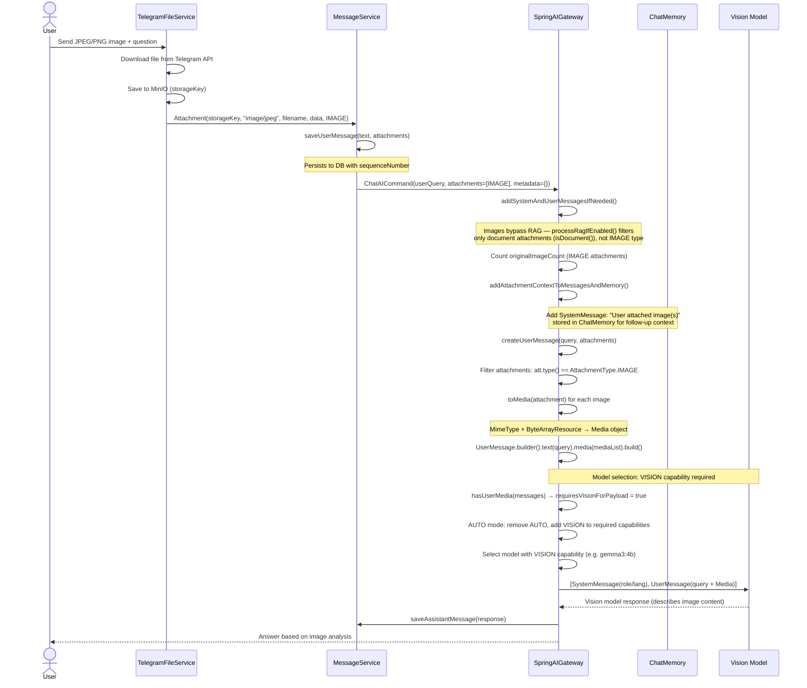
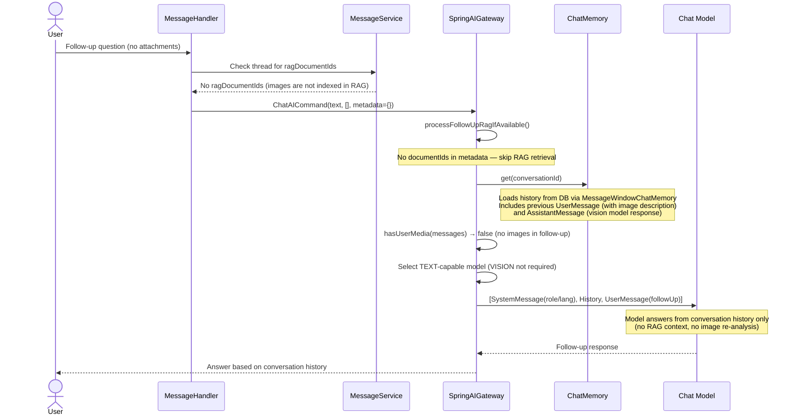

# Direct Image Vision: JPEG/PNG Processing

> **Manual tests:**
> - `ObjectsImageVisionOllamaManualIT`, `ObjectsImageVisionOpenRouterManualIT` — photo of objects
> - `GreekImageVisionOllamaManualIT`, `GreekImageVisionOpenRouterManualIT` — image with Greek text
>
> Run with: `./mvnw -pl opendaimon-app -am clean test-compile failsafe:integration-test failsafe:verify -Dit.test=<TestClass> -Dfailsafe.failIfNoSpecifiedTests=false -Dmanual.ollama.e2e=true`

When a user uploads a JPEG/PNG image (not a PDF), the system sends it directly to a
vision-capable model as a `Media` object. **No RAG indexing is performed** — images bypass
the document processing pipeline entirely. Follow-up questions rely on conversation history
(ChatMemory), not VectorStore.

## First Message (Image Upload + Question)

## Follow-Up Message (No Attachments)

## Key Design Points

1. **No RAG for direct images** — `processRagIfEnabled()` filters attachments via
   `Attachment.isDocument()`, which returns `false` for `AttachmentType.IMAGE`. Images go
   straight to the vision model without chunking, embedding, or VectorStore indexing.

2. **VISION capability auto-detection** — `hasUserMedia(messages)` checks if any
   `UserMessage` contains `Media` objects. If true, `ModelCapabilities.VISION` is added to
   required capabilities, and `ModelCapabilities.AUTO` is removed to force vision model
   selection.

3. **Follow-up uses conversation history, not RAG** — since images are not indexed, follow-up
   questions rely entirely on `ChatMemory` (previous user/assistant messages). The model must
   infer context from the conversation, not from VectorStore chunks.

4. **Model switch between turns** — the first message uses a VISION-capable model (e.g.
   `gemma3:4b`), but the follow-up may use a different TEXT-only model (e.g. `qwen2.5:3b`)
   since no images are present. The conversation history bridges the context gap.

5. **Attachment context in ChatMemory** — `addAttachmentContextToMessagesAndMemory()` adds a
   `SystemMessage` ("User attached image(s)") to `ChatMemory`, helping the follow-up model
   understand that an image was previously discussed.

6. **Media conversion** — `toMedia(attachment)` converts `Attachment.data()` (byte array) into
   a Spring AI `Media` object with the correct MIME type (`image/jpeg`, `image/png`, etc.) and
   a `ByteArrayResource`. This is passed to `UserMessage.builder().media(mediaList)`.

## Comparison with Other Attachment Flows

| Aspect | Direct Image (this doc) | Text PDF | Image-Only PDF | DOC/XLS |
|--------|------------------------|----------|----------------|---------|
| AttachmentType | `IMAGE` | `PDF` | `PDF` | `PDF` |
| Text Extraction | None (vision direct) | PDFBox | Vision OCR fallback | Tika |
| RAG Indexed | **No** | Yes | Yes | Yes |
| Follow-Up Context | ChatMemory only | VectorStore + ChatMemory | VectorStore + ChatMemory | VectorStore + ChatMemory |
| Model Required | VISION | CHAT | CHAT + VISION (OCR) | CHAT |
| Related Doc | — | [text-pdf-rag.md](./text-pdf-rag.md) | [image-pdf-vision-cache.md](./image-pdf-vision-cache.md) | [doc-xls-tika-rag.md](./doc-xls-tika-rag.md) |
