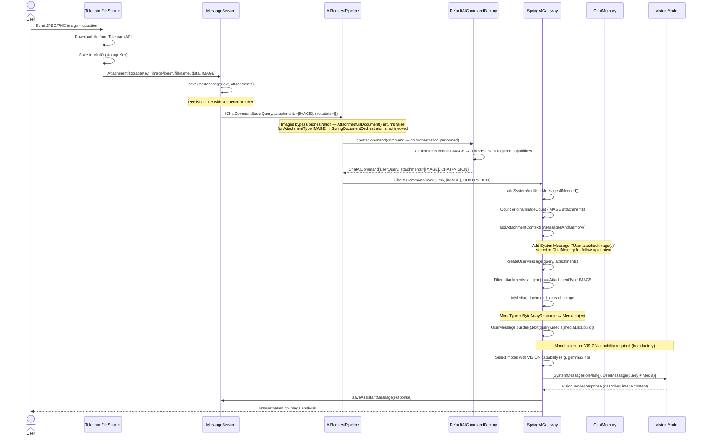
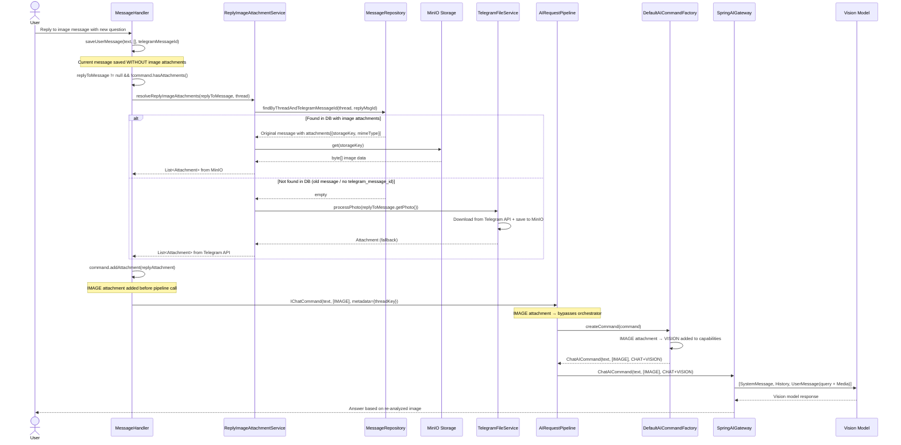
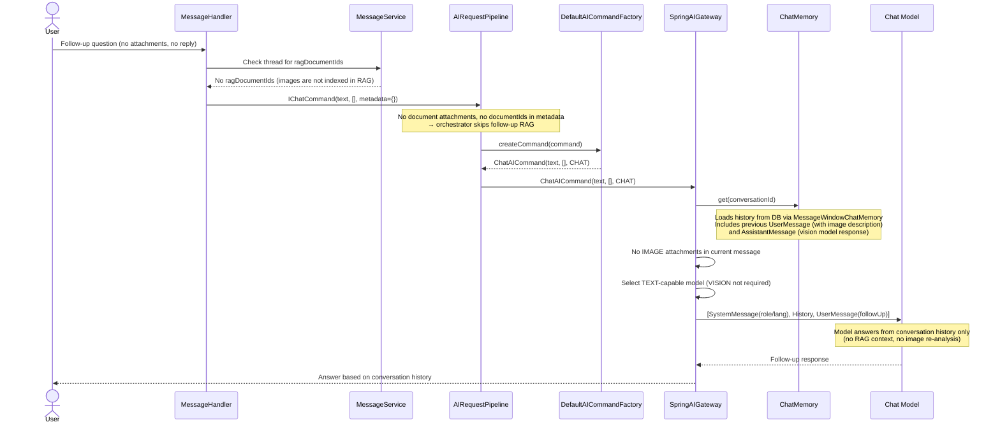

# Direct Image Vision: JPEG/PNG Processing

> **Manual tests:**
> - `ObjectsImageVisionOllamaManualIT`, `ObjectsImageVisionOpenRouterManualIT` — photo of objects
> - `GreekImageVisionOllamaManualIT`, `GreekImageVisionOpenRouterManualIT` — image with Greek text
>
> Run with: `./mvnw -pl opendaimon-app -am clean test-compile failsafe:integration-test failsafe:verify -Dit.test=<TestClass> -Dfailsafe.failIfNoSpecifiedTests=false -Dmanual.ollama.e2e=true`

When a user uploads a JPEG/PNG image (not a PDF), the system sends it directly to a
vision-capable model as a `Media` object. **No RAG indexing is performed** — images bypass
the document orchestration pipeline entirely. Follow-up questions rely on conversation history
(ChatMemory), not VectorStore.

## First Message (Image Upload + Question)

## Reply to Image Message (Re-Attach from DB/MinIO)

When a user replies to a message that contained an image, the system retrieves the
original image from the database (MinIO storage) and attaches it to the new LLM request.
This allows the model to re-analyze the image with a new question.

## Follow-Up Message (No Attachments)

## Key Design Points

1. **Images bypass pipeline orchestration** — `AIRequestPipeline` checks `Attachment.isDocument()`
   before invoking `SpringDocumentOrchestrator`. `isDocument()` returns `false` for
   `AttachmentType.IMAGE`, so images are passed directly to the factory without any
   document preprocessing or RAG orchestration.

2. **VISION capability detection in factory** — `DefaultAICommandFactory` checks for IMAGE
   attachments and adds `ModelCapabilities.VISION` to required capabilities. This is
   consistent with how image-only PDFs (after OCR failure) trigger VISION: the factory
   always decides based on attachment type, not on gateway logic.

3. **Reply-to-image retrieval (DB first, Telegram fallback)** — when a user replies to a
   message that contained an image, `ReplyImageAttachmentService` resolves the image:
   - Looks up the original message via `telegram_message_id` column + thread scope
   - If found, retrieves the image binary from MinIO using the stored `storageKey`
   - Falls back to downloading from Telegram API if the DB lookup fails (e.g. old messages
     without `telegram_message_id`)
   - Reply attachments are added to the command **after** `saveUserMessage` (not persisted as
     the current message's attachments) but **before** `pipeline.prepareCommand()` (so VISION
     capability is detected automatically by the factory)

4. **Reply vs own attachment priority** — if the user sends their own image as a reply to
   another image, the user's new image takes priority (`!command.hasAttachments()` guard).
   Reply image extraction only activates when the current message has no attachments.

5. **Follow-up uses conversation history, not RAG** — since images are not indexed, follow-up
   questions (without reply) rely entirely on `ChatMemory` (previous user/assistant messages).
   The model must infer context from the conversation, not from VectorStore chunks.

6. **Model switch between turns** — the first message uses a VISION-capable model (e.g.
   `gemma3:4b`), but the follow-up may use a different TEXT-only model (e.g. `qwen2.5:3b`)
   since no images are present. The conversation history bridges the context gap.

7. **Attachment context in ChatMemory** — `addAttachmentContextToMessagesAndMemory()` adds a
   `SystemMessage` ("User attached image(s)") to `ChatMemory`, helping the follow-up model
   understand that an image was previously discussed.

8. **Media conversion** — `toMedia(attachment)` converts `Attachment.data()` (byte array) into
   a Spring AI `Media` object with the correct MIME type (`image/jpeg`, `image/png`, etc.) and
   a `ByteArrayResource`. This is passed to `UserMessage.builder().media(mediaList)`.

## Comparison with Other Attachment Flows

| Aspect | Direct Image (this doc) | Reply to Image (this doc) | Text PDF | Image-Only PDF | DOC/XLS |
|--------|------------------------|--------------------------|----------|----------------|---------|
| AttachmentType | `IMAGE` | `IMAGE` (resolved) | `PDF` | `PDF` | `PDF` |
| Pipeline Orchestration | **Bypassed** | **Bypassed** | Yes (text extraction + RAG) | Yes (vision OCR + RAG) | Yes (Tika + RAG) |
| Text Extraction | None (vision direct) | None (vision direct) | PDFBox | Vision OCR fallback | Tika |
| RAG Indexed | **No** | **No** | Yes | Yes | Yes |
| VISION added by | Factory (IMAGE attachment) | Factory (IMAGE attachment) | Not needed | Factory (IMAGE after OCR fail) or N/A after OCR success | Not needed |
| Image Source | Telegram download | DB/MinIO (fallback: Telegram) | — | — | — |
| Follow-Up Context | ChatMemory only | ChatMemory only | VectorStore + ChatMemory | VectorStore + ChatMemory | VectorStore + ChatMemory |
| Model Required | VISION | VISION | CHAT | CHAT (+ VISION for OCR internally) | CHAT |
| Related Doc | — | — | [text-pdf-rag.md](./text-pdf-rag.md) | [image-pdf-vision-cache.md](./image-pdf-vision-cache.md) | [doc-xls-tika-rag.md](./doc-xls-tika-rag.md) |
