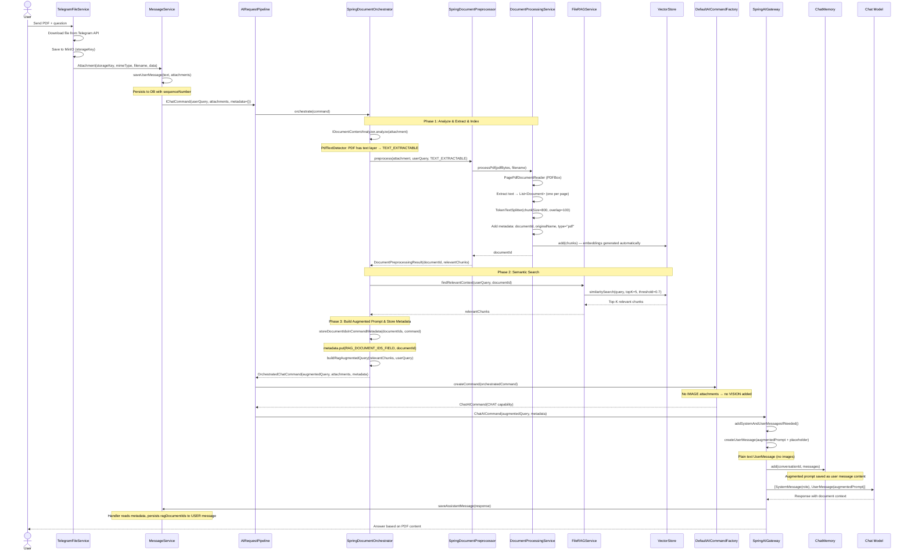
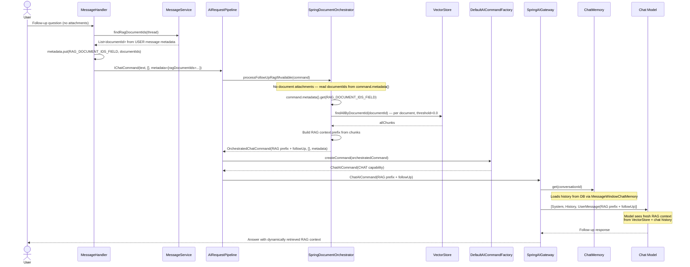

# Text-Based PDF: RAG Flow

> **Fixture test:** `TextPdfRagFixtureIT` — run with `./mvnw clean verify -pl opendaimon-app -am -Pfixture`
>
> **Manual tests:**
> - `TextPdfRagOllamaManualIT`, `TextPdfRagOpenRouterManualIT` — single-page `sample.pdf` with follow-up RAG
> - `ImagesWithTextPdfVisionRagOllamaManualIT`, `ImagesWithTextPdfVisionRagOpenRouterManualIT` — 3-page `images_with_text.pdf` with cross-chunk RAG retrieval
>
> Run with: `./mvnw -pl opendaimon-app -am clean test-compile failsafe:integration-test failsafe:verify -Dit.test=<TestClass> -Dfailsafe.failIfNoSpecifiedTests=false -Dmanual.ollama.e2e=true`

When a user uploads a PDF with a text layer (selectable text), the system extracts text
via PDFBox, indexes chunks in VectorStore, and builds an augmented prompt for the LLM.

## First Message (PDF Upload + Question)

## Follow-Up Message (No Attachments)

## Key Design Points

1. **DocumentIds stored in USER message metadata** — the orchestrator writes documentIds into
   `AICommand.metadata` under `RAG_DOCUMENT_IDS_FIELD`. The handler persists them on the
   USER message via `OpenDaimonMessageService.updateRagMetadata()`.

2. **VectorStore active on both first and follow-up messages** — on first message, chunks
   are indexed and searched. On follow-up, the handler reads stored documentIds from message
   history and injects them into command metadata; the orchestrator fetches fresh chunks from
   VectorStore dynamically (threshold=0.0 to return all chunks for that document).

3. **Chunking strategy** — `TokenTextSplitter` with 800-token chunks and 100-token overlap
   ensures context continuity across chunk boundaries.

4. **Similarity threshold** (0.7) filters out low-relevance chunks, preventing noise
   in the augmented prompt.

5. **Gateway is not involved in RAG** — all document extraction, indexing, and query
   augmentation happens in `AIRequestPipeline` → `SpringDocumentOrchestrator` → `SpringDocumentPreprocessor`
   before the command reaches `SpringAIGateway`.

6. **Image-only PDFs follow a different path** — for scanned/image PDFs and local Ollama
   model constraints, see
   [`docs/usecases/image-pdf-vision-cache.md`](./image-pdf-vision-cache.md).

7. **Office documents (DOC, XLS, etc.) use Tika** — for non-PDF office formats extracted
   via Apache Tika, see [`docs/usecases/doc-xls-tika-rag.md`](./doc-xls-tika-rag.md).

8. **Direct images (JPEG/PNG) bypass RAG** — images sent without a PDF wrapper go directly
   to the vision model without text extraction or indexing. See
   [`docs/usecases/image-vision-direct.md`](./image-vision-direct.md).
