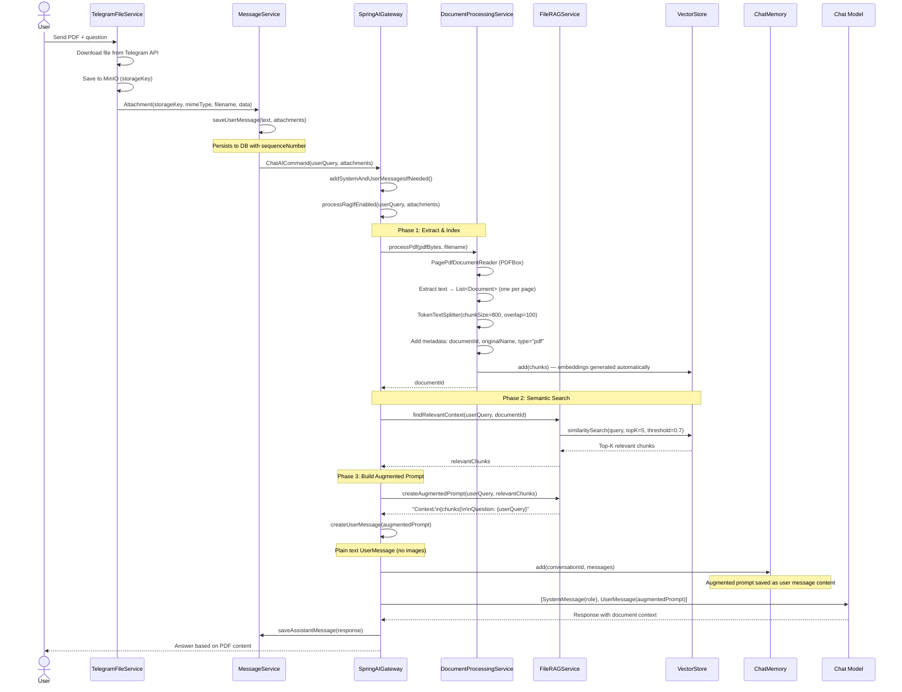
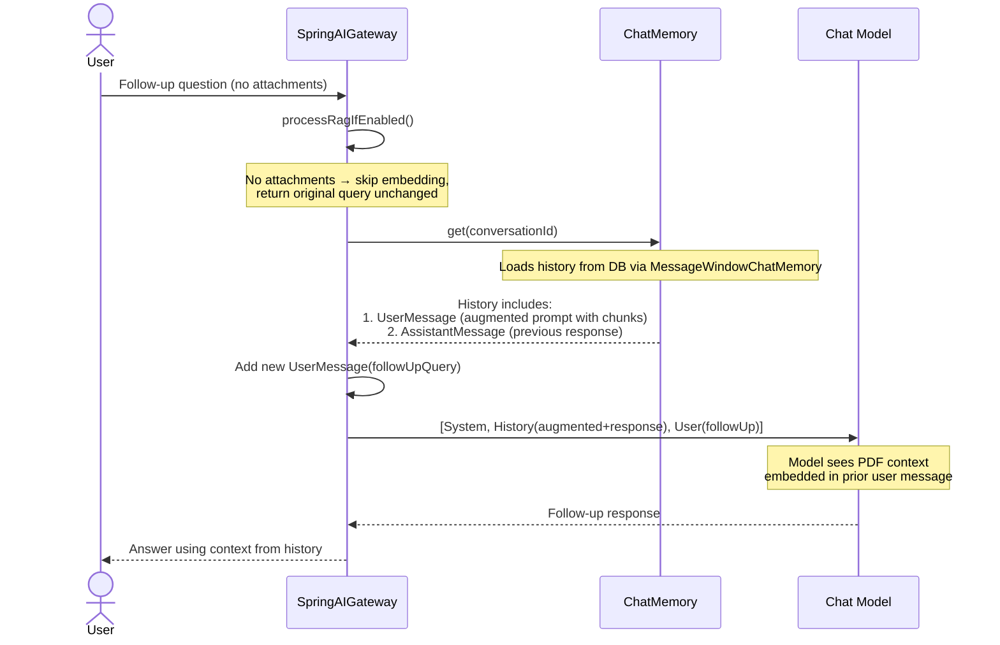

# Text-Based PDF: RAG Flow

> **Fixture test:** `TextPdfRagFixtureIT` — run with `./mvnw clean verify -pl opendaimon-app -am -Pfixture`

When a user uploads a PDF with a text layer (selectable text), the system extracts text
via PDFBox, indexes chunks in VectorStore, and builds an augmented prompt for the LLM.

## First Message (PDF Upload + Question)

## Follow-Up Message (No Attachments)

## Key Design Points

1. **Augmented prompt = context persistence** — the RAG-enriched prompt is saved as user
   message content in ChatMemory. Follow-up messages see it in history without re-querying
   VectorStore.

2. **VectorStore active only on first message** — semantic search runs when attachments
   are present. Follow-ups rely on chat history containing the augmented prompt.

3. **Chunking strategy** — `TokenTextSplitter` with 800-token chunks and 100-token overlap
   ensures context continuity across chunk boundaries.

4. **Similarity threshold** (0.7) filters out low-relevance chunks, preventing noise
   in the augmented prompt.

5. **Image-only PDFs follow a different path** — for scanned/image PDFs and local Ollama
   model constraints, see
   [`docs/usecases/image-pdf-vision-cache.md`](./image-pdf-vision-cache.md).
